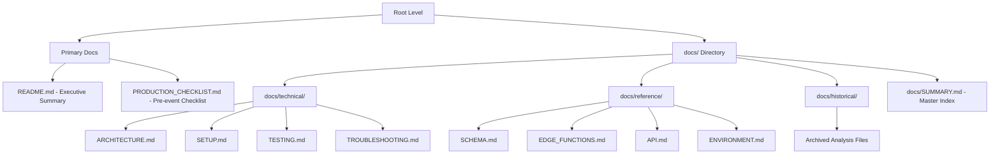

# Baby Shower Interactive Web App

A fun, interactive QR-code-based web app for baby showers with multiple activities and milestone surprises.

**Live Site**: https://baby-shower-qr-app.vercel.app

---

## 📚 Documentation Navigation

### 🎯 Primary Documents (Start Here)

| Document | Description |
|----------|-------------|
| **[PRODUCTION_CHECKLIST.md](PRODUCTION_CHECKLIST.md)** | ✅ **Start here** - Pre-event verification checklist |
| **[README.md](README.md)** | This file - Executive summary and quick start |

### 🚀 Deployment & Setup

| Document | Description |
|----------|-------------|
| **[docs/DEPLOYMENT.md](docs/DEPLOYMENT.md)** | Complete deployment guide |
| **[docs/technical/SETUP.md](docs/technical/SETUP.md)** | Initial setup instructions |
| **[docs/technical/ARCHITECTURE.md](docs/technical/ARCHITECTURE.md)** | System architecture and data flow |

### 🧪 Testing & Validation

| Document | Description |
|----------|-------------|
| **[docs/technical/TESTING.md](docs/technical/TESTING.md)** | Testing guide with feature-by-feature instructions |
| **[PRODUCTION_CHECKLIST.md](PRODUCTION_CHECKLIST.md)** | Pre-event verification checklist |

### 🔧 Reference Documentation

| Document | Description |
|----------|-------------|
| **[docs/reference/SCHEMA.md](docs/reference/SCHEMA.md)** | Database schema details |
| **[docs/reference/EDGE_FUNCTIONS.md](docs/reference/EDGE_FUNCTIONS.md)** | Edge Function specifications |
| **[EDGE_FUNCTION_GUIDE.md](EDGE_FUNCTION_GUIDE.md)** | 🆕 Complete Edge Function development guide |
| **[AGENTS.md](AGENTS.md)** | 🆕 Development patterns and best practices |
| **[docs/reference/API.md](docs/reference/API.md)** | Complete API documentation |
| **[docs/reference/ENVIRONMENT.md](docs/reference/ENVIRONMENT.md)** | Environment variables |

### 📋 Troubleshooting

| Document | Description |
|----------|-------------|
| **[docs/technical/TROUBLESHOOTING.md](docs/technical/TROUBLESHOOTING.md)** | Common issues and solutions |

### 📊 Documentation Index

| Document | Description |
|----------|-------------|
| **[docs/SUMMARY.md](docs/SUMMARY.md)** | Master index with all documentation links |

---

## Features

- **Digital Guestbook** - Leave wishes and messages for baby (no photos)
- **Baby Pool** - Predict birth date, time, weight, and length with live stats
- **Emoji Pictionary** - Solve 5 baby-themed emoji puzzles with scoring
- **Advice Capsule** - Leave parenting advice or wishes for baby's 18th birthday
- **Name Voting** - Heart up to 3 baby names you like with real-time vote counts
- **Milestone Surprises** - Unlock fun surprises at 5, 10, 20, 25, and 50 submissions

## Technology Stack

- **Frontend**: Plain HTML/CSS/JavaScript (responsive, mobile-first)
- **Backend**: Supabase Edge Functions (Deno)
- **Database**: Supabase PostgreSQL with Row Level Security
- **Integration**: Google Sheets webhook for data export
- **Hosting**: Vercel (global edge network, including Sydney for Australian guests)

## Quick Start

### For Event Hosts

1. **Review Checklist**: Open [PRODUCTION_CHECKLIST.md](PRODUCTION_CHECKLIST.md)
2. **Verify Setup**: Follow the pre-event verification steps
3. **Generate QR Codes**: Create QR codes pointing to your Vercel URL

### For Developers

1. **Architecture**: Read [docs/technical/ARCHITECTURE.md](docs/technical/ARCHITECTURE.md)
2. **Setup**: Follow [docs/technical/SETUP.md](docs/technical/SETUP.md)
3. **Deploy**: Use [docs/DEPLOYMENT.md](docs/DEPLOYMENT.md)
4. **Test**: Reference [docs/technical/TESTING.md](docs/technical/TESTING.md)

---

## Documentation Structure



---

## Project Structure

```
Baby_Shower/
├── index.html              # Main application entry point
├── styles/
│   ├── main.css           # Farm theme styles (warm, rustic, earthy tones)
│   └── animations.css     # Confetti, milestone animations
├── scripts/
│   ├── config.js          # App configuration (milestones, baby names)
│   ├── api.js             # API client for Edge Functions
│   ├── main.js            # Core navigation and utilities
│   ├── guestbook.js       # Guestbook functionality
│   ├── pool.js            # Baby pool predictions
│   ├── quiz.js            # Emoji pictionary game
│   ├── advice.js          # Advice capsule
│   ├── surprises.js       # Milestone unlock system
│   └── commit.js          # Git commit utilities
├── backend/
│   ├── Code.gs            # Google Apps Script for Sheets integration
│   ├── supabase-production-schema.sql  # Database schema
│   └── supabase-check.sql # Database validation queries
├── supabase/              # Supabase configuration
├── tests/                 # E2E test files
├── docs/                  # Documentation
│   ├── SUMMARY.md         # Master documentation index
│   ├── DEPLOYMENT.md      # Deployment guide
│   ├── technical/         # Technical documentation
│   ├── reference/         # Reference materials
│   └── historical/        # Archived analysis files
└── README.md              # This file
```

---

## Troubleshooting

Having issues? Check these resources:

1. **[docs/technical/TROUBLESHOOTING.md](docs/technical/TROUBLESHOOTING.md)** - Common issues and solutions
2. **[docs/technical/SETUP.md](docs/technical/SETUP.md)** - Setup instructions
3. **Browser Console** - Check for JavaScript errors
4. **Vercel Logs** - Review deployment logs in Vercel dashboard
5. **Supabase Dashboard** - Verify database is active

---

## Cost

- **Supabase**: Free tier (sufficient for baby shower)
- **Vercel**: Free tier (100GB bandwidth/month)
- **Total**: $0/month for typical usage

---

## Security

- No sensitive data stored (no emails, phone numbers, addresses)
- Supabase RLS policies prevent unauthorized access
- Public URL but not indexed by search engines

---

**Last Updated**: 2026-01-02  
**Version**: 3.0 - Documentation reorganized and consolidated
