# Architecture Diagrams and System Design

**Document Version:** 1.0  
**Date:** 2026-01-02  
**Project:** Baby Shower App Redesign  
**Status:** Research Complete

---

## 1. System Architecture Overview

### 1.1 High-Level Architecture

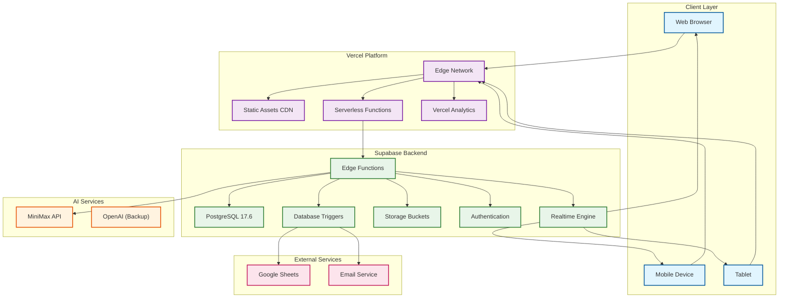

### 1.2 Component Diagram

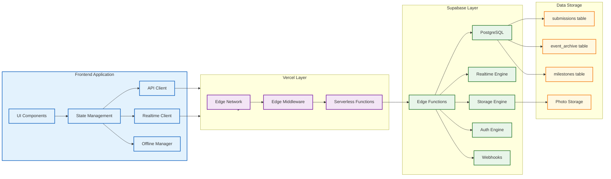

---

## 2. Data Flow Diagrams

### 2.1 Submission Data Flow

```mermaid
flowchart TD
    Start([User submits form])
    
    subgraph Validation["Client Validation"]
        V1[Check required fields]
        V2[Validate data types]
        V3[Format input]
    end
    
    subgraph Queue["Offline Queue"]
        Q1{Online?}
        Q2[Add to queue]
        Q3[Process queue]
    end
    
    subgraph API["API Layer"]
        A1[Send to Edge Function]
        A2[Verify JWT]
        A3[Validate request]
    end
    
    subgraph Business["Business Logic"]
        B1{AI needed?}
        B2[Generate AI content]
        B3[Apply formatting]
    end
    
    subgraph Database["Database"]
        D1[Insert to submissions]
        D2[Trigger audit log]
        D3[Check milestones]
        D4[Notify realtime]
    end
    
    subgraph Response["Response"]
        R1[Return result]
        R2[Update UI]
        R3[Trigger celebration]
    end
    
    Start --> V1
    V1 --> V2
    V2 --> V3
    V3 --> Q1
    Q1 -->|No| Q2
    Q2 -->|Later| Q3
    Q1 -->|Yes| A1
    A1 --> A2
    A2 --> A3
    A3 --> B1
    B1 -->|Yes| B2
    B2 --> B3
    B1 -->|No| B3
    B3 --> D1
    D1 --> D2
    D2 --> D3
    D3 --> D4
    D4 --> R1
    R1 --> R2
    R2 --> R3
    Q3 --> A1

    classDef process fill:#e3f2fd,stroke:#1565c0,stroke-width:2px
    classDef decision fill:#fff3e0,stroke:#e65100,stroke-width:2px
    classDef storage fill:#e8f5e9,stroke:#2e7d32,stroke-width:2px
    classDef startend fill:#fce4ec,stroke:#c2185b,stroke-width:2px

    class V1,V2,V3,A1,A2,A3,B2,B3,D1,D2,D3,D4,R1,R2,R3 process
    class Q1,B1 decision
    class Submissions,Archive,Milestones storage
    class Start,R3 startend
```

### 2.2 Realtime Update Flow

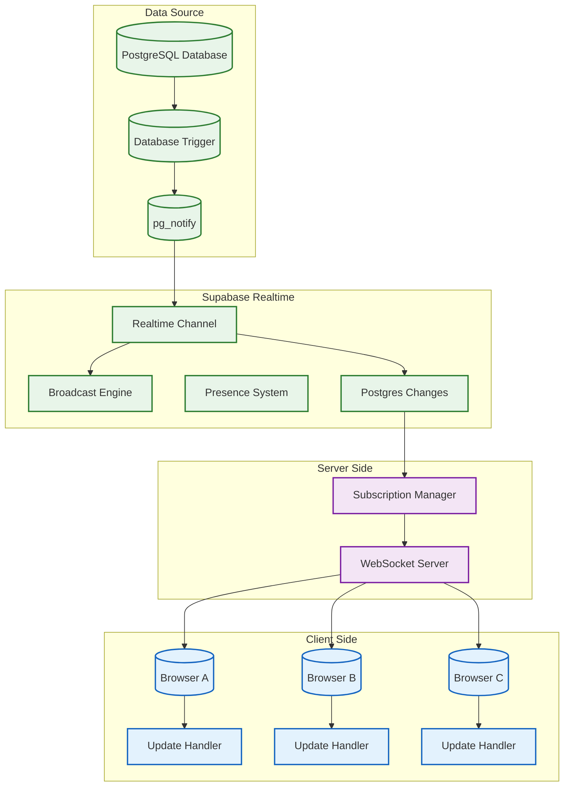

### 2.3 AI Request Flow

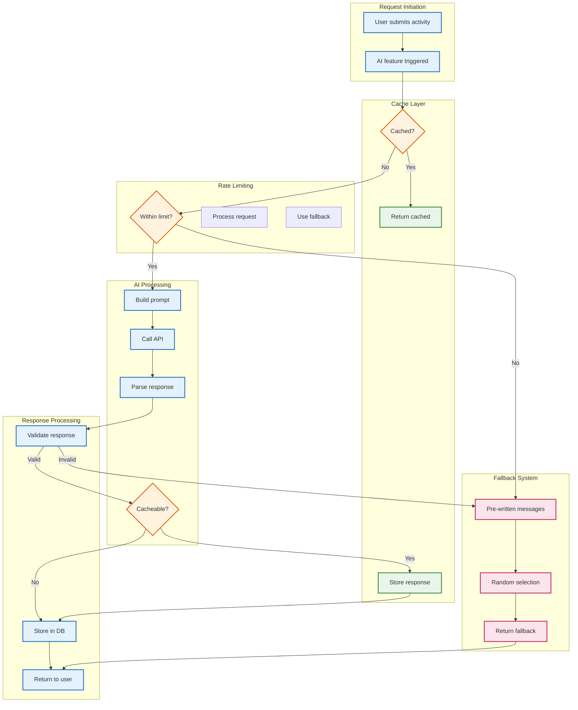

---

## 3. Database Schema Diagrams

### 3.1 Current Schema Architecture

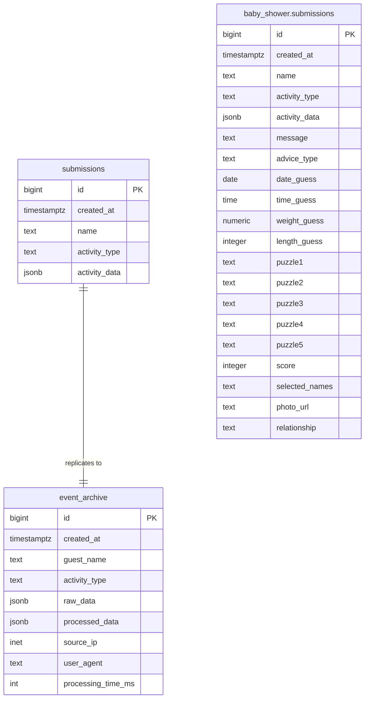

### 3.2 Proposed Multi-Table Schema

```mermaid
erDiagram
    guestbook ||--o{ milestones : "triggers"
    votes ||--o{ milestones : "triggers"
    pool_predictions ||--o{ milestones : "triggers"
    quiz_results ||--o{ milestones : "triggers"
    advice ||--o{ milestones : "triggers"
    
    baby_shower.guestbook {
        bigint id PK
        timestamptz created_at
        text name
        text message
        text relationship
        text photo_url
        boolean is_milestone
        text milestone_type
        jsonb metadata
    }
    
    baby_shower.votes {
        bigint id PK
        timestamptz created_at
        text voter_name
        text[] names
        jsonb metadata
    }
    
    baby_shower.pool_predictions {
        bigint id PK
        timestamptz created_at
        text guest_name
        text prediction
        date due_date
        numeric weight_kg
        integer length_cm
        text roast
        timestamptz roast_generated_at
        jsonb metadata
    }
    
    baby_shower.quiz_results {
        bigint id PK
        timestamptz created_at
        text participant_name
        jsonb answers
        integer score
        integer total_questions
        numeric percentage
        integer time_taken_seconds
        jsonb metadata
    }
    
    baby_shower.advice {
        bigint id PK
        timestamptz created_at
        text advisor_name
        text advice_text
        text category
        boolean is_sealed
        timestamptz sealed_until
        boolean is_approved
        boolean ai_generated
        jsonb ai_enhancements
        jsonb metadata
    }
    
    baby_shower.milestones {
        bigint id PK
        timestamptz created_at
        text milestone_type
        integer threshold
        timestamptz reached_at
        boolean celebration_triggered
        jsonb celebration_metadata
    }
    
    baby_shower.ai_roasts {
        bigint id PK
        timestamptz created_at
        text topic
        text roast_type
        text generated_advice
        text roast_level
        integer tokens_used
        text model
        jsonb metadata
    }
```

---

## 4. Sequence Diagrams

### 4.1 Guestbook Submission Sequence

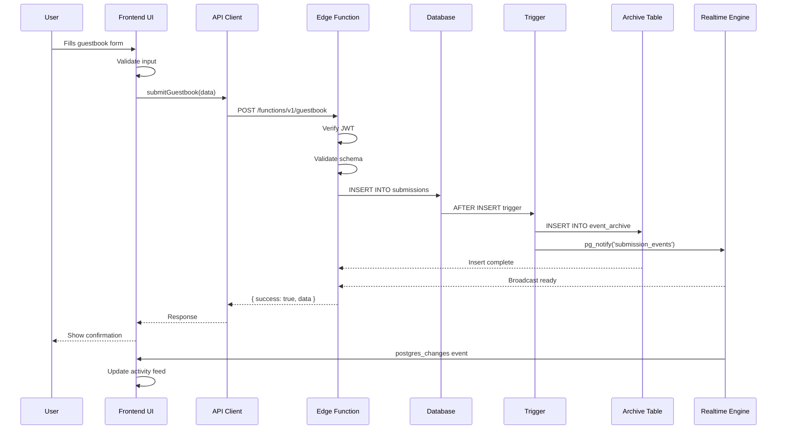

### 4.2 AI Roast Generation Sequence

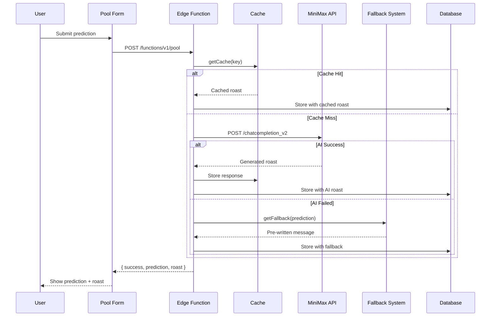

### 4.3 Realtime Vote Update Sequence

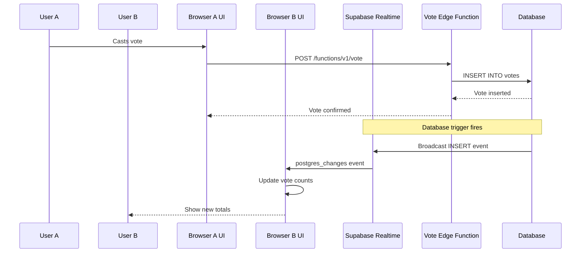

---

## 5. Infrastructure Deployment Diagram

### 5.1 Current Deployment Architecture

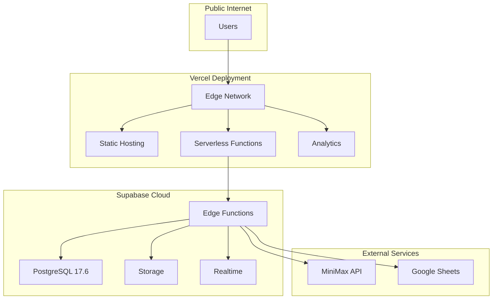

### 5.2 Proposed Deployment Architecture

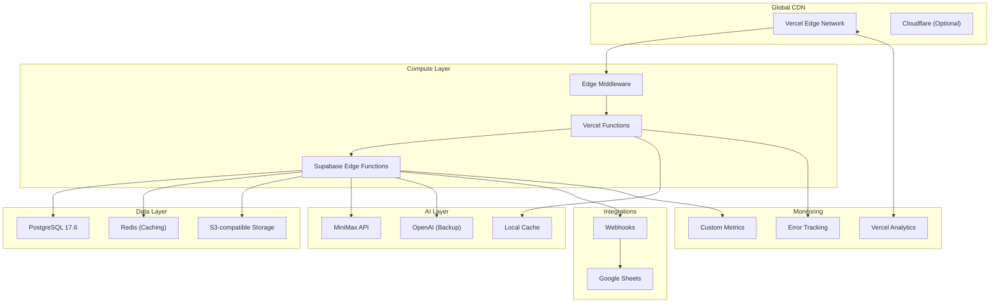

---

## 6. Security Architecture

### 6.1 Security Flow Diagram

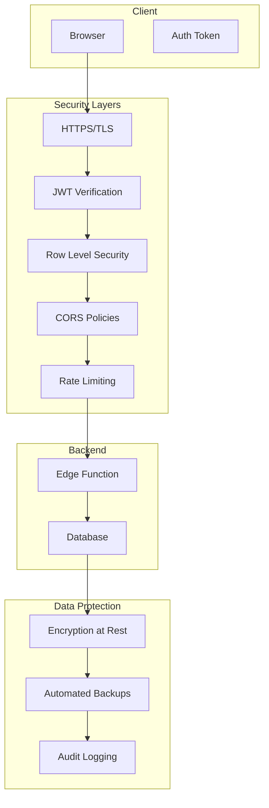

### 6.2 Authentication Flow

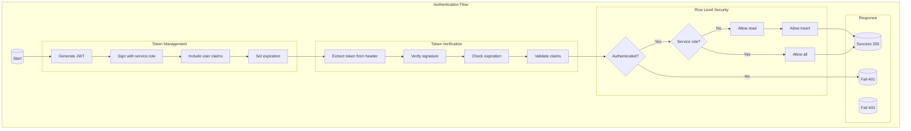

---

## 7. Monitoring and Observability

### 7.1 Monitoring Architecture

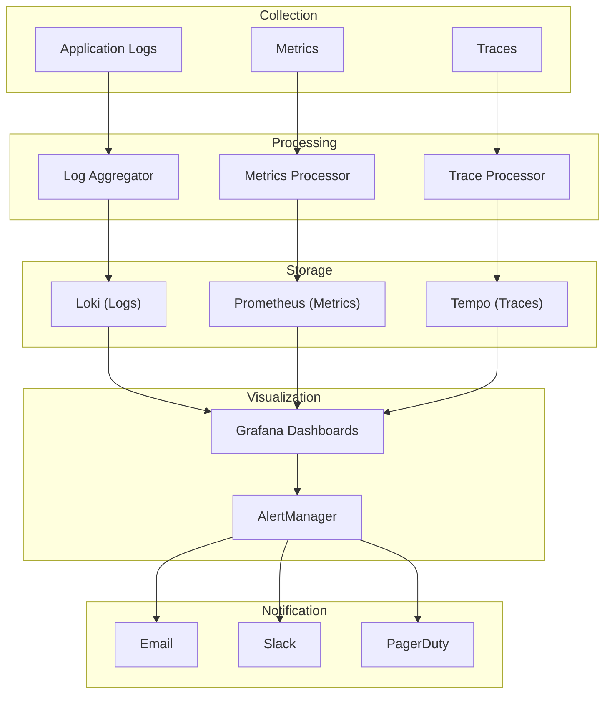

### 7.2 Key Metrics to Monitor

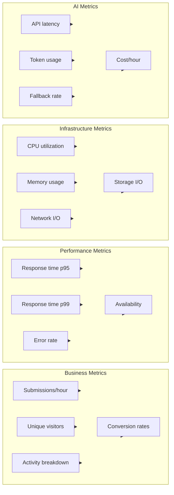

---

## 8. Error Handling Architecture

### 8.1 Error Flow Diagram

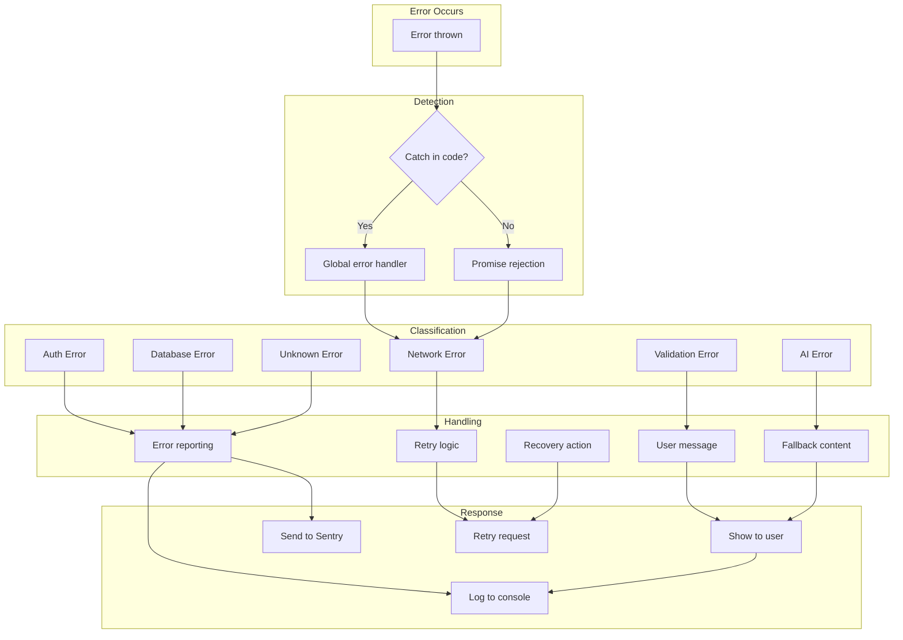

---

## 9. References

### 9.1 Diagram Sources

- [Mermaid Documentation](https://mermaid.js.org/)
- [C4 Model](https://c4model.com/)
- [AWS Architecture Icons](https://aws.amazon.com/architecture/icons/)

### 9.2 Related Documentation

- [`docs/RESEARCH_SUPABASE.md`](docs/RESEARCH_SUPABASE.md) - Supabase capabilities
- [`docs/RESEARCH_VERCEL.md`](docs/RESEARCH_VERCEL.md) - Vercel capabilities
- [`docs/RESEARCH_AI.md`](docs/RESEARCH_AI.md) - AI integration
- [`docs/INTEGRATION_PATTERNS.md`](docs/INTEGRATION_PATTERNS.md) - Integration patterns
- [`docs/DESIGN_PROPOSALS.md`](docs/DESIGN_PROPOSALS.md) - Design proposals

### 9.3 External Resources

- [Supabase Architecture](https://supabase.com/docs/guides/api#architecture)
- [Vercel Platform](https://vercel.com/docs/concepts/architecture)
- [PostgreSQL Triggers](https://www.postgresql.org/docs/current/triggers.html)

---

**Document Maintainer:** Infrastructure Analysis System  
**Last Updated:** 2026-01-02  
**Next Review:** 2026-02-02
