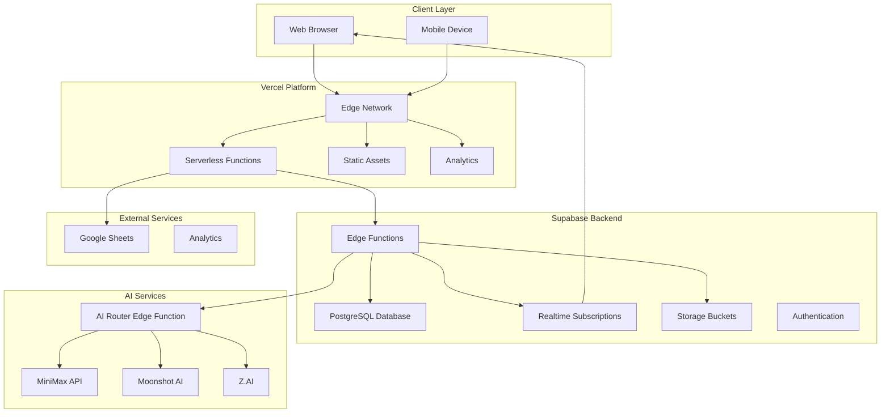

# Technical Integration Patterns

**⚠️ AI CONFIGURATIONS UPDATED - VERIFY BEFORE PRODUCTION**

**Document Version:** 2.1  
**Date:** 2026-01-03  
**Project:** Baby Shower App Redesign  
**Status:** MiniMax Aligned - AI Router Architecture (UPDATED)

---

## 1. Integration Architecture Overview

### 1.1 System Architecture

The Baby Shower app integrates three primary services: Supabase for backend/database, Vercel for frontend hosting and serverless functions, and a multi-provider AI Router for personality-driven AI capabilities. This section documents the integration patterns and data flow between these services.

**Key Architectural Change:** Direct MiniMax API calls have been replaced with the AI Router Edge Function (`/functions/ai-router`) that routes requests to specialized providers based on character personality and intent type.



### 1.2 Data Flow Patterns

| Pattern | Description | Use Case |
|---------|-------------|----------|
| **Request-Response** | Synchronous API calls | Form submissions, queries, AI requests |
| **Event-Driven** | Asynchronous event handling | Database triggers, webhooks |
| **Realtime Streaming** | WebSocket connections | Live updates, activity feed |
| **Batch Processing** | Scheduled bulk operations | Analytics aggregation, backups |
| **AI Routing** | Intent-based provider routing | Personality-driven AI responses |

### 1.3 Integration Points

| From | To | Protocol | Purpose |
|------|-----|----------|---------|
| Frontend | Vercel Edge | HTTPS | Static asset delivery |
| Frontend | Supabase Edge Functions | HTTPS | API calls (including AI Router) |
| Supabase Edge Functions | Supabase Database | PostgreSQL | Data persistence |
| AI Router | MiniMax API | HTTPS | General AI text generation |
| AI Router | Moonshot AI | HTTPS | Roast/Humor AI responses |
| AI Router | Z.AI | HTTPS | Game logic/Agentic AI responses |
| Vercel Serverless | Supabase Database | HTTPS | Admin operations |
| Supabase | Google Sheets | HTTPS | Data backup webhooks |

---

## 2. Frontend-to-Backend Integration

### 2.1 API Client Architecture

```typescript
// scripts/api-supabase.ts

interface ApiConfig {
  supabaseUrl: string;
  supabaseAnonKey: string;
  vercelApiUrl: string;
}

interface ApiClient {
  // Guestbook operations
  submitGuestbook(entry: GuestbookEntry): Promise<ApiResponse<GuestbookEntry>>;
  getGuestbookEntries(limit?: number): Promise<ApiResponse<GuestbookEntry[]>>;
  
  // Voting operations
  submitVote(names: string[]): Promise<ApiResponse<VoteEntry>>;
  getVoteCounts(): Promise<ApiResponse<VoteCounts>>;
  subscribeToVotes(callback: VoteCallback): UnsubscribeFn;
  
  // Pool operations
  submitPrediction(prediction: PredictionData): Promise<ApiResponse<PredictionEntry>>;
  getPoolEntries(): Promise<ApiResponse<PredictionEntry[]>>;
  
  // Quiz operations
  submitQuiz(answers: QuizAnswers): Promise<ApiResponse<QuizResult>>;
  getQuizResults(): Promise<ApiResponse<QuizResult[]>>;
  
  // Advice operations
  submitAdvice(advice: AdviceData): Promise<ApiResponse<AdviceEntry>>;
  getAdvice(category?: string): Promise<ApiResponse<AdviceEntry[]>>;
  
  // AI Router operations
  generateRoast(prediction: PredictionData): Promise<ApiResponse<AIResponse>>;
  generateGameResponse(intent: string, data: Record<string, unknown>): Promise<ApiResponse<AIResponse>>;
  chatWithAI(message: string, context?: Record<string, unknown>): Promise<ApiResponse<AIResponse>>;
  
  // Activity feed
  getRecentActivity(limit?: number): Promise<ApiResponse<ActivityEntry[]>>;
  subscribeToActivity(callback: ActivityCallback): UnsubscribeFn;
}

class SupabaseApiClient implements ApiClient {
  private config: ApiConfig;
  private supabase: SupabaseClient;
  private eventSource: EventSource | null = null;

  constructor(config: ApiConfig) {
    this.config = config;
    this.supabase = createClient(config.supabaseUrl, config.supabaseAnonKey);
  }

  async submitGuestbook(entry: GuestbookEntry): Promise<ApiResponse<GuestbookEntry>> {
    try {
      const { data, error } = await this.supabase.functions.invoke('guestbook', {
        body: entry
      });

      if (error) {
        return {
          success: false,
          error: error.message,
          data: null
        };
      }

      return {
        success: true,
        error: null,
        data: data
      };
    } catch (error) {
      return this.handleError(error);
    }
  }

  async generateRoast(prediction: PredictionData): Promise<ApiResponse<AIResponse>> {
    try {
      // Route to AI Router Edge Function for personality-driven response
      const { data, error } = await this.supabase.functions.invoke('ai-router', {
        body: {
          intent: 'roast',
          data: prediction,
          options: {
            personality: 'sassy',
            avatar: 'dad'
          }
        }
      });

      if (error) {
        return {
          success: false,
          error: error.message,
          data: null
        };
      }

      return {
        success: true,
        error: null,
        data: data
      };
    } catch (error) {
      return this.handleError(error);
    }
  }

  async chatWithAI(message: string, context?: Record<string, unknown>): Promise<ApiResponse<AIResponse>> {
    try {
      const { data, error } = await this.supabase.functions.invoke('ai-router', {
        body: {
          intent: 'general_chat',
          data: { message, ...context },
          options: {
            personality: 'helpful',
            avatar: 'mom'
          }
        }
      });

      if (error) {
        return {
          success: false,
          error: error.message,
          data: null
        };
      }

      return {
        success: true,
        error: null,
        data: data
      };
    } catch (error) {
      return this.handleError(error);
    }
  }

  subscribeToVotes(callback: VoteCallback): UnsubscribeFn {
    const subscription = this.supabase
      .channel('vote-updates')
      .on(
        'postgres_changes',
        {
          event: 'INSERT',
          schema: 'public',
          table: 'submissions',
          filter: "activity_type=eq.voting"
        },
        (payload) => {
          callback(payload.new as VoteEntry);
        }
      )
      .subscribe();

    return () => {
      subscription.unsubscribe();
    };
  }

  private handleError(error: unknown): ApiResponse<unknown> {
    console.error('API Error:', error);
    
    if (error instanceof Error) {
      return {
        success: false,
        error: error.message,
        data: null
      };
    }

    return {
      success: false,
      error: 'An unknown error occurred',
      data: null
    };
  }
}

// Factory function
function createApiClient(): ApiClient {
  const config: ApiConfig = {
    supabaseUrl: import.meta.env.VITE_SUPABASE_URL || '',
    supabaseAnonKey: import.meta.env.VITE_SUPABASE_ANON_KEY || '',
    vercelApiUrl: import.meta.env.VITE_VERCEL_API_URL || ''
  };

  return new SupabaseApiClient(config);
}
```

### 2.2 Request Handler with Retry Logic

```typescript
// scripts/utils/retry.ts

interface RetryConfig {
  maxAttempts: number;
  baseDelay: number;
  maxDelay: number;
  backoffMultiplier: number;
}

const defaultRetryConfig: RetryConfig = {
  maxAttempts: 3,
  baseDelay: 1000,
  maxDelay: 10000,
  backoffMultiplier: 2
};

async function withRetry<T>(
  operation: () => Promise<T>,
  config: Partial<RetryConfig> = {}
): Promise<T> {
  const { maxAttempts, baseDelay, maxDelay, backoffMultiplier } = {
    ...defaultRetryConfig,
    ...config
  };

  let lastError: Error | null = null;

  for (let attempt = 0; attempt < maxAttempts; attempt++) {
    try {
      return await operation();
    } catch (error) {
      lastError = error as Error;
      console.warn(`Attempt ${attempt + 1} failed:`, lastError.message);

      if (attempt < maxAttempts - 1) {
        const delay = Math.min(
          baseDelay * Math.pow(backoffMultiplier, attempt),
          maxDelay
        );

        // Add jitter to prevent thundering herd
        const jitter = delay * (0.5 + Math.random() * 0.5);
        await new Promise(resolve => setTimeout(resolve, jitter));
      }
    }
  }

  throw lastError;
}

// Usage example
async function fetchVoteCounts(): Promise<VoteCounts> {
  return withRetry(
    async () => {
      const response = await fetch('/api/votes');
      if (!response.ok) throw new Error('Failed to fetch votes');
      return response.json();
    },
    { maxAttempts: 3, baseDelay: 500 }
  );
}
```

### 2.3 Offline Support with Queue

```typescript
// scripts/offline-queue.ts

interface QueuedRequest {
  id: string;
  type: 'guestbook' | 'vote' | 'pool' | 'quiz' | 'advice';
  data: Record<string, unknown>;
  timestamp: number;
  retries: number;
}

class OfflineQueue {
  private queue: QueuedRequest[] = [];
  private isOnline: boolean = true;
  private storageKey = 'baby-shower-offline-queue';

  constructor() {
    // Load from localStorage
    const saved = localStorage.getItem(this.storageKey);
    if (saved) {
      this.queue = JSON.parse(saved);
    }

    // Listen for online/offline events
    window.addEventListener('online', () => this.processQueue());
    window.addEventListener('offline', () => {
      this.isOnline = false;
    });
    this.isOnline = navigator.onLine;
  }

  async add(type: QueuedRequest['type'], data: Record<string, unknown>): Promise<void> {
    const request: QueuedRequest = {
      id: this.generateId(),
      type,
      data,
      timestamp: Date.now(),
      retries: 0
    };

    this.queue.push(request);
    this.persist();

    if (this.isOnline) {
      await this.processQueue();
    }
  }

  private async processQueue(): Promise<void> {
    if (this.queue.length === 0) return;

    this.isOnline = navigator.onLine;
    if (!this.isOnline) return;

    const api = createApiClient();

    // Process queue in order
    while (this.queue.length > 0) {
      const request = this.queue[0];

      try {
        switch (request.type) {
          case 'guestbook':
            await api.submitGuestbook(request.data as GuestbookEntry);
            break;
          case 'vote':
            await api.submitVote(request.data.names as string[]);
            break;
          case 'pool':
            await api.submitPrediction(request.data as PredictionData);
            break;
          case 'quiz':
            await api.submitQuiz(request.data as QuizAnswers);
            break;
          case 'advice':
            await api.submitAdvice(request.data as AdviceData);
            break;
        }

        // Success - remove from queue
        this.queue.shift();
        this.persist();

      } catch (error) {
        request.retries++;

        if (request.retries >= 3) {
          // Too many retries - move to dead letter queue
          console.error('Request failed after 3 retries:', request);
          this.queue.shift();
          this.persist();

          // Notify user
          this.notifyFailure(request);
        } else {
          // Wait before retry
          await new Promise(resolve => 
            setTimeout(resolve, Math.pow(2, request.retries) * 1000)
          );
        }
      }
    }
  }

  private persist(): void {
    localStorage.setItem(this.storageKey, JSON.stringify(this.queue));
  }

  private generateId(): string {
    return `${Date.now().toString(36)}-${Math.random().toString(36).substr(2, 9)}`;
  }

  private notifyFailure(request: QueuedRequest): void {
    // Show notification to user
    const event = new CustomEvent('offline-sync-failed', { detail: request });
    window.dispatchEvent(event);
  }
}

export const offlineQueue = new OfflineQueue();
```

---

## 3. Backend Integration Patterns

### 3.1 Supabase Edge Function Structure

```typescript
// supabase/functions/_shared/types.ts

interface BaseContext {
  request: Request;
  env: Record<string, string>;
  supabase: SupabaseClient;
}

interface SubmissionContext extends BaseContext {
  data: Record<string, unknown>;
  user?: {
    id: string;
    email: string;
    role: string;
  };
}

interface AIContext extends BaseContext {
  intent: 'roast' | 'game_logic' | 'general_chat';
  data: Record<string, unknown>;
  options?: {
    personality?: string;
    avatar?: 'mom' | 'dad' | 'thinking' | 'celebration';
    temperature?: number;
  };
}

type Handler<T = unknown> = (context: SubmissionContext) => Promise<Response>;
type AIHandler = (context: AIContext) => Promise<Response>;

// Middleware chain
async function withAuth(
  handler: Handler
): Promise<Handler> {
  return async (context: SubmissionContext) => {
    const authHeader = context.request.headers.get('Authorization');
    
    if (!authHeader) {
      return new Response(
        JSON.stringify({ error: 'Authorization required' }),
        { status: 401 }
      );
    }

    // Verify JWT
    const { data: user, error } = await context.supabase.auth.getUser(
      authHeader.replace('Bearer ', '')
    );

    if (error || !user) {
      return new Response(
        JSON.stringify({ error: 'Invalid authorization' }),
        { status: 401 }
      );
    }

    return handler({
      ...context,
      user: {
        id: user.id,
        email: user.email || '',
        role: user.role || 'authenticated'
      }
    });
  };
}

async function withValidation<T>(
  handler: Handler,
  schema: Record<string, unknown>
): Promise<Handler> {
  return async (context: SubmissionContext) => {
    // Validate request body against schema
    const validationResult = validateSchema(context.data, schema);
    
    if (!validationResult.valid) {
      return new Response(
        JSON.stringify({ 
          error: 'Validation failed',
          details: validationResult.errors 
        }),
        { status: 400 }
      );
    }

    return handler(context);
  };
}

async function withLogging(
  handler: Handler,
  functionName: string
): Promise<Handler> {
  return async (context: SubmissionContext) => {
    const startTime = Date.now();
    
    try {
      const response = await handler(context);
      const duration = Date.now() - startTime;

      console.log(JSON.stringify({
        function: functionName,
        status: response.status,
        duration: `${duration}ms`,
        timestamp: new Date().toISOString()
      }));

      return response;
    } catch (error) {
      const duration = Date.now() - startTime;

      console.error(JSON.stringify({
        function: functionName,
        error: (error as Error).message,
        duration: `${duration}ms`,
        timestamp: new Date().toISOString()
      }));

      throw error;
    }
  };
}

// Example function composition
export const handleGuestbook = withLogging(
  withAuth(
    withValidation(
      async (context) => {
        const { name, message, relationship, photo_url } = context.data;

        const { data, error } = await context.supabase
          .from('submissions')
          .insert({
            name,
            activity_type: 'guestbook',
            activity_data: {
              message,
              relationship,
              photo_url
            }
          })
          .select()
          .single();

        if (error) throw error;

        return new Response(
          JSON.stringify({ success: true, data }),
          { status: 201 }
        );
      },
      {
        name: { type: 'string', minLength: 1, maxLength: 100 },
        message: { type: 'string', minLength: 1, maxLength: 2000 },
        relationship: { type: 'string', minLength: 1, maxLength: 100 }
      }
    )
  ),
  'guestbook'
);
```

### 3.2 Database Trigger Pattern

```sql
-- triggers/submission_triggers.sql

-- Function to handle submission notifications
CREATE OR REPLACE FUNCTION internal.handle_submission_notification()
RETURNS TRIGGER AS $$
DECLARE
    notification_payload JSONB;
    milestone_count INTEGER;
BEGIN
    -- Build notification payload
    notification_payload := jsonb_build_object(
        'type', NEW.activity_type,
        'name', NEW.name,
        'data', NEW.activity_data,
        'timestamp', NEW.created_at
    );

    -- Check for milestone (50th submission)
    IF NEW.activity_type = 'guestbook' THEN
        SELECT COUNT(*) INTO milestone_count
        FROM public.submissions
        WHERE activity_type = 'guestbook';

        IF milestone_count % 50 = 0 THEN
            notification_payload := notification_payload || jsonb_build_object(
                'milestone', jsonb_build_object(
                    'type', 'guestbook_milestone',
                    'count', milestone_count,
                    'message', format('%s wishes recorded! Time to celebrate! 🧁', milestone_count)
                )
            );
        END IF;
    END IF;

    -- Notify via pg_notify
    PERFORM pg_notify(
        'submission_events',
        notification_payload::TEXT
    );

    RETURN NEW;
END;
$$ LANGUAGE plpgsql SECURITY DEFINER;

-- Attach trigger
CREATE TRIGGER on_submission_insert
    AFTER INSERT ON public.submissions
    FOR EACH ROW
    EXECUTE FUNCTION internal.handle_submission_notification();
```

### 3.3 Webhook Handler Pattern

```typescript
// api/webhooks/submissions.ts

interface WebhookPayload {
  event: string;
  data: Record<string, unknown>;
  timestamp: string;
}

interface WebhookHandler {
  event: string;
  handler: (data: Record<string, unknown>) => Promise<void>;
}

const webhookHandlers: WebhookHandler[] = [
  {
    event: 'submission.created',
    handler: async (data) => {
      // Sync to Google Sheets
      await syncToGoogleSheets(data);
      
      // Send analytics event
      await sendAnalyticsEvent('submission', data);
      
      // Check for milestone
      await checkMilestone(data);
    }
  },
  {
    event: 'submission.m milestone',
    handler: async (data) => {
      // Trigger celebration
      await triggerCelebration(data);
      
      // Send notification to admin
      await notifyAdmin(data);
    }
  }
];

export default async function handler(req: Request): Promise<Response> {
  if (req.method !== 'POST') {
    return new Response('Method not allowed', { status: 405 });
  }

  // Verify webhook signature
  const signature = req.headers.get('x-webhook-signature');
  if (!verifyWebhookSignature(signature, req.body)) {
    return new Response('Invalid signature', { status: 401 });
  }

  const payload: WebhookPayload = await req.json();

  try {
    // Find handler for event
    const handler = webhookHandlers.find(h => h.event === payload.event);
    
    if (!handler) {
      return new Response(
        JSON.stringify({ error: 'Unknown event type' }),
        { status: 400 }
      );
    }

    await handler.handler(payload.data);

    return new Response(
      JSON.stringify({ success: true }),
      { status: 200 }
    );

  } catch (error) {
    console.error('Webhook handler error:', error);
    
    return new Response(
      JSON.stringify({ error: 'Webhook processing failed' }),
      { status: 500 }
    );
  }
}

function verifyWebhookSignature(signature: string | null, body: string): boolean {
  if (!signature) return false;
  
  const secret = process.env.WEBHOOK_SECRET || '';
  const expectedSignature = crypto
    .createHmac('sha256', secret)
    .update(body)
    .digest('hex');
  
  return signature === expectedSignature;
}
```

---

## 4. AI Router Integration Patterns

### 4.1 AI Router Architecture

The AI Router is a Supabase Edge Function that routes AI requests to specialized providers based on intent type. This replaces direct MiniMax API calls with a personality-driven routing system.

```typescript
// supabase/functions/ai-router/index.ts

import "jsr:@supabase/functions-js/edge-runtime.d.ts";

interface AIRequest {
  intent: 'roast' | 'game_logic' | 'general_chat';
  data: Record<string, unknown>;
  options?: {
    personality?: string;
    avatar?: 'mom' | 'dad' | 'thinking' | 'celebration';
    temperature?: number;
    max_tokens?: number;
  };
}

interface AIResponse {
  success: boolean;
  text?: string;
  emotion?: string;
  avatar?: string;
  provider?: string;
  cached?: boolean;
  error?: string;
}

// Provider configurations - UPDATED 2026-01-03 with verified models/URLs
const PROVIDERS = {
  roast: {
    provider: 'moonshot',
    model: 'kimi-k2',  // Updated from moonshot-v1-8k
    baseUrl: 'https://api.moonshot.ai/v1'  // Updated: global endpoint
  },
  game_logic: {
    provider: 'zai',
    model: 'glm-4.7',  // UPDATED: Latest flagship model (Dec 2025)
    baseUrl: 'https://api.z.ai/api/paas/v4'  // Updated endpoint
  },
  general_chat: {
    provider: 'minimax',
    model: 'MiniMax-M2.1',  // Updated from abab6.5s-chat
    baseUrl: 'https://api.minimax.chat/v1'  // Updated: OpenAI-compatible endpoint
  }
};

// Intent classifier patterns
const INTENT_PATTERNS = {
  roast: [
    /roast/i,
    /funny/i,
    /joke/i,
    /sassy/i,
    /tease/i,
    /playful/i
  ],
  game_logic: [
    /game/i,
    /score/i,
    /win/i,
    /规则/i,
    /logic/i,
    /agent/i
  ]
};

Deno.serve(async (req: Request) => {
  try {
    const body: AIRequest = await req.json();
    
    // Auto-classify intent if not provided
    const intent = body.intent || classifyIntent(body.data);
    
    // Get provider configuration
    const providerConfig = PROVIDERS[intent] || PROVIDERS.general_chat;
    
    // Execute AI request
    const response = await executeAIRoute(intent, body.data, body.options);
    
    return new Response(JSON.stringify(response), {
      headers: { 'Content-Type': 'application/json' }
    });
    
  } catch (error) {
    console.error('AI Router error:', error);
    
    return new Response(JSON.stringify({
      success: false,
      error: error.message,
      fallback: true
    }), {
      status: 200, // Return 200 to allow frontend fallback
      headers: { 'Content-Type': 'application/json' }
    });
  }
});

function classifyIntent(data: Record<string, unknown>): AIRequest['intent'] {
  const message = JSON.stringify(data).toLowerCase();
  
  for (const pattern of INTENT_PATTERNS.roast) {
    if (pattern.test(message)) return 'roast';
  }
  
  for (const pattern of INTENT_PATTERNS.game_logic) {
    if (pattern.test(message)) return 'game_logic';
  }
  
  return 'general_chat';
}

async function executeAIRoute(
  intent: string,
  data: Record<string, unknown>,
  options?: AIRequest['options']
): Promise<AIResponse> {
  const providerConfig = PROVIDERS[intent as keyof typeof PROVIDERS] || PROVIDERS.general_chat;
  
  const apiKey = Deno.env.get(`${providerConfig.provider.toUpperCase()}_API_KEY`);
  if (!apiKey) {
    return generateFallbackResponse(intent);
  }
  
  try {
    const response = await fetch(`${providerConfig.baseUrl}/chat/completions`, {
      method: 'POST',
      headers: {
        'Authorization': `Bearer ${apiKey}`,
        'Content-Type': 'application/json'
      },
      body: JSON.stringify({
        model: providerConfig.model,
        messages: [{ role: 'user', content: buildPrompt(intent, data) }],
        temperature: options?.temperature ?? getDefaultTemperature(intent),
        max_tokens: options?.max_tokens ?? 200
      })
    });
    
    if (!response.ok) {
      throw new Error(`Provider error: ${response.status}`);
    }
    
    const result = await response.json();
    const text = result.choices?.[0]?.message?.content;
    
    return {
      success: true,
      text,
      emotion: inferEmotion(intent),
      avatar: options?.avatar || inferAvatar(intent),
      provider: providerConfig.provider
    };
    
  } catch (error) {
    console.warn(`AI provider ${providerConfig.provider} failed:`, error);
    
    // Try fallback providers
    return tryFallbackProvider(intent, data, options);
  }
}

function buildPrompt(intent: string, data: Record<string, unknown>): string {
  const templates: Record<string, (data: Record<string, unknown>) => string> = {
    roast: (data) => `Write a playful, family-friendly roast for this baby pool prediction:
${JSON.stringify(data, null, 2)}
Keep it under 100 words. No baby voice.`,
    
    game_logic: (data) => `Analyze this game input and provide structured output:
${JSON.stringify(data, null, 2)}
Respond in JSON format.`,
    
    general_chat: (data) => `Respond to this message helpfully:
${JSON.stringify(data, null, 2)}`
  };
  
  return templates[intent](data);
}

function getDefaultTemperature(intent: string): number {
  const temperatures: Record<string, number> = {
    roast: 0.8,
    game_logic: 0.4,
    general_chat: 0.7
  };
  return temperatures[intent] ?? 0.7;
}

function inferEmotion(intent: string): string {
  const emotions: Record<string, string> = {
    roast: 'sassy',
    game_logic: 'thinking',
    general_chat: 'happy'
  };
  return emotions[intent] ?? 'neutral';
}

function inferAvatar(intent: string): string {
  const avatars: Record<string, string> = {
    roast: 'dad',
    game_logic: 'thinking',
    general_chat: 'mom'
  };
  return avatars[intent] ?? 'mom';
}

function generateFallbackResponse(intent: string): AIResponse {
  const fallbacks: Record<string, string> = {
    roast: "Your prediction is... certainly memorable! Either you're right or baby has some surprises ahead. 🍼",
    game_logic: "Let me help you with that game logic!",
    general_chat: "Thanks for your message! How can I help you today?"
  };
  
  return {
    success: true,
    text: fallbacks[intent] || "Thanks for participating! 🎉",
    emotion: 'happy',
    avatar: inferAvatar(intent),
    provider: 'fallback',
    cached: true
  };
}

async function tryFallbackProvider(
  intent: string,
  data: Record<string, unknown>,
  options?: AIRequest['options']
): Promise<AIResponse> {
  // Try MiniMax as universal fallback
  if (intent !== 'general_chat') {
    try {
      return await executeAIRoute('general_chat', data, options);
    } catch {
      // Continue to fallback response
    }
  }
  
  return generateFallbackResponse(intent);
}
```

### 4.2 Personality-Driven Routing Configuration

```typescript
// supabase/functions/ai-router/personality-config.ts

interface PersonalityConfig {
  name: string;
  avatar: 'mom' | 'dad' | 'thinking' | 'celebration';
  temperature: number;
  systemPrompt: string;
  fallbackProvider: string;
}

export const PERSONALITY_CONFIGS: Record<string, PersonalityConfig> = {
  sassy: {
    name: 'Dad',
    avatar: 'dad',
    temperature: 0.85,
    systemPrompt: `You are the "Dad" character - playful, slightly sarcastic, 
      but always family-friendly. You deliver "roasts" that are witty and fun. 
      Use humor that everyone can enjoy.`,
    fallbackProvider: 'minimax'
  },
  helpful: {
    name: 'Mom',
    avatar: 'mom',
    temperature: 0.7,
    systemPrompt: `You are the "Mom" character - warm, supportive, and helpful. 
      You provide encouragement and useful advice.`,
    fallbackProvider: 'minimax'
  },
  analytical: {
    name: 'Thinking',
    avatar: 'thinking',
    temperature: 0.4,
    systemPrompt: `You are analytical and precise. You help with game logic 
      and structured decision-making.`,
    fallbackProvider: 'zai'
  },
  celebratory: {
    name: 'Celebration',
    avatar: 'celebration',
    temperature: 0.9,
    systemPrompt: `You are enthusiastic and celebratory. You express joy 
      and excitement for achievements.`,
    fallbackProvider: 'minimax'
  }
};

export function getPersonalityConfig(name: string): PersonalityConfig {
  return PERSONALITY_CONFIGS[name] || PERSONALITY_CONFIGS.helpful;
}
```

### 4.3 Circuit Breaker Pattern for AI Providers

```typescript
// supabase/functions/ai-router/circuit-breaker.ts

interface CircuitBreakerState {
  failures: number;
  lastFailure: number;
  state: 'closed' | 'open' | 'half-open';
}

const CIRCUIT_BREAKER_CONFIG = {
  failureThreshold: 3,      // Open circuit after 3 failures
  recoveryTime: 30000,      // 30 seconds before trying again
  halfOpenSuccessThreshold: 2 // Need 2 successes to close circuit
};

const circuitBreakers: Map<string, CircuitBreakerState> = new Map();

export function checkCircuitBreaker(provider: string): boolean {
  const state = circuitBreakers.get(provider);
  
  if (!state) {
    return true; // Circuit is closed (healthy)
  }
  
  if (state.state === 'open') {
    const timeSinceFailure = Date.now() - state.lastFailure;
    if (timeSinceFailure > CIRCUIT_BREAKER_CONFIG.recoveryTime) {
      // Transition to half-open
      state.state = 'half-open';
      circuitBreakers.set(provider, state);
      return true;
    }
    return false; // Circuit is open, reject requests
  }
  
  return true; // Half-open, allow single request
}

export function recordFailure(provider: string): void {
  const state = circuitBreakers.get(provider) || {
    failures: 0,
    lastFailure: 0,
    state: 'closed'
  };
  
  state.failures++;
  state.lastFailure = Date.now();
  
  if (state.failures >= CIRCUIT_BREAKER_CONFIG.failureThreshold) {
    state.state = 'open';
    console.warn(`Circuit breaker opened for provider: ${provider}`);
  }
  
  circuitBreakers.set(provider, state);
}

export function recordSuccess(provider: string): void {
  const state = circuitBreakers.get(provider);
  
  if (!state) return;
  
  if (state.state === 'half-open') {
    state.failures = 0;
    state.state = 'closed';
    console.info(`Circuit breaker closed for provider: ${provider}`);
  } else {
    state.failures = 0;
  }
  
  circuitBreakers.set(provider, state);
}

export function getCircuitBreakerStatus(): Record<string, CircuitBreakerState> {
  return Object.fromEntries(circuitBreakers);
}
```

### 4.4 Health Monitor for AI Providers

```typescript
// supabase/functions/health-monitor/index.ts

interface ProviderHealth {
  provider: string;
  healthy: boolean;
  latency: number;
  lastCheck: number;
  error?: string;
}

const HEALTH_CONFIG = {
  checkInterval: 60000, // Check every 60 seconds
  timeout: 5000         // 5 second timeout for health checks
};

const providerHealth: Map<string, ProviderHealth> = new Map();

export async function checkProviderHealth(
  provider: string,
  checkFn: () => Promise<boolean>
): Promise<ProviderHealth> {
  const startTime = Date.now();
  let healthy = false;
  let error: string | undefined;
  
  try {
    const timeoutPromise = new Promise((_, reject) => 
      setTimeout(() => reject(new Error('Health check timeout')), HEALTH_CONFIG.timeout)
    );
    
    healthy = await Promise.race([checkFn(), timeoutPromise]);
  } catch (e) {
    error = (e as Error).message;
    healthy = false;
  }
  
  const latency = Date.now() - startTime;
  const health: ProviderHealth = {
    provider,
    healthy,
    latency,
    lastCheck: Date.now(),
    error
  };
  
  providerHealth.set(provider, health);
  
  // Update circuit breaker based on health
  if (healthy) {
    recordSuccess(provider);
  } else {
    recordFailure(provider);
  }
  
  return health;
}

export function getAllProviderHealth(): ProviderHealth[] {
  return Array.from(providerHealth.values());
}

export function getHealthyProviders(): string[] {
  return Array.from(providerHealth.entries())
    .filter(([_, health]) => health.healthy)
    .map(([provider]) => provider);
}
```

### 4.5 Fallback Content System

```typescript
// ai/fallback-generator.ts

interface FallbackContent {
  roast: string[];
  categorize: Record<string, string>;
  generate: Record<string, string>;
  game_logic: Record<string, string>;
  general_chat: Record<string, string>;
}

const fallbackContent: FallbackContent = {
  roast: [
    "Your prediction is... certainly memorable! Either you're right or baby has some surprises ahead. 🍼",
    "Bold prediction! Either you'll be the hero of the day or we'll be reminding you of this moment for years!",
    "Wow! That's quite a prediction you've made there! We can't wait to see if you're spot-on!",
    "Either you have insider information or you're just feeling confident! Either way, we love the enthusiasm!",
    "Your prediction is definitely... unique! Whether it's spot-on or hilariously wrong, it adds to the fun!"
  ],
  categorize: {
    general: "Thanks for the great advice!",
    naming: "Great name suggestions!",
    feeding: "Solid feeding tips!",
    sleeping: "Hope these sleep tips work for you!",
    safety: "Important safety reminders!",
    fun: "Love the fun suggestions!",
    milestone: "Exciting milestone tips!",
    relationship: "Great relationship advice!"
  },
  generate: {
    welcome: "Welcome to {{ babyName }}'s Shower! 🎉",
    milestone: "🎉 Milestone reached!",
    celebration: "Let's celebrate! 🥳",
    encouragement: "You're doing great! 💪"
  },
  game_logic: {
    score: "Let me calculate that for you!",
    rule: "Here's how that works...",
    default: "I'm thinking... 🤔"
  },
  general_chat: {
    greeting: "Hi there! 👋 How can I help you today?",
    thanks: "You're welcome! 😊",
    goodbye: "Thanks for visiting! Come back soon! 👋",
    unclear: "I'm not sure I understand. Could you tell me more?"
  }
};

class FallbackGenerator {
  generate(type: string, data: Record<string, unknown>): string {
    switch (type) {
      case 'roast':
        return this.getRandomRoast();
      case 'categorize':
        return fallbackContent.categorize[data.category as string] || 
               fallbackContent.categorize.general;
      case 'game_logic':
        return fallbackContent.game_logic[data.subtype as string] || 
               fallbackContent.game_logic.default;
      case 'general_chat':
        return fallbackContent.general_chat[data.purpose as string] || 
               fallbackContent.general_chat.greeting;
      case 'generate':
        return fallbackContent.generate[data.purpose as string] || 
               fallbackContent.generate.welcome;
      default:
        return "Thanks for participating! 🎉";
    }
  }

  getRandomRoast(): string {
    const index = Math.floor(Math.random() * fallbackContent.roast.length);
    return fallbackContent.roast[index];
  }
}

export const fallbackGenerator = new FallbackGenerator();
```

---

## 5. Realtime Synchronization

### 5.1 Supabase Realtime Setup

```typescript
// scripts/realtime/manager.ts

interface RealtimeConfig {
  supabaseUrl: string;
  supabaseKey: string;
  table: string;
  filters?: { column: string; value: string }[];
}

type RealtimeCallback<T> = (data: T) => void;

class RealtimeManager<T extends Record<string, unknown>> {
  private supabase: SupabaseClient;
  private channel: RealtimeChannel | null = null;
  private callbacks: Map<string, Set<RealtimeCallback<T>>> = new Map();
  private config: RealtimeConfig;

  constructor(config: RealtimeConfig) {
    this.config = config;
    this.supabase = createClient(config.supabaseUrl, config.supabaseKey);
  }

  subscribe(event: string, callback: RealtimeCallback<T>): () => void {
    // Ensure channel is connected
    if (!this.channel) {
      this.connect();
    }

    // Add callback to registry
    if (!this.callbacks.has(event)) {
      this.callbacks.set(event, new Set());
    }
    this.callbacks.get(event)!.add(callback);

    // Return unsubscribe function
    return () => {
      this.callbacks.get(event)?.delete(callback);
      if (this.callbacks.get(event)?.size === 0) {
        this.callbacks.delete(event);
        this.unsubscribe(event);
      }
    };
  }

  private connect(): void {
    const channelConfig = {
      event: 'postgres_changes',
      schema: 'public',
      table: this.config.table,
      filter: this.config.filters?.map(f => 
        `${f.column}=eq.${f.value}`
      ).join(',') || undefined
    };

    this.channel = this.supabase
      .channel(this.config.table)
      .on(channelConfig, (payload) => {
        this.handleEvent(payload);
      })
      .subscribe((status) => {
        if (status === 'SUBSCRIBED') {
          console.log('Realtime connected to', this.config.table);
        } else if (status === 'CHANNEL_ERROR') {
          console.error('Realtime channel error');
          this.reconnect();
        }
      });
  }

  private handleEvent(payload: { eventType: string; new: T; old?: T }): void {
    const event = payload.eventType.toLowerCase(); // INSERT, UPDATE, DELETE
    
    const callbacks = this.callbacks.get(event);
    if (callbacks) {
      callbacks.forEach(callback => {
        try {
          callback(payload.new);
        } catch (error) {
          console.error('Realtime callback error:', error);
        }
      });
    }

    // Also trigger 'all' events
    const allCallbacks = this.callbacks.get('all');
    if (allCallbacks) {
      allCallbacks.forEach(callback => {
        try {
          callback(payload.new);
        } catch (error) {
          console.error('Realtime callback error:', error);
        }
      });
    }
  }

  private reconnect(): void {
    setTimeout(() => {
      if (this.channel) {
        this.supabase.removeChannel(this.channel);
      }
      this.connect();
    }, 5000);
  }

  private unsubscribe(event: string): void {
    if (this.callbacks.size === 0 && this.channel) {
      this.supabase.removeChannel(this.channel);
      this.channel = null;
    }
  }

  disconnect(): void {
    if (this.channel) {
      this.supabase.removeChannel(this.channel);
      this.channel = null;
    }
    this.callbacks.clear();
  }
}

// Factory function
export function createRealtimeManager<T extends Record<string, unknown>>(
  config: Omit<RealtimeConfig, 'supabaseUrl' | 'supabaseKey'>
): RealtimeManager<T> {
  return new RealtimeManager<T>({
    supabaseUrl: import.meta.env.VITE_SUPABASE_URL || '',
    supabaseKey: import.meta.env.VITE_SUPABASE_ANON_KEY || '',
    ...config
  });
}
```

### 5.2 Activity Feed Implementation

```typescript
// scripts/realtime/activity-feed.ts

interface ActivityItem {
  id: string;
  type: 'guestbook' | 'vote' | 'pool' | 'quiz' | 'advice';
  name: string;
  description: string;
  timestamp: Date;
  highlighted?: boolean;
}

class ActivityFeed {
  private items: ActivityItem[] = [];
  private maxItems: number = 50;
  private callbacks: Set<(items: ActivityItem[]) => void> = new Set();

  constructor() {
    // Load from localStorage
    const saved = localStorage.getItem('activity-feed');
    if (saved) {
      this.items = JSON.parse(saved);
    }
  }

  addItem(item: Omit<ActivityItem, 'id' | 'timestamp'>): void {
    const newItem: ActivityItem = {
      ...item,
      id: this.generateId(),
      timestamp: new Date()
    };

    this.items.unshift(newItem);

    // Limit size
    if (this.items.length > this.maxItems) {
      this.items = this.items.slice(0, this.maxItems);
    }

    this.persist();
    this.notifySubscribers();
  }

  subscribe(callback: (items: ActivityItem[]) => void): () => void {
    this.callbacks.add(callback);
    
    // Immediately call with current state
    callback(this.items);

    return () => {
      this.callbacks.delete(callback);
    };
  }

  getItems(): ActivityItem[] {
    return [...this.items];
  }

  private notifySubscribers(): void {
    this.callbacks.forEach(callback => {
      try {
        callback(this.items);
      } catch (error) {
        console.error('Activity feed callback error:', error);
      }
    });
  }

  private persist(): void {
    localStorage.setItem('activity-feed', JSON.stringify(this.items));
  }

  private generateId(): string {
    return `${Date.now().toString(36)}-${Math.random().toString(36).substr(2, 9)}`;
  }
}

export const activityFeed = new ActivityFeed();
```

---

## 6. Error Handling Patterns

### 6.1 Comprehensive Error Handler

```typescript
// utils/error-handler.ts

interface ErrorResponse {
  code: string;
  message: string;
  details?: Record<string, unknown>;
  timestamp: string;
}

type ErrorHandler = (error: Error, context?: Record<string, unknown>) => void;

class ErrorManager {
  private handlers: Map<string, ErrorHandler> = new Map();
  private context: Map<string, unknown> = new Map();

  constructor() {
    // Register default handlers
    this.register('NETWORK_ERROR', this.handleNetworkError);
    this.register('VALIDATION_ERROR', this.handleValidationError);
    this.register('AUTH_ERROR', this.handleAuthError);
    this.register('DATABASE_ERROR', this.handleDatabaseError);
    this.register('AI_ERROR', this.handleAIError);
    this.register('AI_ROUTER_ERROR', this.handleAIRouterError);
  }

  register(code: string, handler: ErrorHandler): void {
    this.handlers.set(code, handler);
  }

  handle(error: Error, context?: Record<string, unknown>): ErrorResponse {
    const code = this.determineErrorCode(error);
    const handler = this.handlers.get(code) || this.defaultHandler;

    // Add context
    if (context) {
      this.context = new Map(Object.entries(context));
    }

    // Execute handler
    handler(error, Object.fromEntries(this.context));

    // Build response
    return {
      code,
      message: this.getUserMessage(code),
      details: {
        error: error.message,
        context: Object.fromEntries(this.context),
        timestamp: new Date().toISOString()
      }
    };
  }

  private determineErrorCode(error: Error): string {
    if (error.name === 'NetworkError') return 'NETWORK_ERROR';
    if (error.message.includes('validation')) return 'VALIDATION_ERROR';
    if (error.message.includes('auth') || error.message.includes('Unauthorized')) return 'AUTH_ERROR';
    if (error.message.includes('database') || error.message.includes('Supabase')) return 'DATABASE_ERROR';
    if (error.message.includes('AI Router')) return 'AI_ROUTER_ERROR';
    if (error.message.includes('AI') || error.message.includes('MiniMax') || error.message.includes('circuit')) return 'AI_ERROR';
    return 'UNKNOWN_ERROR';
  }

  private handleNetworkError(error: Error, context?: Record<string, unknown>): void {
    console.warn('Network error occurred:', error.message);
    // Could trigger retry logic or offline queue
  }

  private handleValidationError(error: Error, context?: Record<string, unknown>): void {
    console.warn('Validation failed:', error.message);
    // Could trigger form validation updates
  }

  private handleAuthError(error: Error, context?: Record<string, unknown>): void {
    console.warn('Authentication error:', error.message);
    // Could trigger re-authentication flow
  }

  private handleDatabaseError(error: Error, context?: Record<string, unknown>): void {
    console.error('Database error:', error.message);
    // Could trigger error reporting
  }

  private handleAIError(error: Error, context?: Record<string, unknown>): void {
    console.warn('AI processing error, using fallback:', error.message);
    // Fallback content is already handled in AI pipeline
  }

  private handleAIRouterError(error: Error, context?: Record<string, unknown>): void {
    console.error('AI Router error:', error.message);
    // Log for monitoring, frontend should use fallback
  }

  private defaultHandler(error: Error): void {
    console.error('Unhandled error:', error);
  }

  private getUserMessage(code: string): string {
    const messages: Record<string, string> = {
      NETWORK_ERROR: 'Connection problem. Please check your internet.',
      VALIDATION_ERROR: 'Please check your input and try again.',
      AUTH_ERROR: 'Session expired. Please refresh and try again.',
      DATABASE_ERROR: 'Service temporarily unavailable. Please try again.',
      AI_ERROR: 'Something went wrong with AI. Please try again.',
      AI_ROUTER_ERROR: 'AI service is busy. Please try again in a moment.',
      UNKNOWN_ERROR: 'An unexpected error occurred. Please try again.'
    };
    return messages[code] || messages.UNKNOWN_ERROR;
  }
}

export const errorManager = new ErrorManager();
```

### 6.2 Graceful Degradation

```typescript
// utils/degradation.ts

interface FeatureStatus {
  name: string;
  available: boolean;
  fallback?: string;
  error?: string;
}

class DegradationManager {
  private features: Map<string, FeatureStatus> = new Map();

  constructor() {
    // Initialize feature statuses
    this.features.set('ai_roasts', { name: 'AI Roasts', available: true });
    this.features.set('ai_router', { name: 'AI Router', available: true });
    this.features.set('realtime_updates', { name: 'Live Updates', available: true });
    this.features.set('photo_uploads', { name: 'Photo Uploads', available: true });
    this.features.set('google_sheets_sync', { name: 'Google Sheets Sync', available: true });
  }

  async checkFeatures(): Promise<void> {
    // Check AI Router availability
    try {
      await this.testAIRouterEndpoint();
      this.features.set('ai_router', { ...this.features.get('ai_router')!, available: true });
    } catch (error) {
      this.features.set('ai_router', { 
        name: 'AI Router', 
        available: false,
        fallback: 'Static response templates'
      });
    }

    // Check AI individual providers
    try {
      await this.testProviderHealth();
      this.features.set('ai_roasts', { ...this.features.get('ai_roasts')!, available: true });
    } catch (error) {
      this.features.set('ai_roasts', { 
        name: 'AI Roasts', 
        available: false,
        fallback: 'Pre-generated roast messages'
      });
    }

    // Check Supabase availability
    try {
      await this.testSupabaseConnection();
      this.features.set('realtime_updates', { 
        name: 'Live Updates', 
        available: true 
      });
    } catch (error) {
      this.features.set('realtime_updates', { 
        name: 'Live Updates', 
        available: false,
        fallback: 'Manual refresh required'
      });
    }
  }

  getFeatureStatus(feature: string): FeatureStatus | undefined {
    return this.features.get(feature);
  }

  getAllStatus(): FeatureStatus[] {
    return Array.from(this.features.values());
  }

  private async testAIRouterEndpoint(): Promise<void> {
    const response = await fetch(
      `${Deno.env.get('SUPABASE_URL')}/functions/v1/ai-router`,
      {
        method: 'POST',
        headers: {
          'Authorization': `Bearer ${Deno.env.get('SUPABASE_ANON_KEY')}`,
          'Content-Type': 'application/json'
        },
        body: JSON.stringify({
          intent: 'health_check',
          data: {}
        })
      }
    );

    if (!response.ok) {
      throw new Error('AI Router unavailable');
    }
  }

  private async testProviderHealth(): Promise<void> {
    // Check circuit breaker status
    const status = getCircuitBreakerStatus();
    const failedProviders = Object.entries(status)
      .filter(([_, state]) => state.state === 'open')
      .map(([provider]) => provider);
    
    if (failedProviders.length >= 2) {
      throw new Error('Multiple AI providers unavailable');
    }
  }

  private async testSupabaseConnection(): Promise<void> {
    const response = await fetch(
      `${Deno.env.get('SUPABASE_URL')}/rest/v1/submissions?select=count&limit=1`,
      {
        headers: {
          'apikey': Deno.env.get('SUPABASE_ANON_KEY') || ''
        }
      }
    );

    if (!response.ok) {
      throw new Error('Supabase unavailable');
    }
  }
}

export const degradationManager = new DegradationManager();
```

---

## 7. References

### 7.1 Official Documentation

- [Supabase Edge Functions](https://supabase.com/docs/guides/functions)
- [Supabase Realtime](https://supabase.com/docs/guides/realtime)
- [Vercel Serverless Functions](https://vercel.com/docs/functions)
- [MiniMax API Documentation](https://platform.minimax.io/docs/guides/models-intro) - UPDATED
- [Moonshot AI Documentation](https://platform.moonshot.cn/docs/guide/start-using-kimi-api) - UPDATED
- [Z.AI API Documentation](https://docs.z.ai/api-reference/llm/chat-completion) - UPDATED

### 7.2 Related Files in Project

- [`scripts/api-supabase.js`](scripts/api-supabase.js) - Current API client
- [`supabase/functions/`](supabase/functions/) - Edge Functions
- [`backend/supabase-integration.md`](backend/supabase-integration.md) - Integration guide
- [`docs/MiniMax_Plan/02_TECHNICAL_ARCHITECTURE.md`](docs/MiniMax_Plan/02_TECHNICAL_ARCHITECTURE.md) - AI Router architecture
- [`docs/MiniMax_Plan/99_COMPREHENSIVE_ANALYSIS.md`](docs/MiniMax_Plan/99_COMPREHENSIVE_ANALYSIS.md) - MiniMax plan analysis
- [`docs/REALIGNMENT_STRATEGY.md`](docs/REALIGNMENT_STRATEGY.md) - Migration strategy

### 7.3 External Resources

- [MDN Fetch API](https://developer.mozilla.org/en-US/docs/Web/API/Fetch_API)
- [PostgreSQL Triggers](https://www.postgresql.org/docs/current/triggers.html)
- [Webhooks Best Practices](https://webhooks.guide/)
- [Circuit Breaker Pattern](https://martinfowler.com/bliki/CircuitBreaker.html)

---

**Document Maintainer:** Infrastructure Analysis System  
**Last Updated:** 2026-01-03  
**Next Review:** 2026-02-03

**Changelog:**
- v2.0 (2026-01-03): Updated to MiniMax AI Router architecture with multi-provider routing
- v1.0 (2026-01-02): Initial document with single MiniMax API integration
