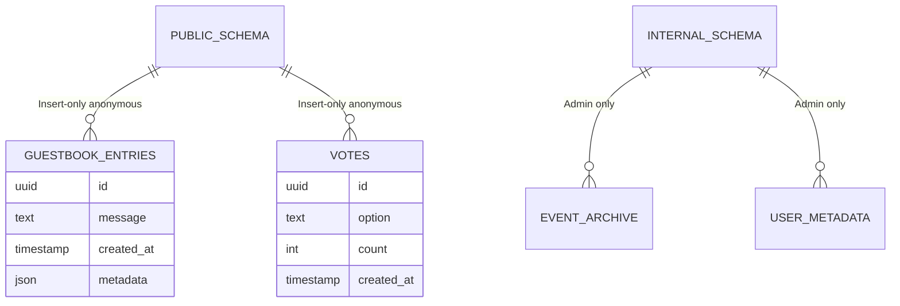

# MiniMax Plan Comprehensive Analysis

**Document Status:** Analysis Reference  
**Created:** 2026-01-03  
**Purpose:** Foundation document for the Baby Shower V2 realignment work

---

## Executive Summary

The MiniMax Plan represents a fundamental philosophical and technical shift from the current Baby Shower application architecture. This analysis identifies the core transformations required, documents key decisions, and highlights areas of alignment or potential conflict across the three core planning documents.

---

## 1. Core Philosophical Shifts

### From Static to Living Application

| Aspect | Old Architecture | MiniMax Vision |
|--------|------------------|----------------|
| **User Perception** | Digital form/greeting card | "Digital Living Room" - an interactive space |
| **Interaction Model** | Request-response submission | Conversational with AI "Hosts" |
| **Visual Treatment** | Standard flat web design | Game UI / Storybook aesthetic |
| **Animation** | Minimal/CSS-only | Physics-based spring animations, parallax backgrounds |
| **Backend Role** | Simple data storage | Intelligent routing, personality-driven responses |

### The System vs. Soul Metaphor

The plan introduces a dual-entity conceptualization that guides all decisions:

```
┌─────────────────────────────────────────────────────────────────┐
│                    THE BABY SHOWER APPLICATION                   │
├───────────────────────────┬─────────────────────────────────────┤
│      THE SOUL (Frontend)  │        THE SYSTEM (Backend)         │
│  ┌─────────────────────┐  │  ┌─────────────────────────────────┐ │
│  │ Vue 3 + Vite        │  │  │ Supabase (PostgreSQL +          │ │
│  │ Cinematic           │  │  │ Edge Functions)                 │ │
│  │ Animated            │  │  │ Secure                          │ │
│  │ Reactive            │  │  │ Realtime                        │ │
│  │ Ghibli-meets-       │  │  │ Firewalled Data                 │ │
│  │ Stardew Valley      │  │  │                                 │ │
│  └─────────────────────┘  │  └─────────────────────────────────┘ │
├───────────────────────────┴─────────────────────────────────────┤
│                    THE BRAIN (AI Layer)                          │
│  ┌─────────────────────────────────────────────────────────────┐ │
│  │ Multi-Provider Router (MiniMax, Moonshot, Z.AI)             │ │
│  │ Personality-Driven: Sassy, Helpful, Agentic                 │ │
│  └─────────────────────────────────────────────────────────────┘ │
└─────────────────────────────────────────────────────────────────┘
```

---

## 2. Key Technical Decisions and Rationale

### Technology Stack Specification

| Component | Decision | Rationale |
|-----------|----------|-----------|
| **Frontend Framework** | Vue 3 (Composition API) | Best balance of performance and ease for complex animations via `<Transition>` and `@vueuse/motion` |
| **Build Tool** | Vite | Fast HMR, optimized builds |
| **State Management** | Pinia | Lightweight, intuitive, Vue-native |
| **Routing** | Vue Router | Standard, well-supported |
| **Animation Library** | `@vueuse/motion` + `lottie-web` (optional) | Physics-based spring animations for "alive" feel |
| **Styling** | Tailwind CSS | Customized with "Farm" palette |
| **Backend** | Supabase (PostgreSQL + Edge Functions) | Secure, Realtime, PostgreSQL reliability |
| **AI Providers** | Multi-router (MiniMax, Moonshot, Z.AI) | Specialized routing based on intent type |

### Backend Architecture: The "Firewall" Pattern

The plan introduces strict schema segregation:



**Key Security Requirements:**
- `public` schema: Insert-only for anonymous users (no reads, no updates)
- `internal` schema: No public access, accessible only via Edge Functions
- RLS (Row Level Security) policies must enforce these boundaries

### AI Router Architecture - UPDATED 2026-01-03

The intelligence layer routes requests based on `intent`:

| Intent Type | Provider | Model | Base URL | Selection Rationale |
|-------------|----------|-------|----------|---------------------|
| "Roast" / Humor | Moonshot AI | `kimi-k2` | `https://api.moonshot.ai/v1` | High "Attitude", cultural nuance, sass capability |
| Game Logic / UI | Z.AI | `glm-4-plus` | `https://api.z.ai/api/paas/v4` | Agentic capabilities, structured JSON output |
| General Chat | MiniMax | `MiniMax-M2.1` | `https://api.minimax.chat/v1` | Balanced latency/quality, reliable workhorse |

**Response Contract:**
```typescript
interface AIResponse {
  text: string;      // The response content
  emotion: string;   // Emotional state (happy, excited, sassy, etc.)
  avatar: "mom" | "dad" | "thinking" | "celebration";  // Which agent to display
}
```

---

## 3. Design Aesthetic Requirements

### Visual Language: "Ghibli-meets-Stardew Valley"

The design system represents a departure from "Flat Web" to a "Game UI / Storybook" aesthetic.

**Core Visual Characteristics:**
- **Backgrounds:** Painterly, lush, animated with parallax scrolling
- **Characters:** Chibi style, expressive, reactive to user input
- **Motion:** Everything "breathes" - leaves sway, clouds drift, buttons bounce

### Color Palette

| Color Name | Hex Code | Usage |
|------------|----------|-------|
| Meadow Green | `#4caf50` | Primary buttons, success states, lush accents |
| Azure Sky | `#2196f3` | Secondary accents, links, info states |
| Cream Paper | `#fff9e6` | Main content backgrounds, warm replacement for white |
| Chibi Pink | `#ffc1e3` | Hearts, blushes, "Love" reactions, "Mom" agent highlights |
| Earth Brown | `#795548` | Text, borders, "Wood" UI elements |

### Typography

| Usage | Font | Characteristics |
|-------|------|-----------------|
| Headings | Quicksand / Fredoka One | Rounded, friendly, soft |
| Body | Nunito | Highly readable with rounded terminals |

### Asset Mapping Strategy

The plan explicitly maps PNG assets to Vue components:

| Asset | Component Role | Behavior |
|-------|---------------|----------|
| `asset_anime_scene.png` | Background (Back layer) | Static base with parallax movement |
| `app_hero_anime.png` | Background (Mid layer) | Parallax scrolling, gentle sway via `@vueuse/motion` |
| `asset_chibi_avatar_f.png` | The Host (Mom) | Welcoming users, supportive AI responses |
| `asset_chibi_avatar_m.png` | The Comic Relief (Dad) | Roast responses, technical errors, dad jokes |
| `asset_chibi_think.png` | Loading State | Bobs up and down during AI generation |
| `asset_chibi_win.png` | Success State | Slides in on Toast when vote cast/game won |
| `asset_chibi_heart.png` | Love System | Particle effect - floats upward, fades out on "like" actions |

### UI Component Directives

| Component | Style Specification |
|-----------|-------------------|
| **Buttons** | "Wood" or "Candy" style - slightly 3D, rounded corners |
| **Cards** | Translucent Cream Paper (`#fff9e6`) with `backdrop-filter: blur(10px)` |
| **Transitions** | Spring physics (not linear fade) for modals, chats, and all UI elements |

---

## 4. Implementation Phases and Priorities

### Phase 1: The New Foundation ⭐ PRIORITY 1
**Goal:** Establish the visual and technical foundation

| Deliverable | Key Tasks |
|-------------|-----------|
| `baby-shower-v2` initialized | Vue 3 + Vite setup, Pinia store, Vue Router |
| "Cozy Barnyard" Visual System | Tailwind config with custom palette, fonts integration |
| Supabase Connection | Client setup, authentication flow |
| State Management | Pinia stores for user, game, and UI state |
| **Milestone Deliverable** | Beautiful, animated Landing Page with new assets |

### Phase 2: The Intelligent Backend ⭐ PRIORITY 2
**Goal:** Enable personality-driven AI interactions

| Deliverable | Key Tasks |
|-------------|-----------|
| AI Router Edge Function | `/functions/ai-router` implementation |
| Provider Integration | MiniMax, Moonshot, Z.AI API connections |
| Personality Switchboard | Intent classification and routing logic |
| **Milestone Deliverable** | Functional Chat/Guestbook with personality-driven responses |

### Phase 3: Privacy & Security ⭐ PRIORITY 3
**Goal:** Secure the application and protect sensitive data

| Deliverable | Key Tasks |
|-------------|-----------|
| Environment Variable Masking | `VITE_BABY_NAME` implementation for Baby's Name |
| Schema Separation | `internal` vs `public` schema enforcement |
| RLS Policies | Row Level Security for both schemas |
| **Milestone Deliverable** | Security audit passes, production-ready privacy |

### Phase 4: Interactive Games (TBD)
**Goal:** Agentic games powered by Z.AI

| Status | Notes |
|--------|-------|
| Pending detailed design discussion | Requires separate design session |
| Focus | Agentic games, Realtime events, Z.AI integration |

---

## 5. Privacy and Security Requirements

### The "Hidden Name" Standard

**Development Phase:**
- Baby's name is NEVER hardcoded
- Represented by `VITE_BABY_NAME` in `.env`
- Default fallback: `"The Little One"`

**Production Phase:**
- Real name injected at build time via secure environment variables
- String literal of real name must **never** be committed to Git

**Implementation Pattern:**
```javascript
// In Vue Components
const babyName = import.meta.env.VITE_BABY_NAME || "The Little One";
```

### Schema Security Model

| Schema | Tables | Public Access | Access Method |
|--------|--------|---------------|---------------|
| `public` | `guestbook_entries`, `votes | Insert-only (RLS) | Direct from frontend |
| `internal` | `event_archive`, `user_metadata` | None | Edge Functions only |

---

## 6. Conflicts and Inconsistencies Analysis

### Potential Conflicts Identified

| Issue | Location | Description | Resolution Recommendation |
|-------|----------|-------------|-------------------------|
| **Animation Library Ambiguity** | Roadmap vs. Architecture | Roadmap mentions `@vueuse/motion`, Architecture adds `lottie-web` as optional | Both are valid - `lottie-web` for complex vector animations, `@vueuse/motion` for spring physics |
| **Font Selection** | UI Design | Lists "Quicksand OR Fredoka One" for headings | Decision needed: Choose one or provide fallback stack |
| **Phase 4 Ambiguity** | Roadmap | "Interactive Games (TBD)" - no concrete deliverables | Schedule design sprint before implementation |
| **Asset Filename Consistency** | UI Design | Asset names referenced (e.g., `asset_chibi_avatar_f.png`) | Verify these exact filenames exist in assets; create mapping file if not |
| **Realtime Event Naming** | Architecture | Lists `new_roast` event - may conflict with roast/humor routing | Consider renaming to `dad_interaction` for clarity |

### Documentation Gaps

| Gap | Impact | Recommendation |
|-----|--------|----------------|
| No explicit Component Library specification | Inconsistent UI development | Create `COMPONENT_LIBRARY.md` with all UI component specs |
| No Animation Guidelines document | Inconsistent motion patterns | Create `ANIMATION_GUIDELINES.md` with physics specifications |
| No API Contract documentation | Frontend/Backend integration risk | Create `API_CONTRACT.md` with all Edge Function signatures |

---

## 7. Compatibility Analysis with Existing Documentation

### Compatible Elements (No Changes Required)

| Document | Compatible Because |
|----------|-------------------|
| `docs/ARCHITECTURE_DIAGRAM.md` | Can be extended to show new layers |
| `docs/DEPLOYMENT.md` | Vercel deployment still valid |
| `supabase/migrations/` | New schema additions, existing tables remain |
| `test-results/` | Test methodologies remain valid |

### Elements Requiring Updates

| Document | Required Changes |
|----------|-----------------|
| `docs/architecture/01-current-system.md` | Mark as "Legacy Architecture" |
| `docs/architecture/02-proposed-options.md` | MiniMax plan supersedes these options |
| `MASTER_PLAN.md` | Reference MiniMax Plan as authoritative |
| `styles/main.css` | Replace with Tailwind + custom palette |
| `scripts/api-supabase.js` | Refactor for new Edge Function architecture |
| `scripts/voting.js` | Update for new Realtime event naming |

### Elements Requiring New Creation

| Document | Purpose |
|----------|---------|
| `docs/MiniMax_Plan/03_ANIMATION_SPEC.md` | Detailed animation timing, physics, and patterns |
| `docs/MiniMax_Plan/04_COMPONENT_LIBRARY.md` | Vue component specifications |
| `docs/MiniMax_Plan/05_ASSET_MANIFEST.md` | Asset-to-component mapping with fallbacks |
| `docs/MiniMax_Plan/06_AI_ROUTER_SPEC.md` | Edge Function implementation details |
| `docs/MiniMax_Plan/07_PRIVACY_SECURITY.md` | Security policies, RLS configurations |

---

## 8. Action Items Summary

### Immediate (Before Implementation)

- [ ] Choose between Quicksand and Fredoka One for headings
- [ ] Verify asset filenames match specification
- [ ] Rename `new_roast` to `dad_interaction` for clarity
- [ ] Schedule Phase 4 design sprint

### Documentation (Parallel Work)

- [ ] Create `03_ANIMATION_SPEC.md`
- [ ] Create `04_COMPONENT_LIBRARY.md`
- [ ] Create `05_ASSET_MANIFEST.md`
- [ ] Create `06_AI_ROUTER_SPEC.md`
- [ ] Create `07_PRIVACY_SECURITY.md`
- [ ] Update `MASTER_PLAN.md` to reference MiniMax Plan
- [ ] Archive `docs/architecture/02-proposed-options.md`

### Implementation Order

1. Phase 1: Foundation (Vue 3, Visual System, Supabase Connection)
2. Phase 2: AI Router (Multi-provider, personality system)
3. Phase 3: Privacy & Security (RLS, environment variables)
4. Phase 4: Games (Pending design)

---

## 9. Risk Assessment

| Risk | Probability | Impact | Mitigation |
|------|-------------|--------|------------|
| Asset quality doesn't match "Ghibli" aesthetic | Medium | High | Commission/create assets; use CSS filters as fallback |
| AI provider rate limits affecting personality system | Low | High | Implement caching layer; fallback to MiniMax for all requests |
| Spring animations causing performance issues on mobile | Medium | Medium | Implement `prefers-reduced-motion` detection; provide fallbacks |
| Privacy breach via public schema reads | Low | Critical | Rigorous RLS testing before deployment |

---

## 10. Conclusion

The MiniMax Plan represents a coherent, well-thought-out transformation of the Baby Shower application. The three core documents align well, with only minor ambiguities that can be resolved before implementation begins.

**Key Success Factors:**
1. Strict adherence to the System/Soul/Brain architecture
2. Consistent implementation of the "Cozy Barnyard" visual language
3. Security-first approach with the Firewall pattern
4. Phased implementation starting with foundation work

This analysis document serves as the reference foundation for all realignment work. All subsequent implementation decisions should be traced back to these specifications.

---

*Document Version: 1.0*  
*Last Updated: 2026-01-03*  
*Status: Analysis Complete - Ready for Implementation*
