# Documentation Summary - Baby Shower App

**Last Updated**: 2026-01-02  
**Version**: 1.0  
**Purpose**: Master index of all documentation

---

## Documentation Structure

```mermaid
graph TD
    A[Root Level] --> B[README.md - Executive Summary]
    A --> C[PRODUCTION_CHECKLIST.md - Pre-event Verification]
    A --> D[docs/ - Main Documentation Directory]
    
    D --> E[docs/technical/ - Technical Documentation]
    E --> F[ARCHITECTURE.md - System Design]
    E --> G[DEPLOYMENT.md - Complete Deployment Guide]
    E --> H[TESTING.md - Testing Guide]
    E --> I[SETUP.md - Initial Setup]
    E --> J[TROUBLESHOOTING.md - Common Issues]
    
    D --> K[docs/reference/ - Reference Materials]
    K --> L[SCHEMA.md - Database Schema]
    K --> M[EDGE_FUNCTIONS.md - API Specifications]
    K --> N[API.md - API Documentation]
    K --> O[ENVIRONMENT.md - Environment Variables]
    
    D --> P[docs/historical/ - Archived Analysis]
    P --> Q[CRITICAL_ANALYSIS_2026-01-02.md]
    P --> R[DETAILED_FIX_PLAN.md]
    P --> S[DATABASE_SCHEMA_ANALYSIS.md]
    P --> T[PLANS.md]
    P --> U[GOOGLE_SHEETS_INTEGRATION_VERIFICATION.md]
    
    D --> V[docs/testing/ - Testing Docs]
    V --> W[E2E_TEST_REPORT.md]
    V --> X[E2E_TEST_STRATEGY.md]
```

---

## Quick Navigation

### For Event Day
1. **[PRODUCTION_CHECKLIST.md](PRODUCTION_CHECKLIST.md)** - Complete pre-event verification
2. **[TESTING.md](docs/technical/TESTING.md)** - Feature-by-feature testing guide

### For Setup & Deployment
1. **[SETUP.md](docs/technical/SETUP.md)** - Initial setup instructions
2. **[DEPLOYMENT.md](docs/DEPLOYMENT.md)** - Complete deployment guide
3. **[ENVIRONMENT.md](docs/reference/ENVIRONMENT.md)** - Environment variables

### For Technical Reference
1. **[ARCHITECTURE.md](docs/technical/ARCHITECTURE.md)** - System architecture
2. **[SCHEMA.md](docs/reference/SCHEMA.md)** - Database schema
3. **[EDGE_FUNCTIONS.md](docs/reference/EDGE_FUNCTIONS.md)** - Edge function specs
4. **[API.md](docs/reference/API.md)** - Complete API documentation

### For Troubleshooting
1. **[TROUBLESHOOTING.md](docs/technical/TROUBLESHOOTING.md)** - Common issues and solutions

---

## Document Descriptions

### Root Level Documents

| Document | Description | Last Updated |
|----------|-------------|--------------|
| **[README.md](README.md)** | Executive summary, quick start, project overview | 2026-01-02 |
| **[PRODUCTION_CHECKLIST.md](PRODUCTION_CHECKLIST.md)** | Pre-event verification checklist | 2026-01-02 |

### Technical Documents (docs/technical/)

| Document | Description | Last Updated |
|----------|-------------|--------------|
| **[ARCHITECTURE.md](docs/technical/ARCHITECTURE.md)** | System architecture and data flow | 2026-01-02 |
| **[DEPLOYMENT.md](docs/DEPLOYMENT.md)** | Complete deployment guide (merged) | 2026-01-02 |
| **[TESTING.md](docs/technical/TESTING.md)** | Testing and validation guide | 2026-01-02 |
| **[SETUP.md](docs/technical/SETUP.md)** | Initial setup instructions | 2026-01-02 |
| **[TROUBLESHOOTING.md](docs/technical/TROUBLESHOOTING.md)** | Common issues and solutions | 2026-01-02 |

### Reference Documents (docs/reference/)

| Document | Description | Last Updated |
|----------|-------------|--------------|
| **[SCHEMA.md](docs/reference/SCHEMA.md)** | Database schema details | 2026-01-02 |
| **[EDGE_FUNCTIONS.md](docs/reference/EDGE_FUNCTIONS.md)** | Edge function specifications | 2026-01-02 |
| **[API.md](docs/reference/API.md)** | Complete API documentation | 2026-01-02 |
| **[ENVIRONMENT.md](docs/reference/ENVIRONMENT.md)** | Environment variables | 2026-01-02 |

### Historical Documents (docs/historical/)

| Document | Description | Last Updated |
|----------|-------------|--------------|
| **[CRITICAL_ANALYSIS_2026-01-02.md](docs/historical/CRITICAL_ANALYSIS_2026-01-02.md)** | 🔴 ARCHIVED - Critical issues analysis | 2026-01-02 |
| **[DETAILED_FIX_PLAN.md](docs/historical/DETAILED_FIX_PLAN.md)** | 🛠️ ARCHIVED - Detailed fix plan | 2026-01-02 |
| **[DATABASE_SCHEMA_ANALYSIS.md](docs/historical/DATABASE_SCHEMA_ANALYSIS.md)** | 🔍 ARCHIVED - Schema analysis | 2026-01-02 |
| **[PLANS.md](docs/historical/PLANS.md)** | 📋 ARCHIVED - Development plan | 2026-01-02 |
| **[GOOGLE_SHEETS_INTEGRATION_VERIFICATION.md](docs/historical/GOOGLE_SHEETS_INTEGRATION_VERIFICATION.md)** | ✅ ARCHIVED - Google Sheets verification | 2026-01-02 |

### Testing Documents (docs/testing/)

| Document | Description | Last Updated |
|----------|-------------|--------------|
| **[E2E_TEST_REPORT.md](docs/testing/E2E_TEST_REPORT.md)** | End-to-end test results | varies |
| **[E2E_TEST_STRATEGY.md](docs/testing/E2E_TEST_STRATEGY.md)** | Testing strategy document | varies |

---

## Key Links

### Live Application
- **Production URL**: https://baby-shower-v2.vercel.app

### Supabase Project
- **Project ID**: bkszmvfsfgvdwzacgmfz
- **Dashboard**: https://supabase.com/dashboard/project/bkszmvfsfgvdwzacgmfz

### External Resources
- **Supabase Docs**: https://supabase.com/docs
- **Vercel Docs**: https://vercel.com/docs
- **Google Apps Script**: https://developers.google.com/apps-script

---

## Document Version History

| Date | Version | Changes |
|------|---------|---------|
| 2026-01-02 | 1.0 | Initial consolidated documentation structure |

---

## Next Steps

1. **Read README.md** for project overview
2. **Review PRODUCTION_CHECKLIST.md** before event day
3. **Use SETUP.md** for initial configuration
4. **Reference API.md** and EDGE_FUNCTIONS.md for technical details
5. **Consult TROUBLESHOOTING.md** if issues arise

---

**Document Version**: 1.0  
**Last Updated**: 2026-01-02  
**Maintained By**: Development Team
