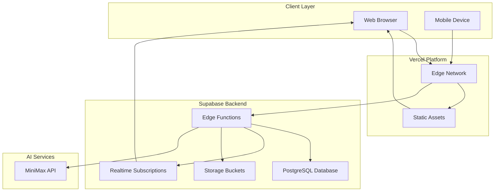

# Current System Architecture

**Document Version:** 1.0  
**Date:** 2026-01-02  
**Project:** Baby Shower App Redesign

---

## System Overview

### 1.1 Current Architecture

### 1.2 Component Inventory

| Component | Technology | Status |
|-----------|------------|--------|
| Frontend | Vanilla HTML/JS/CSS | Production |
| Hosting | Vercel | Active |
| Database | PostgreSQL 17.6.1 | Active |
| Edge Functions | Deno Runtime | Active |
| Realtime | Supabase Realtime | Active |
| AI | MiniMax API | Active |

---

## References

- [`docs/architecture/`](docs/architecture/) - Architecture documentation
- [`docs/research/`](docs/research/) - Research findings

---

**Document Maintainer:** Infrastructure Analysis System  
**Last Updated:** 2026-01-02
