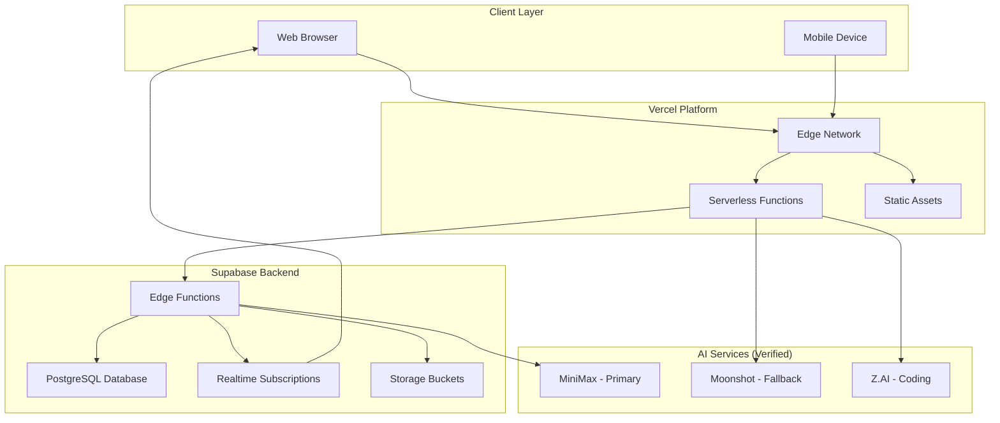

# Proposed Architecture Options

**Document Version:** 1.0  
**Date:** 2026-01-02  
**Project:** Baby Shower App Redesign

---

## 1. Proposed Architecture Options

### 1.1 Option A: Enhanced Current Architecture

**Recommended for:** Single event, minimal changes needed

### 1.2 Option B: Full Redesign

**Recommended for:** Multiple events, advanced features

| Feature | Option A | Option B |
|---------|----------|----------|
| AI Routing | MiniMax only | Multi-provider |
| Caching | None | Redis/Edge cache |
| Analytics | Basic | Advanced |
| Admin Panel | None | Full dashboard |
| Cost | $0-10/mo | $25-50/mo |

---

## 2. AI Provider Routing (Verified)

| Task | Provider | Fallback |
|------|----------|----------|
| Text Generation | MiniMax | Moonshot |
| Complex Reasoning | Moonshot | MiniMax |
| Code Generation | Z.AI | Manual |
| Content Moderation | MiniMax | Rule-based |

---

## References

- [`docs/architecture/01-current-system.md`](docs/architecture/01-current-system.md) - Current system
- [`docs/architecture/03-data-flows.md`](docs/architecture/03-data-flows.md) - Data flows
- [`docs/research/03-ai-providers.md`](docs/research/03-ai-providers.md) - AI providers

---

**Document Maintainer:** Infrastructure Analysis System  
**Last Updated:** 2026-01-02
