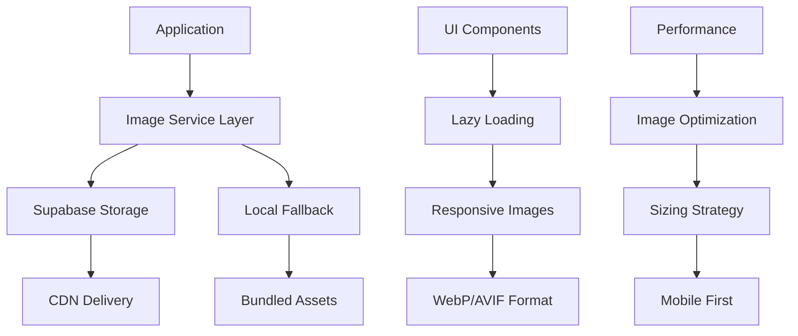

# Baby Shower Picture Integration Plan

## Executive Summary

This plan provides a comprehensive strategy for integrating personal anime/chibi style illustrations into the Baby Shower 2026 application, transforming it from a functional app into a deeply personal and emotionally engaging experience for guests.

## Picture Inventory Analysis

### Available Picture Categories

**1. Couple/Hero Images (Michelle_Jazeel/)**
- `app_hero_chibi.png` - Primary hero image for welcome section
- `app_hero_anime.png` - Alternative anime-style hero image
- `app_hero_illustration.png` - Illustrated hero variant
- `app_hero_pixar.png` - Pixar-style rendering
- `asset_anime_portrait.png` - Portrait-style couple illustration
- `asset_anime_scene.png` - Scene-based couple illustration
- `chibi_couple_expecting.png` - Pregnancy announcement style

**2. Jazeel Baby Pictures (Jazeel_Baby/)**
- `chibi_jazeel_newborn_edit.png` - Newborn baby Jazeel
- `chibi_jazeel_birthday_edit.png` - Birthday celebration
- `chibi_jazeel_cake.png` - Cake-themed baby picture
- `chibi_jazeel_dad_couch_edit.png` - With father on couch
- `anime_jazeel_birthday_v2.png` - Anime-style birthday
- `anime_jazeel_dad_couch_v2.png` - Anime-style with dad

**3. Michelle Baby Pictures (Michelle_Baby/)**
- `chibi_michelle_1st_birthday.png` - First birthday celebration
- `chibi_michelle_garden.png` - Garden/outdoor scene
- `chibi_michelle_sisters.png` - With sisters
- Various chibi-style baby illustrations

**4. Theme/Farm Animals (Theme/)**
- `chibi_farm_animals.png` - Cozy farm animals matching Myuna Farm venue

**5. Icon/Avatar Images (Multiple Icon folders/)**
- `asset_chibi_avatar_m.png` - Male avatar
- `asset_chibi_avatar_f.png` - Female avatar
- Various emotional state icons (heart, think, win)

**6. Venue Map (Map/)**
- `Myuna Farm Map - Sep 2024.pdf` - PDF map of event location

## Picture Content & Theme Analysis

### Art Style Consistency
- **Style**: Cozy chibi/anime illustration style
- **Color Palette**: Soft, warm colors that complement the app's sage green (#9CAF88), soft gold (#F4E4BC), and warm cream (#FFF8E7) theme
- **Composition**: High-quality illustrations with transparent backgrounds (PNG format)
- **Emotional Tone**: Warm, celebratory, family-oriented

### Theme Alignment
The pictures perfectly align with the "Cozy Animal Nursery" theme:
- Farm animals connect to Myuna Farm venue
- Chibi style creates a soft, approachable aesthetic
- Family-oriented content supports the baby shower celebration
- Anime style adds a modern, personalized touch

## Picture Placement Strategy

### 1. Welcome Section Hero Area
**Current**: Placeholder emojis (👨‍👩‍👧 🍊)
**Replace with**: `app_hero_chibi.png`
**Placement**: Replace the hero-placeholder span with the couple illustration
**Impact**: Immediate emotional connection, personalized welcome

### 2. Activity Cards Enhancement
**Current**: Emoji icons for each activity
**Enhance with**: Custom illustrations as backgrounds or icons
- Guestbook: Add subtle couple illustration background
- Baby Pool: Use baby pictures as decorative elements
- Quiz: Integrate chibi characters into puzzle elements
- Advice: Use envelope/capsule illustrations
- Voting: Add heart-themed illustrations

### 3. Section-Specific Integrations

#### Guestbook Section
- Background: Subtle `chibi_couple_expecting.png` watermark
- Form accents: Farm animal corners from `chibi_farm_animals.png`
- Success state: Show celebratory couple illustration

#### Baby Pool Section
- Header: Jazeel and Michelle baby pictures side by side
- Form backgrounds: Age-progression concept using baby pictures
- Stats display: Include baby illustrations as decorative frames

#### Quiz Section
- Puzzle backgrounds: Themed illustrations for each question
- Success states: Character reactions from icon set
- Results: Personalized congratulations with couple illustration

#### Advice Section
- Letter styling: Incorporate avatar icons for "From:" field
- Envelope/capsule graphics: Use actual illustrations vs emojis
- Background: Subtle farm animal pattern

#### Voting Section
- Name cards: Heart icons from `asset_chibi_heart.png`
- Header: Romantic couple illustration
- Success: Celebratory animation with themed characters

### 4. New Gallery Section (Recommended Addition)
**Purpose**: Showcase the full story of Jazeel and Michelle
**Content**: Timeline from baby pictures to expecting parents
**Format**: Horizontal scrolling carousel or grid
**Location**: Accessible from welcome section as a "Our Story" activity

### 5. Progress & Milestone Graphics
Use illustrations for:
- Loading states: Animated chibi characters
- Success modals: Celebratory scenes
- Milestone unlocks: Special couple moments
- Error states: Friendly character illustrations

## Technical Implementation Plan

### Image Hosting Strategy

**Option A: Supabase Storage (Recommended)**
- Create dedicated storage bucket: `baby-shower-images`
- Organize by folders matching local structure
- Enable public access with proper caching headers
- Set up automatic optimization and resizing

**Option B: Vercel/Static Hosting**
- Deploy images with application code
- Use build-time optimization
- Simpler but less flexible for updates

**Decision**: Use Supabase Storage for easier management and CDN benefits

### Implementation Architecture



### Responsive Image Strategy

#### Breakpoint-Specific Images
- **Mobile (≤768px)**: 400px width maximum
- **Tablet (769-1024px)**: 600px width maximum  
- **Desktop (>1024px)**: 800px width maximum

#### Format Strategy
- **Primary**: WebP with fallbac- **Secondary**: PNG for illustrations with transparency
- **Tertiary**: JPEG for photographic content (if added later)

#### Lazy Loading Implementation
```javascript
// Image component with lazy loading
const LazyImage = ({ src, alt, className }) => {
  const [loaded, setLoaded] = useState(false);
  
  return (
    <div className="image-wrapper">
      {!loaded && <div className="image-skeleton" />}
       setLoaded(true)}
      />
    </div>
  );
};
```

### UI Components Needed

#### 1. Hero Image Component
- Responsive couple illustration
- Animated entrance effect
- Fallback to emojis if image fails to load

#### 2. Gallery Carousel Component
- Touch-friendly horizontal scroll
- Lazy loading for performance
- Lightbox modal for full-size viewing
- Caption support for storytelling

#### 3. Decorative Image Wrapper
- Consistent styling across sections
- Hover effects for interactivity
- Theme-aware border treatments
- Accessibility considerations (alt text)

#### 4. Icon Integration System
- Replace emoji icons with custom illustrations
- Consistent sizing and styling
- Hover states and micro-interactions

#### 5. Background Pattern Generator
- CSS patterns using farm animal illustrations
- Subtle, non-distracting placement
- Theme color integration
- Responsive tiling

### Performance Optimization

#### Image Preparation Pipeline
1. **Source Images**: High-quality PNGs from baby_content/
2. **Optimization**: Convert to WebP, maintain PNG fallback
3. **Resizing**: Generate multiple sizes for responsive delivery
4. **Compression**: Lossless for illustrations, balanced for photos
5. **Caching**: Aggressive caching headers (1 year for immutable assets)

#### Loading Strategy
- **Critical Path**: Hero image loads immediately
- **Above Fold**: Activity card images load after hero
- **Below Fold**: Section-specific images load on scroll
- **Gallery**: Images load when section is accessed

### Accessibility Considerations

#### Alt Text Strategy
- **Hero Images**: Descriptive text about the couple
- **Decorative Images**: Empty alt attributes (aria-hidden="true")
- **Functional Images**: Descriptive alt for screen readers
- **Gallery Images**: Story-focused descriptions

#### Keyboard Navigation
- All image interactions keyboard accessible
- Focus indicators for interactive images
- Skip links for image-heavy sections

## Step-by-Step Implementation Guide

### Phase 1: Foundation Setup

**Step 1.1**: Set up Supabase Storage
- Create `baby-shower-images` bucket
- Configure public access policies
- Set up folder structure matching local organization
- Upload all optimized images

**Step 1.2**: Create Image Service Layer
- Build JavaScript module for image URL generation
- Implement responsive image logic
- Add error handling and fallbacks
- Create utility functions for different image types

**Step 1.3**: Optimize All Images
- Convert PNGs to WebP with fallback
- Generate responsive sizes (400w, 600w, 800w)
- Compress while maintaining quality
- Create manifest file mapping local to CDN paths

### Phase 2: Core Integration

**Step 2.1**: Hero Section Update
- Replace placeholder emoji with couple illustration
- Implement responsive sizing
- Add subtle entrance animation
- Test across all device sizes

**Step 2.2**: Activity Card Enhancement
- Add background images to cards
- Implement hover effects
- Ensure text readability over images
- Maintain touch target sizes

**Step 2.3**: Section Background Integration
- Add decorative images to each section
- Implement parallax effects where appropriate
- Ensure theme consistency
- Test performance impact

### Phase 3: Advanced Features

**Step 3.1**: Gallery Section Creation
- Build new "Our Story" activity card
- Implement horizontal scrolling gallery
- Add lightbox modal functionality
- Include timeline storytelling

**Step 3.2**: Icon Replacement System
- Replace emoji icons with custom illustrations
- Implement consistent sizing system
- Add micro-interactions
- Ensure fallback to emojis if needed

**Step 3.3**: Interactive Elements
- Add hover states to images
- Implement click-to-expand functionality
- Create animated transitions
- Add loading states

### Phase 4: Polish & Optimization

**Step 4.1**: Performance Tuning
- Audit image loading performance
- Optimize critical rendering path
- Implement advanced lazy loading
- Add preloading for key images

**Step 4.2**: Accessibility Audit
- Test with screen readers
- Verify keyboard navigation
- Check color contrast with images
- Validate alt text descriptions

**Step 4.3**: Cross-Browser Testing
- Test WebP fallbacks
- Verify responsive behavior
- Check animation performance
- Validate touch interactions

### Phase 5: Deployment & Monitoring

**Step 5.1**: Production Deployment
- Deploy optimized images to Supabase
- Update production URLs
- Monitor loading performance
- Verify CDN caching

**Step 5.2**: Analytics Setup
- Track image loading success rates
- Monitor performance metrics
- Gather user engagement data
- A/B test different placements

## Success Metrics

### Performance Metrics
- **Lighthouse Score**: Maintain >90 for Performance
- **LCP (Largest Contentful Paint)**: <2.5s for hero image
- **FID (First Input Delay)**: <100ms with images loaded
- **CLS (Cumulative Layout Shift)**: <0.1 with image loading

### Engagement Metrics
- **Time on Page**: Increase by 20% with visual enhancements
- **Section Completion**: Track if images increase form submissions
- **Gallery Interaction**: Monitor "Our Story" engagement
- **Social Sharing**: Track if personalized images increase sharing

### Technical Metrics
- **Image Load Success Rate**: >99.5%
- **Error Fallback Rate**: <0.5% (emojis as backup)
- **CDN Cache Hit Rate**: >85%
- **Responsive Image Selection Accuracy**: 100%

## Risk Mitigation

### Technical Risks
- **Image Load Failure**: Fallback to emoji placeholders
- **Slow Connection**: Progressive enhancement with low-res placeholders
- **Storage Outage**: Local fallback images bundled with app
- **Format Support**: WebP with PNG/JPEG fallbacks

### Design Risks
- **Theme Inconsistency**: Test images against color palette
- **Text Readability**: Ensure sufficient contrast for all text overlays
- **Mobile Performance**: Aggressive mobile optimization
- **Accessibility**: Maintain screen reader compatibility

### Timeline Risks
- **Image Preparation**: Batch process all images upfront
- **Testing**: Parallel testing on multiple devices
- **Performance**: Continuous monitoring during rollout

## Conclusion

This implementation plan transforms the Baby Shower 2026 application from a functional tool into a deeply personal celebration of Jazeel and Michelle's journey. The chibi/anime style illustrations create an emotional connection while maintaining the cozy, welcoming atmosphere perfect for a baby shower celebration.

The technical approach prioritizes performance and accessibility while delivering a rich visual experience. By following this phased implementation, we can ensure each addition enhances rather than overwhelms the user experience.

**Next Steps**: Proceed with Phase 1 implementation - Supabase Storage setup and image optimization pipeline.