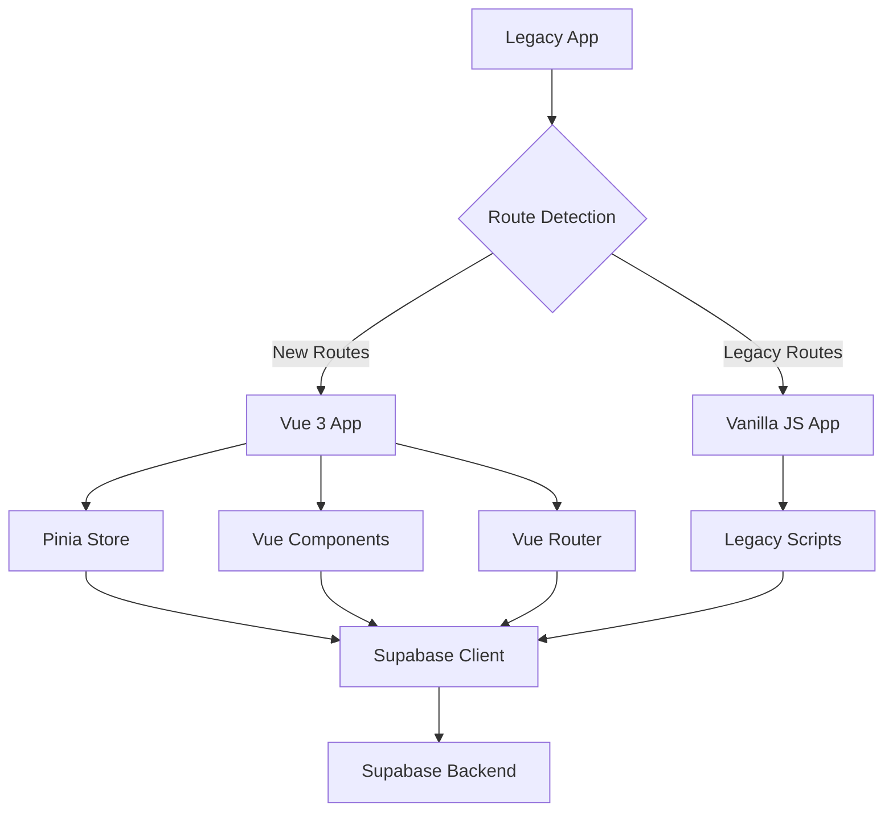
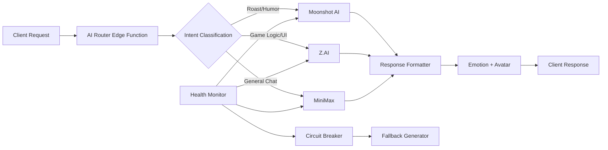

**⚠️ AI CONFIGURATIONS UPDATED - VERIFY BEFORE PRODUCTION**

# Baby Shower App Realignment Strategy
**Transitioning from Legacy to MiniMax Vision**

**Document Version:** 1.0  
**Date:** 2026-01-03  
**Status:** Strategy & Planning Document

---

## A. Executive Summary

### What Needs to be Realigned

The Baby Shower application requires a fundamental architectural realignment from its current vanilla JavaScript implementation to the MiniMax Vision—a "Digital Living Room" concept featuring Vue 3 frontend, multi-provider AI routing, and enhanced privacy controls.

**Core Transformation Areas:**
- **Frontend:** Vanilla JS/HTML/CSS → Vue 3 + Vite with component architecture
- **Backend:** Direct MiniMax API calls → Multi-provider AI Router (MiniMax, Moonshot, Z.AI)
- **Database:** Unified `public.submissions` → Multi-table `baby_shower.*` schema with security separation
- **Design:** Functional web UI → "Cozy Barnyard" aesthetic with Ghibli-inspired animations

### Why Realignment is Necessary

The current architecture has reached its extensibility limits. The MiniMax Vision provides:
1. **Scalability:** Component-based architecture supports future game development (Phase 4)
2. **Resilience:** Multi-provider AI routing prevents single-point-of-failure
3. **Privacy:** "Hidden Name" standard and schema separation protect sensitive data
4. **Experience:** Physics-based animations and personality-driven AI create emotional engagement

### Key Decisions Required Before Realignment

| Decision | Options | Impact | Recommendation |
|----------|---------|--------|----------------|
| **Font Selection** | Quicksand vs Fredoka One | Affects entire design system | Choose Quicksand for better readability |
| **Asset Verification** | Verify PNG assets match specification | Blocks visual implementation | Audit assets before Phase 1 |
| **Realtime Naming** | `new_roast` vs `dad_interaction` | API consistency | Rename to `dad_interaction` |
| **Phase 4 Scope** | Defer vs design now | Timeline impact | Schedule design sprint after Phase 3 |

### Estimated Scope of Work

- **Documents requiring updates:** 6 existing documents
- **New documents required:** 7 critical documentation files
- **Code files requiring migration:** 12+ JavaScript files to Vue SFC
- **Edge Functions requiring refactoring:** 5 activity handlers
- **Database migrations required:** 2 (schema + data)
- **Estimated timeline:** 4 phases across 3-4 weeks

---

## B. Realignment Priorities

### CRITICAL - Document Updates (Block Phase 1 Implementation)

#### 1. docs/MiniMax_Plan/01_VUE3_SETUP.md
- **Current Status:** Does not exist
- **Changes Needed:** Create new document with:
  - Vue 3 + Vite project initialization steps
  - Pinia store setup and architecture
  - Component library structure
  - Migration path from vanilla JS
- **Dependencies:** None (foundational)
- **Blocks:** All frontend development work

#### 2. docs/MiniMax_Plan/03_AI_ROUTER.md
- **Current Status:** Does not exist  
- **Changes Needed:** Create new document with:
  - Multi-provider routing architecture (MiniMax/Moonshot/Z.AI)
  - Intent classification system
  - Personality-driven response generation
  - Fallback and circuit breaker patterns
- **Dependencies:** Provider API credentials
- **Blocks:** Phase 2 AI Backend implementation

#### 3. docs/MiniMax_Plan/06_MIGRATION_STRATEGY.md
- **Current Status:** Does not exist
- **Changes Needed:** Create new document with:
  - Vanilla JS to Vue 3 migration approach
  - File-by-file migration plan
  - Testing strategy during migration
  - Rollback procedures
- **Dependencies:** Vue 3 setup documentation
- **Blocks:** Phase 1 execution

#### 4. docs/architecture/01-current-system.md
- **Current Status:** Documents vanilla JS architecture
- **Changes Needed:** Update to reflect:
  - Vue 3 + Vite architecture
  - Pinia state management layer
  - Component-based frontend structure
  - Updated technology stack table
- **Specific Changes:**
  - Line 52: "Vanilla HTML/JS/CSS" → "Vue 3 + Vite"
  - Add: Pinia state management to component inventory
  - Add: Component architecture diagram
- **Dependencies:** Vue 3 setup documentation
- **Blocks:** Architecture understanding across team

---

### HIGH - Important Documents for Development

#### 5. docs/DESIGN_PROPOSALS.md (Partial Update)
- **Current Status:** Contains vanilla JS implementation details
- **Changes Needed:** Merge with MiniMax design system:
  - Convert CSS examples to Vue SFC `<style scoped>` format
  - Update color palette to "Cozy Barnyard" theme
  - Refactor HTML examples to Vue component templates
  - Add animation system documentation
- **Specific Sections:** Lines 43-98, 154-263, 267-399, 405-629
- **Dependencies:** Visual theme documentation
- **Estimated Effort:** Moderate - requires careful merging

#### 6. docs/SCHEMA_IMPLEMENTATION.md (Schema Separation)
- **Current Status:** Single `baby_shower` schema
- **Changes Needed:** Add `internal` vs `public` schema separation:
  - Move sensitive data (baby name) to `internal` schema
  - Document RLS policies for both schemas
  - Update migration strategy to include schema split
  - Add security considerations documentation
- **Specific Sections:** Lines 1-33, 224-246
- **Dependencies:** Privacy standard documentation
- **Blocks:** Phase 3 security implementation

#### 7. docs/MiniMax_Plan/02_PINIA_STATE.md (New)
- **Current Status:** Does not exist
- **Changes Needed:** Create new document with:
  - Store architecture for user, game, and UI state
  - LocalStorage persistence strategy
  - Realtime subscription management patterns
  - Optimistic update implementation
- **Dependencies:** Vue 3 setup documentation
- **Required For:** State management consistency

#### 8. docs/MiniMax_Plan/04_PRIVACY_STANDARD.md (New)
- **Current Status:** Does not exist
- **Changes Needed:** Create new document with:
  - "Hidden Name" implementation pattern
  - Environment variable configuration (`VITE_BABY_NAME`)
  - Build-time injection procedures
  - Schema separation security model
- **Dependencies:** None
- **Required For:** Phase 3 privacy implementation

#### 9. docs/MiniMax_Plan/05_VISUAL_THEME.md (New)
- **Current Status:** Does not exist
- **Changes Needed:** Create new document with:
  - "Cozy Barnyard" design system specification
  - Color palette (Meadow Green, Azure Sky, Cream Paper, etc.)
  - Typography guidelines (Quicksand/Nunito)
  - Animation system using `@vueuse/motion`
  - Asset-to-component mapping
- **Dependencies:** DESIGN_PROPOSALS.md merge
- **Required For:** Visual consistency

#### 10. docs/architecture/02_TARGET_ARCHITECTURE.md (New)
- **Current Status:** Does not exist
- **Changes Needed:** Create new document with:
  - Target Vue 3 + Supabase architecture diagram
  - Component hierarchy and relationships
  - State management data flow
  - Deployment architecture for Vercel
- **Dependencies:** Vue 3 setup, AI router documentation
- **Required For:** Team alignment on target state

---

### MEDIUM - Useful Reference Documents

#### 11. docs/DESIGN_PROPOSALS.md (Implementation Roadmap)
- **Current Status:** 5-phase roadmap (doesn't align with MiniMax)
- **Changes Needed:** Update to align with MiniMax 4-phase approach:
  - Phase 1: Vue 3 Foundation + Visual Design
  - Phase 2: AI Backend + Personality Switchboard
  - Phase 3: Privacy & Security
  - Phase 4: Interactive Games
- **Specific Sections:** Lines 1588-1634
- **Dependencies:** MiniMax master roadmap
- **Update Strategy:** Replace existing roadmap section

#### 12. docs/INTEGRATION_PATTERNS.md (AI Section Updates)
- **Current Status:** Single-provider MiniMax integration
- **Changes Needed:** Update AI integration patterns:
  - Router pattern instead of direct API calls
  - Multi-provider support documentation
  - Personality-driven routing logic
  - Updated fallback content system
- **Specific Sections:** Lines 713-926
- **Dependencies:** AI router documentation
- **Update Strategy:** Refactor to router pattern

#### 13. docs/MiniMax_Plan/07_ASSET_MANIFEST.md (New)
- **Current Status:** Does not exist
- **Changes Needed:** Create new document with:
  - Asset filename verification checklist
  - Component-to-asset mapping
  - Fallback asset strategy
  - Animation asset specifications
- **Dependencies:** Visual theme documentation
- **Purpose:** Ensure asset consistency

---

### LOW - Historical/Archive Documents

#### 14. docs/RESEARCH_VERCEL.md (Environment Variables)
- **Current Status:** Missing baby name masking documentation
- **Changes Needed:** Add `VITE_BABY_NAME` documentation:
  - Environment variable specification
  - Build-time injection procedures
  - Security considerations
- **Specific Sections:** Lines 278-289
- **Dependencies:** Privacy standard documentation
- **Update Timing:** During Phase 1

#### 15. docs/DESIGN_PROPOSALS.md (Visual Design System)
- **Current Status:** "Yin-Yin" theme (needs barnyard elements)
- **Changes Needed:** Merge with Cozy Barnyard aesthetic:
  - Add animal/barnyard color variations
  - Extend typography with script fonts
  - Add animation system documentation
  - Include animal iconography
- **Specific Sections:** Lines 37-148
- **Dependencies:** Visual theme documentation
- **Update Timing:** During Phase 1-2

#### 16. Historical Document Archive
- **Documents to Archive:**
  - `docs/historical/CRITICAL_ANALYSIS_2026-01-02.md` → Superseded by MiniMax Plan
  - `docs/historical/DATABASE_SCHEMA_ANALYSIS.md` → Merged into SCHEMA_IMPLEMENTATION.md
  - `docs/historical/DETAILED_FIX_PLAN.md` → Superseded by MiniMax Plan
  - `docs/historical/PLANS.md` → Merged into MASTER_PLAN.md
- **Archive Process:** Move to `docs/archive/` with backward references
- **Timing:** After Phase 2 completion

---

## C. Technical Migration Strategy

### Frontend: Vanilla JS → Vue 3 Migration

#### Migration Approach: "Strangler Fig" Pattern



#### Incremental Migration Steps:

**Step 1: Foundation Setup (Week 1)**
1. Create new `baby-shower-v2` directory with Vue 3 + Vite
2. Set up Pinia stores for state management
3. Configure Tailwind CSS with "Cozy Barnyard" theme
4. Create Supabase client utilities
5. Build initial component library (Button, Card, Input)

**Step 2: Landing Page Migration (Week 1-2)**
1. Create `HeroSection.vue` component with parallax animations
2. Build `ActivityCard.vue` components for activity grid
3. Implement `LandingPage.vue` composition
4. Set up Vue Router for new routes
5. Deploy alongside legacy app

**Step 3: Feature-by-Feature Migration (Week 2-3)**
1. **Guestbook:** Create `Guestbook.vue` + `GuestbookForm.vue`
2. **Voting:** Build `Voting.vue` with realtime updates
3. **Pool:** Migrate `Pool.vue` with AI roast integration
4. **Quiz:** Implement `Quiz.vue` with state management
5. **Advice:** Create `AdviceCapsule.vue` component

**Step 4: Legacy Deprecation (Week 4)**
1. Redirect legacy routes to Vue 3 app
2. Remove legacy script files
3. Update deployment configuration
4. Archive legacy code

#### Key Technical Considerations

- **State Migration:** Move from LocalStorage to Pinia + LocalStorage persistence
- **API Compatibility:** Maintain existing Supabase Edge Function contracts initially
- **Animation Migration:** Convert CSS animations to `@vueuse/motion` spring physics
- **Testing Strategy:** Implement Vitest for unit tests, Playwright for E2E

#### Migration Checklist

- [ ] Vue 3 + Vite project initialized
- [ ] Pinia stores created (user, activities, ui)
- [ ] Tailwind configured with barnyard theme
- [ ] Supabase client utilities implemented
- [ ] Component library established
- [ ] Landing page migrated
- [ ] Activity components created
- [ ] Router configuration complete
- [ ] Legacy app runs alongside
- [ ] Feature parity achieved

---

### Backend: Direct AI Calls → AI Router Pattern

#### Router Architecture



#### Implementation Strategy

**Phase 1: Router Foundation (Week 2)**
1. Create `ai-router` Edge Function
2. Implement intent classification system:
   - Pattern matching for roast/humor requests
   - Task-type detection for game logic
   - Default routing for general chat
3. Build provider abstraction layer
4. Implement unified error handling

**Phase 2: Provider Integration (Week 2-3)**
1. **Moonshot Integration:** High-attitude roast generation - UPDATED 2026-01-03
   - Model: `kimi-k2`  // UPDATED from moonshot-v1-8k
   - Base URL: `https://api.moonshot.ai/v1`  // UPDATED: global endpoint
   - Temperature: 0.8-0.9 for personality
   - Specialized prompt engineering for sassy responses
   
2. **Z.AI Integration:** Structured game logic output - UPDATED 2026-01-03
   - Model: `glm-4-plus`  // UPDATED from glm-4
   - Base URL: `https://api.z.ai/api/paas/v4`  // UPDATED: new endpoint
   - Temperature: 0.3-0.5 for consistency
   - JSON schema enforcement for game states
   
3. **MiniMax Integration:** General conversational AI - UPDATED 2026-01-03
   - Model: `MiniMax-M2.1`  // UPDATED from abab6.5
   - Base URL: `https://api.minimax.chat/v1`  // UPDATED: OpenAI-compatible endpoint
   - Balanced temperature: 0.7
   - Reliable fallback for all other tasks

**Phase 3: Resilience & Monitoring (Week 3)**
1. **Circuit Breaker Pattern:** Prevent cascading failures
   - 3 failures → 30s cooldown
   - 5 failures → 5min cooldown
   - Auto-recovery on health check success
   
2. **Health Monitoring:** Background provider checks
   - Ping each provider every 60s
   - Track latency and error rates
   - Auto-failover to healthy providers
   
3. **Fallback System:** Graceful degradation
   - Pre-generated roast variations
   - Static game logic responses
   - Generic conversational replies

#### Response Contract Standardization

```typescript
interface AIResponse {
  text: string;           // The response content
  emotion: string;        // Emotional state (happy, excited, sassy, thinking)
  avatar: "mom" | "dad" | "thinking" | "celebration";  // Agent to display
  provider: string;       // Source provider (for debugging)
  cached: boolean;        // Whether response was cached
}
```

#### Edge Function Structure

```
supabase/functions/
├── ai-router/
│   ├── index.ts              # Main router logic
│   ├── intent-classifier.ts  # Intent detection
│   ├── providers/
│   │   ├── minimax.ts       # MiniMax provider
│   │   ├── moonshot.ts      # Moonshot provider
│   │   ├── zai.ts          # Z.AI provider
│   │   └── fallback.ts     # Fallback generator
│   └── cache/
│       ├── index.ts        # Response caching
│       └── store.ts        # Cache storage
├── health-monitor/          # Provider health checks
└── personality-switchboard/ # Personality management
```

---

### Schema: Current Unified → Multi-Table with Firewall Pattern

#### Current State Analysis

**Current Schema:** `public.submissions`
```sql
CREATE TABLE public.submissions (
    id UUID PRIMARY KEY,
    name TEXT NOT NULL,
    activity_type TEXT NOT NULL,  -- 'guestbook', 'voting', 'pool', etc.
    activity_data JSONB NOT NULL, -- Arbitrary JSON per activity
    created_at TIMESTAMPTZ DEFAULT NOW()
);
```

**Problems with Current Schema:**
1. No data type enforcement at database level
2. Difficult to query specific activity types
3. No referential integrity
4. Complex indexing for JSONB queries
5. Single point of failure for RLS policies

#### Target Schema Architecture

**Multi-Table Design:** `baby_shower.*` schema
```sql
-- Normalized tables with proper typing
CREATE TABLE baby_shower.guestbook (
    id UUID PRIMARY KEY,
    guest_name TEXT NOT NULL,
    message TEXT NOT NULL CHECK (length(message) >= 10),
    relationship TEXT NOT NULL,
    -- ... other specific columns
);

CREATE TABLE baby_shower.votes (
    id UUID PRIMARY KEY,
    voter_name TEXT NOT NULL,
    selected_names JSONB NOT NULL,  -- Array of name strings
    -- ... vote-specific columns
);

-- AI Roasts in separate table with foreign key
CREATE TABLE baby_shower.ai_roasts (
    id UUID PRIMARY KEY,
    prediction_id UUID REFERENCES baby_shower.pool_predictions(id),
    roast_text TEXT NOT NULL,
    -- ... AI metadata
);
```

#### Migration Strategy: 4-Phase Approach

**Phase 1: Schema Creation (Week 1)**
1. Run migration `20250102_multi_table_schema.sql` to create new tables
2. Enable RLS on all new tables with proper policies
3. Create indexes for performance optimization
4. Set up realtime publications

**Phase 2: Dual-Write Implementation (Week 2)**
1. Update Edge Functions to write to both schemas:
   ```typescript
   // Write to legacy table (existing)
   await supabase.from('public.submissions').insert(legacyData);
   
   // Write to new table (new)
   await supabase.from('baby_shower.guestbook').insert(normalizedData);
   ```
2. Implement data validation layer
3. Monitor for data consistency issues

**Phase 3: Data Migration (Week 3)**
1. Run `202501