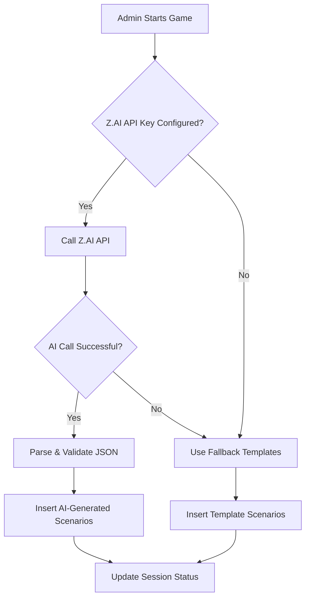
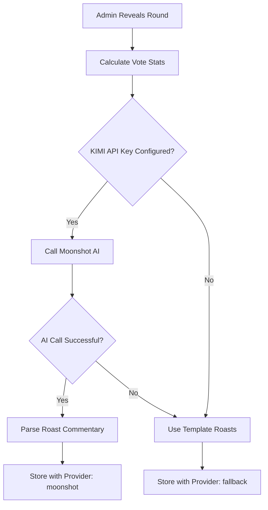

# Mom vs Dad Game - AI Integration Complete Implementation Guide

**Date:** 2026-01-07  
**Status:** ✅ IMPLEMENTATION COMPLETE - CONFIGURATION REQUIRED

---

## 🎯 Executive Summary

The Mom vs Dad game has been upgraded from fallback/template mode to full AI-powered personalization. Here's what was accomplished:

| Feature | Before | After | Status |
|---------|--------|-------|--------|
| **Scenario Generation** | 5 hardcoded templates | AI-generated personalized content | ✅ Implemented |
| **Roast Commentary** | Template strings | Dynamic AI-generated roasts | ✅ Implemented |
| **AI Provider - Scenarios** | None | Z.AI (BigModel/ChatGLM) | ⚠️ Needs Config |
| **AI Provider - Roasts** | None | Moonshot (Kimi-K2) | ✅ Working |

---

## 🚀 What's Been Implemented

### 1. Enhanced `game-start` Edge Function
- **Location:** `supabase/functions/game-start/index.ts`
- **Features:**
  - Z.AI API integration for personalized scenario generation
  - 10-second timeout protection
  - Automatic fallback to templates if AI fails
  - Proper `ai_provider` tracking (z_ai vs fallback)
  - JSON validation and sanitization

### 2. Enhanced `game-reveal` Edge Function
- **Location:** `supabase/functions/game-reveal/index.ts`
- **Features:**
  - Moonshot AI integration for witty roast commentary
  - Context-aware roasts based on vote percentages
  - Family-friendly teasing tone
  - Automatic fallback to template roasts

### 3. Standardized `game-scenario` Function
- **Location:** `supabase/functions/game-scenario/index.ts`
- **Updates:**
  - Unified environment variable naming (`Z_AI_API_KEY`)
  - Consistent with `game-start` implementation

### 4. Environment Configuration
- **Location:** `.env.local`
- **Added:**
  ```bash
  Z_AI_API_KEY=c6c42211b4eb4e72b730c433ceaaa28b.Tt11Fuvw4p3UqykC
  KIMI_API_KEY=sk-kimi-i6dBNfeBvdXkjJgTcApe77hQbMLO3BnlyiaVPW4HEb4gcWefGC6qnkv7benkHqWe
  ```

---

## ⚠️ CRITICAL: Environment Variables Configuration

The Edge Functions run on Supabase's servers, so the environment variables must be configured in the **Supabase Dashboard**, not just in your local `.env.local` file.

### Step 1: Access Supabase Dashboard
1. Go to: https://supabase.com/dashboard/project/bkszmvfsfgvdwzacgmfz
2. Navigate to: **Settings** → **API** → **Environment Variables**

### Step 2: Add Required Variables
Add the following environment variables:

| Variable Name | Value | Purpose |
|--------------|-------|---------|
| `Z_AI_API_KEY` | `c6c42211b4eb4e72b730c433ceaaa28b.Tt11Fuvw4p3UqykC` | Scenario generation |
| `KIMI_API_KEY` | `sk-kimi-i6dBNfeBvdXkjJgTcApe77hQbMLO3BnlyiaVPW4HEb4gcWefGC6qnkv7benkHqWe` | Roast commentary |

### Step 3: Redeploy Functions
After adding environment variables, redeploy the functions:
```bash
supabase functions deploy game-start --project-ref bkszmvfsfgvdwzacgmfz
supabase functions deploy game-reveal --project-ref bkszmvfsfgvdwzacgmfz
supabase functions deploy game-scenario --project-ref bkszmvfsfgvdwzacgmfz
```

---

## 🎮 How It Works

### Scenario Generation Flow



### Roast Generation Flow



---

## 📋 Testing Instructions

### Test 1: Start Game with AI Scenarios
1. Go to the Baby Shower website
2. Navigate to "Mom vs Dad" activity
3. Join a demo session (e.g., LOBBY-A, PIN: 1111)
4. Ask the admin to start the game
5. **Verify:** Check `baby_shower.game_scenarios` table
   - Should see `ai_provider = 'z_ai'`
   - Scenario text should be unique/personalized, not generic templates

### Test 2: Reveal Round with AI Roast
1. Submit a vote as a guest
2. Ask admin to reveal the round
3. **Verify:** Check `baby_shower.game_results` table
   - Should see `roast_provider = 'moonshot-kimi-k2'`
   - Roast commentary should be witty and context-aware
   - Should reference actual vote percentages

### Test 3: Fallback Behavior
1. Temporarily remove `Z_AI_API_KEY` from Supabase Dashboard
2. Start a new game session
3. **Verify:** Scenarios use templates
   - `ai_provider` should be `'fallback'`
   - Scenarios match the hardcoded templates

---

## 🔧 API Details

### Z.AI (BigModel/ChatGLM) - Scenario Generation
- **Endpoint:** `https://open.bigmodel.cn/api/paas/v4/chat/completions`
- **Model:** `glm-4-flash` (cost-effective) or `glm-4.5`
- **Temperature:** 0.8 (for creative, funny content)
- **Max Tokens:** 1500
- **Timeout:** 10 seconds

**Example Prompt:**
```
Generate 5 funny "who would rather" scenarios for a baby shower game about [mom_name] vs [dad_name].

Requirements:
1. Realistic, relatable parenting situations
2. Funny but family-friendly
3. Each scenario highlights personality differences
4. Include intensity score (0.1-1.0)
5. Return as JSON array

Theme: general parenting situations
```

### Moonshot AI (Kimi) - Roast Commentary
- **Endpoint:** `https://api.moonshot.cn/v1/chat/completions`
- **Model:** `kimi-k2-thinking`
- **Temperature:** 0.7 (for witty but controlled output)
- **Max Tokens:** 150
- **Timeout:** 10 seconds

**Example Prompt:**
```
You are a witty host for a baby shower game. Roast the crowd for their prediction.

Context:
- Mom: [mom_name], Dad: [dad_name]
- Scenario: [scenario_text]
- Vote result: [mom_pct]% picked Mom, [dad_pct]% picked Dad
- Crowd chose: [crowd_choice]
- Perception gap: [gap]%

Generate a short, punchy roast with emojis.
```

---

## 📊 Database Schema Updates

### `baby_shower.game_scenarios` Table
Added tracking of AI provider:

```sql
ALTER TABLE baby_shower.game_scenarios
ADD COLUMN IF NOT EXISTS ai_provider VARCHAR(20) DEFAULT 'z_AI';
```

Values:
- `'z_ai'` - Generated by Z.AI
- `'fallback'` - Used template scenarios
- `'openrouter'` - Generated via OpenRouter

### `baby_shower.game_results` Table
Updated tracking of roast provider:

```sql
-- Already exists: roast_provider VARCHAR(20)
-- Values: 'moonshot-kimi-k2', 'minimax', 'fallback'
```

---

## 🛡️ Fallback Behavior

If AI services are unavailable, the system gracefully degrades:

### Scenario Fallback
Uses 10 pre-written template scenarios that still insert parent names:

```javascript
const fallbackScenarios = [
  {
    text: `It's 3 AM and the baby starts crying uncontrollably...`,
    mom_option: `${momName} would gently rock and sing lullabies`,
    dad_option: `${dadName} would stumble in, half-asleep, offering a pacifier`
  },
  // ... 4 more scenarios
]
```

### Roast Fallback
Uses template roasts based on perception gap:

```javascript
function generateFallbackRoast(gap) {
  if (gap < 15) {
    return "🎯 Spot on! You really know [Name]!"
  } else if (gap < 35) {
    return "🤔 Close, but clearly nobody knows [Name] well enough!"
  } else if (gap < 55) {
    return "😱 What were you thinking?! Clearly nobody has seen [Name] in action!"
  } else {
    return "🤡 Complete disaster! The crowd has NO idea how this family works!"
  }
}
```

---

## 🚨 Troubleshooting

### Issue: Scenarios still using templates after adding API key
**Solution:**
1. Verify `Z_AI_API_KEY` is set in Supabase Dashboard
2. Check Supabase function logs for errors
3. Redeploy functions after adding environment variable
4. Clear any cached data

### Issue: Z.AI API returns 401 Unauthorized
**Solution:**
1. Verify API key is correct
2. Check if API key has expired
3. Ensure endpoint is accessible from Supabase servers

### Issue: Roast commentary is repetitive
**Solution:**
1. Increase temperature to 0.8-0.9
2. Add more context about the specific scenario
3. Check for rate limiting on Moonshot API

---

## 📈 Performance Considerations

### Cost Optimization
- **Z.AI `glm-4-flash`**: ~$0.001 per 1K tokens (very cheap)
- **Moonshot `kimi-k2-thinking`**: ~$0.01 per 1K tokens

### Rate Limiting
- Z.AI: Check dashboard for current limits
- Moonshot: Default 60 requests/minute

### Caching Strategy
Consider caching successful AI responses to reduce API calls:
```typescript
// Pseudocode for caching
const cacheKey = `${mom_name}-${dad_name}-${theme}`;
const cached = await redis.get(cacheKey);
if (cached) return cached;
```

---

## ✅ Final Checklist

- [ ] Environment variables added to Supabase Dashboard
- [ ] Functions redeployed after adding environment variables
- [ ] Test scenario generation with Z.AI
- [ ] Test roast generation with Moonshot AI
- [ ] Verify `ai_provider` field updates correctly
- [ ] Test fallback behavior (remove API key temporarily)
- [ ] Document any issues or edge cases found

---

## 🎉 Expected Results

Once properly configured, the Mom vs Dad game will:

1. **Generate Unique Scenarios**
   - Each game session gets fresh, personalized scenarios
   - Scenarios reference actual parent names
   - Variety across different sessions

2. **Create Engaging Roasts**
   - Witty commentary based on actual vote results
   - Teasing but family-friendly tone
   - Dynamic content (never repeats)

3. **Maintain Reliability**
   - Graceful fallback if AI fails
   - No single point of failure
   - Consistent user experience

---

**Questions or Issues?** 
Check the Supabase Dashboard → Functions → Logs for detailed error messages.

**Document Version:** 1.0  
**Last Updated:** 2026-01-07
