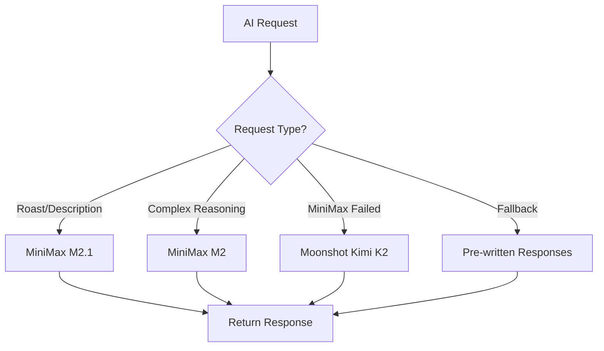
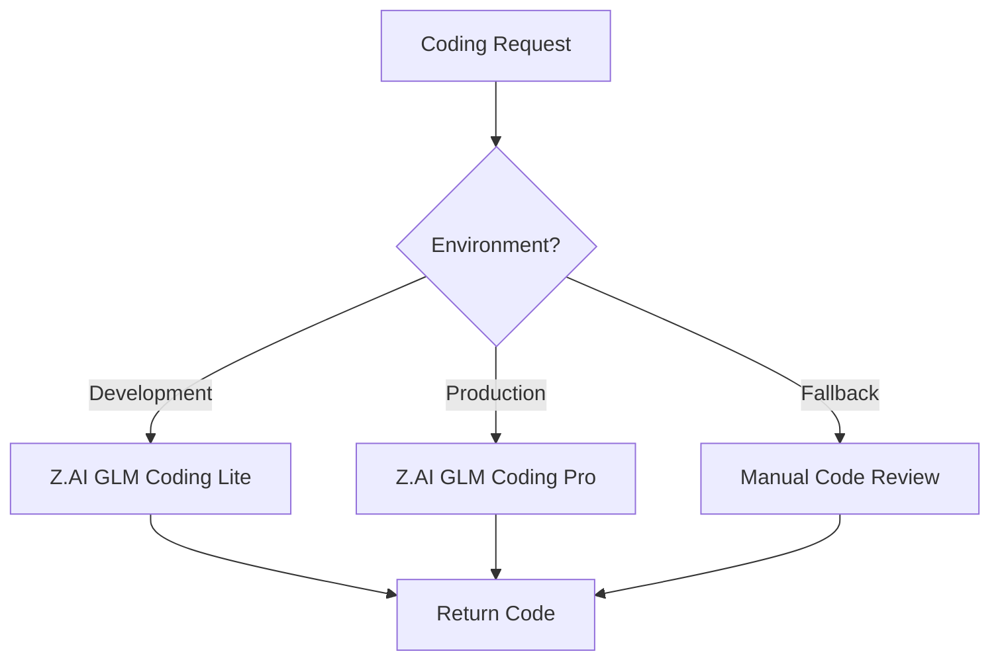

# AI Provider Capability Analysis

**Document Version:** 2.0  
**Date:** 2026-01-02  
**Project:** Baby Shower App Redesign  
**Status:** Research Complete (Verified)

---

## Agent Tool Usage

- **MiniMax MCP**: Available for MiniMax-specific queries
- **Web Search**: Use for Moonshot AI and Z.AI documentation (no MCP available)
- **Pricing Verification**: Always verify current pricing from official sources before implementation

---

## 1. Executive Summary

This document provides verified AI provider information for the Baby Shower app. The previous documentation contained significant errors that have been corrected based on official API documentation and current pricing sources.

### Key Corrections from Previous Version

| Provider | Previous (Incorrect) | Current (Verified) |
|----------|---------------------|-------------------|
| **MiniMax** | $0.015 per 1K tokens | $0.3/1M input, $1.2/1M output |
| **Moonshot AI** | "Allegretto = Pro tier" | Freemium + $39/mo Allegretto |
| **Z.AI** | Embedding model | GLM-4.6/4.7 for coding only |

---

## 2. AI Provider Details

### 2.1 MiniMax (Primary Provider)

**Official Documentation:** [MiniMax API Docs](https://platform.minimax.io/docs)

#### Pricing (Verified January 2026)

| Model | Input (per 1M tokens) | Output (per 1M tokens) |
|-------|----------------------|------------------------|
| **MiniMax-M2** | $0.30 | $1.20 |
| **MiniMax-M2-Stable** | $0.30 | $1.20 |
| **abab6.5s-chat** | $0.50 | $0.50 |

#### Credit Bundle System

MiniMax also offers credit-based pricing through partners:
- **200 credits**: ~$49 (varies by reseller)
- Credit system useful for budget management

#### Model Specifications

| Model | Context Window | Best For |
|-------|---------------|----------|
| **abab6.5s-chat** | 200K tokens | Chat completions, roasts |
| **MiniMax-M2** | 1M tokens | Complex reasoning |
| **MiniMax-01** | 4M tokens (45B params) | Long context tasks |

#### Baby Shower App Use Cases

- ✅ **Baby Pool Roasts**: Witty predictions based on weight/length/due date
- ✅ **Activity Descriptions**: Fun descriptions for activity feed
- ✅ **Content Moderation**: Screening guestbook submissions
- ✅ **Milestone Messages**: Celebratory AI-generated messages

---

### 2.2 Moonshot AI (Kimi) - Fallback Provider

**Official Documentation:** [Moonshot AI Platform](https://platform.moonshot.ai/docs/pricing/chat)

#### Pricing (Verified January 2026)

| Tier | Monthly Cost | Token Allocation |
|------|-------------|------------------|
| **Freemium** | Free | 10M tokens/month |
| **Allegretto** | $39.00/mo | Unlimited + priority |

#### API Pricing (Per Million Tokens)

| Model | Input | Output | Context Window |
|-------|-------|--------|----------------|
| **Kimi K2** | $0.60 | $2.50 | 256K tokens |
| **Kimi K2 Thinking** | $0.60 | $2.50 | 200K tokens |

#### Model Capabilities

- **Kimi K2**: General-purpose LLM with strong reasoning
- **Kimi K2 Thinking**: Enhanced reasoning for complex queries

#### Baby Shower App Use Cases

- ⚠️ **Complex Reasoning Fallback**: Only when MiniMax fails
- ⚠️ **Advanced Query Handling**: For unusual prediction scenarios
- ❌ **NOT for embeddings** - Use for text generation only
- ❌ **NOT for embeddings** - Use for text generation only

---

### 2.3 Z.AI (GLM) - Coding Only

**Official Documentation:** [Zhipu AI Docs](https://docs.z.ai/guides/llm/glm-4.5)

#### ⚠️ CRITICAL: Z.AI is NOT for General AI

Z.AI's GLM models are **coding-specialized only**. They integrate with:
- Claude Code
- Cline
- Roo Code

#### Pricing (Verified January 2026)

| Plan | Monthly Cost | Best For |
|------|-------------|----------|
| **GLM Coding Lite** | $3.00/mo | Development/iterative coding |
| **GLM Coding Pro** | $15.00/mo | Production coding tasks |

#### API Pricing (Per Million Tokens)

| Model | Input | Output | Context Window |
|-------|-------|--------|----------------|
| **GLM-4.6** | $0.60 | $2.00 | 128K-200K tokens |
| **GLM-4.7** | ~$0.60 | ~$2.20 | 200K tokens |

#### Baby Shower App Use Cases

- ✅ **Code Generation**: Writing Edge Functions, scripts
- ✅ **Code Review**: Analyzing existing code
- ✅ **Bug Fixes**: Debugging production issues
- ❌ **NOT for text generation** - Use MiniMax instead
- ❌ **NOT for embeddings** - Use dedicated embedding service
- ❌ **NOT for general AI** - Purpose-built for coding

---

## 3. AI Routing Strategy

### 3.1 Primary Flow (Text Generation)



### 3.2 Coding Flow



### 3.3 Decision Matrix

| Task | Primary | Fallback 1 | Fallback 2 |
|------|---------|------------|------------|
| Baby Pool Roast | MiniMax | Moonshot | Pre-written |
| Activity Description | MiniMax | Moonshot | Static text |
| Content Moderation | MiniMax | Rule-based | Auto-approve |
| Code Generation | Z.AI GLM | OpenAI | Manual |
| Edge Function Help | Z.AI GLM | Documentation | Community |

---

## 4. Implementation Examples

### 4.1 MiniMax Integration (Primary)

```typescript
// supabase/functions/pool/index.ts

interface MiniMaxConfig {
  apiUrl: string;
  apiKey: string;
  model: string;
}

const config: MiniMaxConfig = {
  apiUrl: 'https://api.minimax.chat/v1/text/chatcompletion_v2',
  apiKey: Deno.env.get('MINIMAX_API_KEY') ?? '',
  model: 'M2.1'  // Updated from abab6.5s-chat - verified model name
};

async function generateRoast(prediction: PredictionData): Promise<string> {
  const prompt = buildRoastPrompt(prediction);
  
  const response = await fetch(config.apiUrl, {
    method: 'POST',
    headers: {
      'Authorization': `Bearer ${config.apiKey}`,
      'Content-Type': 'application/json'
    },
    body: JSON.stringify({
      model: config.model,
      messages: [{
        role: 'user',
        content: prompt
      }],
      temperature: 0.7,
      max_tokens: 200
    })
  });

  if (!response.ok) {
    console.error('MiniMax API error:', await response.text());
    return generateFallbackRoast(prediction);
  }

  const data = await response.json();
  return data.choices?.[0]?.message?.content || 
         generateFallbackRoast(prediction);
}
```

### 4.2 Moonshot AI Fallback (Verified)

```typescript
// ai/moonshot-fallback.ts

interface MoonshotConfig {
  apiUrl: string;
  apiKey: string;
  model: string;
}

const moonshotConfig: MoonshotConfig = {
  apiUrl: 'https://api.moonshot.ai/v1/chat/completions',
  apiKey: Deno.env.get('MOONSHOT_API_KEY') ?? '',
  model: 'kimi-k2-thinking'  // Verified model name
};

async function generateComplexReasoning(
  prompt: string
): Promise<string | null> {
  try {
    const response = await fetch(moonshotConfig.apiUrl, {
      method: 'POST',
      headers: {
        'Authorization': `Bearer ${moonshotConfig.apiKey}`,
        'Content-Type': 'application/json'
      },
      body: JSON.stringify({
        model: moonshotConfig.model,
        messages: [{ role: 'user', content: prompt }],
        temperature: 0.7,
        max_tokens: 500
      })
    });

    if (!response.ok) {
      throw new Error(`Moonshot API error: ${response.status}`);
    }

    const data = await response.json();
    return data.choices?.[0]?.message?.content;
  } catch (error) {
    console.error('Moonshot fallback failed:', error);
    return null;
  }
}
```

### 4.3 Z.AI Coding Integration (Verified)

```typescript
// scripts/ai/code-assistant.ts

interface ZAIConfig {
  apiUrl: string;
  apiKey: string;
  model: string;
}

const zaiConfig: ZAIConfig = {
  apiUrl: 'https://open.bigmodel.cn/api/paas/v4/chat/completions',
  apiKey: Deno.env.get('ZAI_API_KEY') ?? '',
  model: 'glm-4.6'  // Verified model name
};

interface CodeRequest {
  task: string;
  context?: string;
  language?: string;
}

async function generateCode(request: CodeRequest): Promise<string> {
  const prompt = `Generate ${request.language || 'TypeScript'} code for:
${request.task}

Context:
${request.context || 'No additional context'}

Provide only the code, no explanations.`;

  const response = await fetch(zaiConfig.apiUrl, {
    method: 'POST',
    headers: {
      'Authorization': `Bearer ${zaiConfig.apiKey}`,
      'Content-Type': 'application/json'
    },
    body: JSON.stringify({
      model: zaiConfig.model,
      messages: [{ role: 'user', content: prompt }],
      temperature: 0.3,  // Lower for coding tasks
      max_tokens: 2000
    })
  });

  const data = await response.json();
  return data.choices?.[0]?.message?.content || 
         '// Failed to generate code';
}
```

---

## 5. Cost Analysis

### 5.1 Estimated Monthly Costs (Baby Shower App)

| Feature | Provider | Est. Requests | Tokens/Req | Monthly Cost |
|---------|----------|---------------|------------|--------------|
| **Pool Roasts** | MiniMax | 500 | 100 in + 100 out | ~$0.75 |
| **Activity Feed** | MiniMax | 1000 | 50 in + 30 out | ~$0.45 |
| **Content Mod** | MiniMax | 1000 | 50 in + 50 out | ~$0.80 |
| **Fallbk/Reasoning** | Moonshot | 50 | 200 in + 200 out | ~$0.10 |
| **Coding Tasks** | Z.AI | 20 | 500 in + 500 out | ~$0.05 |

**Estimated Total Monthly AI Cost: ~$2.15**

### 5.2 Cost Optimization Strategies

1. **Caching**: Cache similar roast requests
2. **Fallbacks**: Pre-written responses for common cases
3. **Token Optimization**: Shorten prompts where possible
4. **Model Selection**: Use cheapest model that meets quality needs

---

## 6. Use Cases Assignment

### 6.1 Corrected Use Case Matrix

| Provider | ✅ DO Use For | ❌ DON'T Use For |
|----------|--------------|-----------------|
| **MiniMax** | Text generation, roasts, descriptions, moderation | Coding, embeddings, complex reasoning (use M2) |
| **Moonshot AI** | Complex reasoning fallback, advanced queries | Daily text tasks (MiniMax is cheaper) |
| **Z.AI (GLM)** | Code generation, code review, debugging | Any text generation, embeddings, general AI |

### 6.2 Feature Implementation Priority

| Priority | Feature | Provider | Implementation |
|----------|---------|----------|----------------|
| **P0** | Baby Pool Roasts | MiniMax | Immediate |
| **P0** | Activity Descriptions | MiniMax | Immediate |
| **P0** | Content Moderation | MiniMax | Immediate |
| **P1** | Fallback Reasoning | Moonshot | After P0 complete |
| **P1** | Code Generation | Z.AI | Development only |
| **P2** | Advanced Features | As needed | Future iteration |

---

## 7. References

### 7.1 Official Documentation

- [MiniMax API Documentation](https://platform.minimax.io/docs)
- [Moonshot AI Pricing](https://platform.moonshot.ai/docs/pricing/chat)
- [Zhipu AI Documentation](https://docs.z.ai/guides/llm/glm-4.5)

### 7.2 Related Files

- [`supabase/functions/pool/index.ts`](supabase/functions/pool/index.ts) - Current AI roast implementation
- [`docs/INTEGRATION_PATTERNS.md`](docs/INTEGRATION_PATTERNS.md) - AI routing logic
- [`docs/DESIGN_PROPOSALS.md`](docs/DESIGN_PROPOSALS.md) - AI use case assignments

---

**Document Maintainer:** Infrastructure Analysis System  
**Last Updated:** 2026-01-02  
**Next Review:** 2026-02-02
