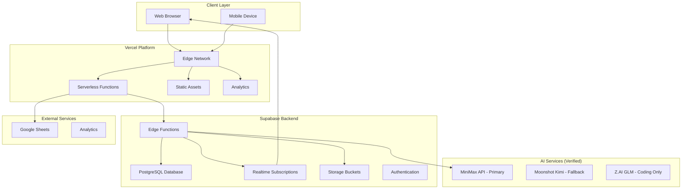
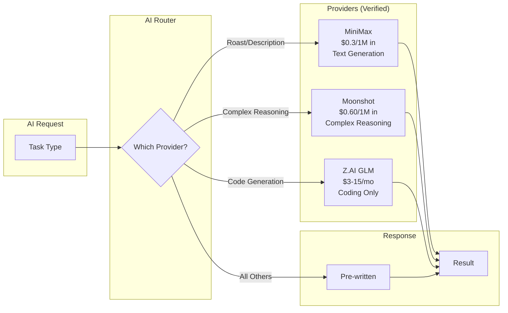

# Technical Integration Patterns

**Document Version:** 2.0  
**Date:** 2026-01-02  
**Project:** Baby Shower App Redesign  
**Status:** Research Complete (Verified)

---

## Agent Tool Usage

- **MiniMax MCP**: Use for MiniMax API queries and troubleshooting
- **Web Search**: Use for Moonshot AI and Z.AI documentation
- **Supabase MCP**: Use for database queries and Edge Function inspection
- **Vercel**: No MCP available - use web interface at https://vercel.com/dashboard

---

## 1. Integration Architecture Overview

### 1.1 System Architecture (Verified)



### 1.2 AI Provider Routing (Corrected)



### 1.3 Corrected Data Flow Patterns

| Pattern | Description | Use Case |
|---------|-------------|----------|
| **Request-Response** | Synchronous API calls | Form submissions, queries |
| **Event-Driven** | Asynchronous event handling | Database triggers, webhooks |
| **Realtime Streaming** | WebSocket connections | Live updates, activity feed |
| **Batch Processing** | Scheduled bulk operations | Analytics aggregation, backups |

### 1.4 Integration Points (Verified)

| From | To | Protocol | Purpose |
|------|-----|----------|---------|
| Frontend | Vercel Edge | HTTPS | Static asset delivery |
| Frontend | Supabase Edge Functions | HTTPS | API calls |
| Supabase Edge Functions | Supabase Database | PostgreSQL | Data persistence |
| Supabase Edge Functions | MiniMax API | HTTPS | AI text generation |
| Supabase Edge Functions | Moonshot API | HTTPS | AI fallback reasoning |
| Vercel Serverless | Z.AI API | HTTPS | Code generation |
| Vercel Serverless | Supabase Database | HTTPS | Admin operations |
| Supabase | Google Sheets | HTTPS | Data backup webhooks |

---

## 2. AI Integration Patterns

### 2.1 Verified AI Request Pipeline

```typescript
// ai/request-pipeline.ts

interface AIRequest {
  type: 'roast' | 'categorize' | 'summarize' | 'generate' | 'code';
  data: Record<string, unknown>;
  context?: Record<string, unknown>;
}

interface AIResponse {
  success: boolean;
  content?: string;
  error?: string;
  tokens?: {
    prompt: number;
    completion: number;
    total: number;
  };
  provider: 'minimax' | 'moonshot' | 'zai';
}

class AIPipeline {
  private config: AIConfig;
  private cache: Cache<string, AIResponse>;
  private rateLimiter: RateLimiter;
  private fallbackGenerator: FallbackGenerator;

  constructor(config: AIConfig) {
    this.config = config;
    this.cache = new LRUCache({ max: 1000, ttl: 3600000 }); // 1 hour
    this.rateLimiter = new TokenBucketRateLimiter({
      tokensPerInterval: 100,
      interval: 60000 // per minute
    });
    this.fallbackGenerator = new FallbackGenerator();
  }

  async process(request: AIRequest): Promise<AIResponse> {
    // Check cache first
    const cacheKey = this.generateCacheKey(request);
    const cached = this.cache.get(cacheKey);
    if (cached) {
      return { ...cached, cached: true };
    }

    // Check rate limit
    if (!this.rateLimiter.tryConsume(1)) {
      console.warn('AI rate limit exceeded, using fallback');
      return {
        success: true,
        content: this.fallbackGenerator.generate(request.type, request.data),
        fallback: true,
        provider: 'minimax'
      };
    }

    // Route to appropriate provider (VERIFIED)
    const provider = this.selectProvider(request.type);
    
    try {
      const response = await this.executeRequest(provider, request);
      this.cache.set(cacheKey, response);
      return response;
    } catch (error) {
      console.error('AI pipeline error:', error);
      
      // Try fallback provider
      const fallbackResponse = await this.tryFallbackProvider(
        request, 
        provider
      );
      
      if (fallbackResponse) {
        return fallbackResponse;
      }

      return {
        success: true,
        content: this.fallbackGenerator.generate(request.type, request.data),
        fallback: true,
        error: (error as Error).message,
        provider: provider
      };
    }
  }

  private selectProvider(type: AIRequest['type']): 'minimax' | 'moonshot' | 'zai' {
    // VERIFIED ROUTING LOGIC
    switch (type) {
      case 'code':
        return 'zai';  // Z.AI for coding only
      case 'categorize':
      case 'summarize':
        return 'moonshot';  // Complex reasoning
      case 'roast':
      case 'generate':
      default:
        return 'minimax';  // Primary for text generation
    }
  }

  private async executeRequest(
    provider: 'minimax' | 'moonshot' | 'zai',
    request: AIRequest
  ): Promise<AIResponse> {
    const startTime = Date.now();

    const configs = {
      minimax: {
        url: 'https://api.minimax.chat/v1/text/chatcompletion_v2',
        model: 'M2.1',  // Updated from abab6.5s-chat
        apiKey: this.config.minimaxApiKey
      },
      moonshot: {
        url: 'https://api.moonshot.ai/v1/chat/completions',
        model: 'kimi-k2-thinking',
        apiKey: this.config.moonshotApiKey
      },
      zai: {
        url: 'https://open.bigmodel.cn/api/paas/v4/chat/completions',
        model: 'glm-4.6',
        apiKey: this.config.zaiApiKey
      }
    };

    const config = configs[provider];
    const prompt = this.buildPrompt(request);

    const response = await fetch(config.url, {
      method: 'POST',
      headers: {
        'Authorization': `Bearer ${config.apiKey}`,
        'Content-Type': 'application/json'
      },
      body: JSON.stringify({
        model: config.model,
        messages: [{ role: 'user', content: prompt }],
        temperature: 0.7,
        max_tokens: 200
      })
    });

    const duration = Date.now() - startTime;

    if (!response.ok) {
      throw new Error(`AI API error: ${response.status}`);
    }

    const data = await response.json();
    const content = data.choices?.[0]?.message?.content;

    if (!content) {
      throw new Error('Empty AI response');
    }

    return {
      success: true,
      content,
      tokens: {
        prompt: data.usage?.prompt_tokens || 0,
        completion: data.usage?.completion_tokens || 0,
        total: data.usage?.total_tokens || 0
      },
      provider
    };
  }

  private async tryFallbackProvider(
    request: AIRequest,
    primaryProvider: string
  ): Promise<AIResponse | null> {
    // If MiniMax fails, try Moonshot for text tasks
    if (primaryProvider === 'minimax' && 
        (request.type === 'roast' || request.type === 'generate')) {
      try {
        return await this.executeRequest('moonshot', request);
      } catch {
        return null;
      }
    }
    return null;
  }

  private buildPrompt(request: AIRequest): string {
    const templates: Record<string, (data: Record<string, unknown>) => string> = {
      roast: (data) => this.buildRoastPrompt(data),
      categorize: (data) => this.buildCategorizePrompt(data),
      summarize: (data) => this.buildSummarizePrompt(data),
      generate: (data) => this.buildGeneratePrompt(data),
      code: (data) => this.buildCodePrompt(data)
    };

    return templates[request.type](request.data);
  }

  private buildRoastPrompt(data: Record<string, unknown>): string {
    return `Write a playful, family-friendly roast for this baby pool prediction:
${JSON.stringify(data, null, 2)}
Keep it under 100 words. No baby voice.`;
  }

  private buildCodePrompt(data: Record<string, unknown>): string {
    return `Generate code for: ${data.task}
Language: ${data.language || 'TypeScript'}
Context: ${JSON.stringify(data.context || {})}`;
  }

  private generateCacheKey(request: AIRequest): string {
    return `${request.type}:${this.hash(JSON.stringify(request.data))}`;
  }

  private hash(str: string): string {
    let hash = 0;
    for (let i = 0; i < str.length; i++) {
      const char = str.charCodeAt(i);
      hash = ((hash << 5) - hash) + char;
      hash = hash & hash;
    }
    return Math.abs(hash).toString(36);
  }
}
```

### 2.2 Fallback Content System (Verified)

```typescript
// ai/fallback-generator.ts

interface FallbackContent {
  roast: string[];
  categorize: Record<string, string>;
  generate: Record<string, string>;
  code: Record<string, string>;
}

const fallbackContent: FallbackContent = {
  roast: [
    "Your prediction is... certainly memorable! Either you're right or baby has some surprises ahead. 🍼",
    "Bold prediction! Either you'll be the hero of the day or we'll be reminding you of this moment for years!",
    "Wow! That's quite a prediction you've made there! We can't wait to see if you're spot-on!",
    "Either you have insider information or you're just feeling confident! Either way, we love the enthusiasm!",
    "Your prediction is definitely... unique! Whether it's spot-on or hilariously wrong, it adds to the fun!"
  ],
  categorize: {
    general: "Thanks for the great advice!",
    naming: "Great name suggestions!",
    feeding: "Solid feeding tips!",
    sleeping: "Hope these sleep tips work for you!",
    safety: "Important safety reminders!",
    fun: "Love the fun suggestions!",
    milestone: "Exciting milestone tips!",
    relationship: "Great relationship advice!"
  },
  generate: {
    welcome: "Welcome to Baby Maya's Shower! 🎉",
    milestone: "🎉 Milestone reached!",
    celebration: "Let's celebrate! 🥳",
    encouragement: "You're doing great! 💪"
  },
  code: {
    default: "// Code generation failed. Please try again or write manually.",
    typescript: "// TypeScript code generation failed",
    javascript: "// JavaScript code generation failed"
  }
};

class FallbackGenerator {
  generate(type: string, data: Record<string, unknown>): string {
    switch (type) {
      case 'roast':
        return this.getRandomRoast();
      case 'categorize':
        return fallbackContent.categorize[data.category as string] || 
               fallbackContent.categorize.general;
      case 'generate':
        return fallbackContent.generate[data.purpose as string] || 
               fallbackContent.generate.welcome;
      case 'code':
        return fallbackContent.code[data.language as string] || 
               fallbackContent.code.default;
      default:
        return "Thanks for participating! 🎉";
    }
  }

  private getRandomRoast(): string {
    const index = Math.floor(Math.random() * fallbackContent.roast.length);
    return fallbackContent.roast[index];
  }
}
```

---

## 3. Backend Integration Patterns

### 3.1 Supabase Edge Function Structure (Verified)

```typescript
// supabase/functions/_shared/types.ts

interface BaseContext {
  request: Request;
  env: Record<string, string>;
  supabase: SupabaseClient;
}

interface SubmissionContext extends BaseContext {
  data: Record<string, unknown>;
  user?: {
    id: string;
    email: string;
    role: string;
  };
}

type Handler<T = unknown> = (context: SubmissionContext) => Promise<Response>;

// Middleware chain
async function withAuth(handler: Handler): Promise<Handler> {
  return async (context: SubmissionContext) => {
    const authHeader = context.request.headers.get('Authorization');
    
    if (!authHeader) {
      return new Response(
        JSON.stringify({ error: 'Authorization required' }),
        { status: 401 }
      );
    }

    const { data: user, error } = await context.supabase.auth.getUser(
      authHeader.replace('Bearer ', '')
    );

    if (error || !user) {
      return new Response(
        JSON.stringify({ error: 'Invalid authorization' }),
        { status: 401 }
      );
    }

    return handler({
      ...context,
      user: {
        id: user.id,
        email: user.email || '',
        role: user.role || 'authenticated'
      }
    });
  };
}

async function withValidation<T>(
  handler: Handler,
  schema: Record<string, unknown>
): Promise<Handler> {
  return async (context: SubmissionContext) => {
    const validationResult = validateSchema(context.data, schema);
    
    if (!validationResult.valid) {
      return new Response(
        JSON.stringify({ 
          error: 'Validation failed',
          details: validationResult.errors 
        }),
        { status: 400 }
      );
    }

    return handler(context);
  };
}

async function withLogging(
  handler: Handler,
  functionName: string
): Promise<Handler> {
  return async (context: SubmissionContext) => {
    const startTime = Date.now();
    
    try {
      const response = await handler(context);
      const duration = Date.now() - startTime;

      console.log(JSON.stringify({
        function: functionName,
        status: response.status,
        duration: `${duration}ms`,
        timestamp: new Date().toISOString()
      }));

      return response;
    } catch (error) {
      const duration = Date.now() - startTime;

      console.error(JSON.stringify({
        function: functionName,
        error: (error as Error).message,
        duration: `${duration}ms`,
        timestamp: new Date().toISOString()
      }));

      throw error;
    }
  };
}
```

### 3.2 Database Trigger Pattern (Verified)

```sql
-- triggers/submission_triggers.sql

-- Function to handle submission notifications
CREATE OR REPLACE FUNCTION internal.handle_submission_notification()
RETURNS TRIGGER AS $$
DECLARE
    notification_payload JSONB;
    milestone_count INTEGER;
BEGIN
    notification_payload := jsonb_build_object(
        'type', NEW.activity_type,
        'name', NEW.name,
        'data', NEW.activity_data,
        'timestamp', NEW.created_at
    );

    -- Check for milestone (50th submission)
    IF NEW.activity_type = 'guestbook' THEN
        SELECT COUNT(*) INTO milestone_count
        FROM public.submissions
        WHERE activity_type = 'guestbook';

        IF milestone_count % 50 = 0 THEN
            notification_payload := notification_payload || jsonb_build_object(
                'milestone', jsonb_build_object(
                    'type', 'guestbook_milestone',
                    'count', milestone_count,
                    'message', format('%s wishes recorded! Time to celebrate! 🧁', milestone_count)
                )
            );
        END IF;
    END IF;

    PERFORM pg_notify(
        'submission_events',
        notification_payload::TEXT
    );

    RETURN NEW;
END;
$$ LANGUAGE plpgsql SECURITY DEFINER;

CREATE TRIGGER on_submission_insert
    AFTER INSERT ON public.submissions
    FOR EACH ROW
    EXECUTE FUNCTION internal.handle_submission_notification();
```

---

## 4. Error Handling Patterns

### 4.1 Comprehensive Error Handler (Verified)

```typescript
// utils/error-handler.ts

interface ErrorResponse {
  code: string;
  message: string;
  details?: Record<string, unknown>;
  timestamp: string;
}

type ErrorHandler = (error: Error, context?: Record<string, unknown>) => void;

class ErrorManager {
  private handlers: Map<string, ErrorHandler> = new Map();
  private context: Map<string, unknown> = new Map();

  constructor() {
    this.register('NETWORK_ERROR', this.handleNetworkError);
    this.register('VALIDATION_ERROR', this.handleValidationError);
    this.register('AUTH_ERROR', this.handleAuthError);
    this.register('DATABASE_ERROR', this.handleDatabaseError);
    this.register('MINIMAX_ERROR', this.handleAIError);
    this.register('MOONSHOT_ERROR', this.handleAIError);
    this.register('ZAI_ERROR', this.handleAIError);
  }

  register(code: string, handler: ErrorHandler): void {
    this.handlers.set(code, handler);
  }

  handle(error: Error, context?: Record<string, unknown>): ErrorResponse {
    const code = this.determineErrorCode(error);
    const handler = this.handlers.get(code) || this.defaultHandler;

    if (context) {
      this.context = new Map(Object.entries(context));
    }

    handler(error, Object.fromEntries(this.context));

    return {
      code,
      message: this.getUserMessage(code),
      details: {
        error: error.message,
        context: Object.fromEntries(this.context),
        timestamp: new Date().toISOString()
      }
    };
  }

  private determineErrorCode(error: Error): string {
    if (error.name === 'NetworkError') return 'NETWORK_ERROR';
    if (error.message.includes('validation')) return 'VALIDATION_ERROR';
    if (error.message.includes('auth') || error.message.includes('Unauthorized')) 
      return 'AUTH_ERROR';
    if (error.message.includes('database') || error.message.includes('Supabase')) 
      return 'DATABASE_ERROR';
    if (error.message.includes('MiniMax')) return 'MINIMAX_ERROR';
    if (error.message.includes('Moonshot') || error.message.includes('Kimi')) 
      return 'MOONSHOT_ERROR';
    if (error.message.includes('Z.AI') || error.message.includes('GLM')) 
      return 'ZAI_ERROR';
    return 'UNKNOWN_ERROR';
  }

  private handleAIError(error: Error, context?: Record<string, unknown>): void {
    console.warn('AI processing error, using fallback:', error.message);
    // Fallback content is already handled in AI pipeline
  }

  private getUserMessage(code: string): string {
    const messages: Record<string, string> = {
      NETWORK_ERROR: 'Connection problem. Please check your internet.',
      VALIDATION_ERROR: 'Please check your input and try again.',
      AUTH_ERROR: 'Session expired. Please refresh and try again.',
      DATABASE_ERROR: 'Service temporarily unavailable. Please try again.',
      MINIMAX_ERROR: 'AI service temporarily unavailable. Using fallback response.',
      MOONSHOT_ERROR: 'AI fallback service unavailable. Using cached response.',
      ZAI_ERROR: 'Code generation service unavailable. Please try again.',
      UNKNOWN_ERROR: 'An unexpected error occurred. Please try again.'
    };
    return messages[code] || messages.UNKNOWN_ERROR;
  }
}

export const errorManager = new ErrorManager();
```

---

## 5. References

### 5.1 Official Documentation

- [MiniMax API Documentation](https://platform.minimax.io/docs)
- [Moonshot AI Documentation](https://platform.moonshot.ai/docs)
- [Zhipu AI Documentation](https://docs.z.ai/guides/llm/glm-4.5)
- [Supabase Edge Functions](https://supabase.com/docs/guides/functions)
- [Supabase Realtime](https://supabase.com/docs/guides/realtime)

### 5.2 Related Files in Project

- [`docs/research/03-ai-providers.md`](docs/research/03-ai-providers.md) - AI provider details
- [`supabase/functions/`](supabase/functions/) - Edge Functions
- [`docs/ARCHITECTURE_DIAGRAM.md`](docs/ARCHITECTURE_DIAGRAM.md) - Architecture diagrams

### 5.3 External Resources

- [MDN Fetch API](https://developer.mozilla.org/en-US/docs/Web/API/Fetch_API)
- [PostgreSQL Triggers](https://www.postgresql.org/docs/current/triggers.html)
- [Webhooks Best Practices](https://webhooks.guide/)

---

**Document Maintainer:** Infrastructure Analysis System  
**Last Updated:** 2026-01-02  
**Next Review:** 2026-02-02
