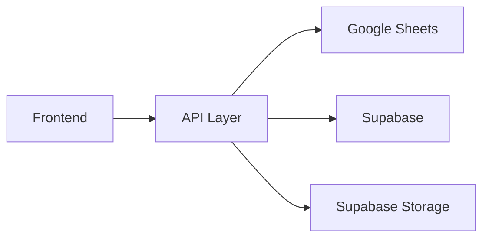

# Supabase Integration Guide

This guide shows how to integrate Supabase alongside Google Sheets for development and learning purposes.

## Architecture Overview



## Why Use Both?

- **Google Sheets**: Primary storage (already working, easy to view data)
- **Supabase**: Learning opportunity, modern database, future scalability
- **Dual-write**: All data goes to both systems
- **Seamless**: Frontend doesn't need to know about dual storage

## Setup Supabase

### 1. Create Supabase Project

1. Go to [supabase.com](https://supabase.com)
2. Sign up/login
3. Click "New Project"
4. Name it: "BabyShower2025"
5. Choose organization (or create new one)
6. Wait for project to be created

### 2. Create Database Tables

#### Table: guestbook

```sql
CREATE TABLE guestbook (
    id BIGSERIAL GENERATED ALWAYS AS IDENTITY PRIMARY KEY,
    created_at TIMESTAMP WITH TIME ZONE DEFAULT NOW(),
    name TEXT NOT NULL,
    relationship TEXT NOT NULL,
    message TEXT NOT NULL,
    photo_url TEXT
);
```

#### Table: baby_pool

```sql
CREATE TABLE baby_pool (
    id BIGSERIAL GENERATED ALWAYS AS IDENTITY PRIMARY KEY,
    created_at TIMESTAMP WITH TIME ZONE DEFAULT NOW(),
    name TEXT NOT NULL,
    date_guess DATE NOT NULL,
    time_guess TIME NOT NULL,
    weight_guess DECIMAL NOT NULL,
    length_guess INTEGER NOT NULL
);
```

#### Table: quiz_answers

```sql
CREATE TABLE quiz_answers (
    id BIGSERIAL GENERATED ALWAYS AS IDENTITY PRIMARY KEY,
    created_at TIMESTAMP WITH TIME ZONE DEFAULT NOW(),
    name TEXT NOT NULL,
    puzzle1 TEXT NOT NULL,
    puzzle2 TEXT NOT NULL,
    puzzle3 TEXT NOT NULL,
    puzzle4 TEXT NOT NULL,
    puzzle5 TEXT NOT NULL,
    score INTEGER NOT NULL
);
```

#### Table: advice

```sql
CREATE TABLE advice (
    id BIGSERIAL GENERATED ALWAYS AS IDENTITY PRIMARY KEY,
    created_at TIMESTAMP WITH TIME ZONE DEFAULT NOW(),
    name TEXT NOT NULL,
    advice_type TEXT NOT NULL,
    message TEXT NOT NULL
);
```

#### Table: name_votes

```sql
CREATE TABLE name_votes (
    id BIGSERIAL GENERATED ALWAYS AS IDENTITY PRIMARY KEY,
    created_at TIMESTAMP WITH TIME ZONE DEFAULT NOW(),
    name TEXT NOT NULL,
    selected_names TEXT NOT NULL
);
```

#### Table: milestones

```sql
CREATE TABLE milestones (
    id BIGSERIAL GENERATED ALWAYS AS IDENTITY PRIMARY KEY,
    key TEXT UNIQUE NOT NULL,
    value INTEGER NOT NULL,
    unlocked_at TIMESTAMP WITH TIME ZONE DEFAULT NOW()
);
```

### 3. Create Storage Bucket

1. Go to "Storage" tab in Supabase
2. Click "New bucket"
3. Name it: "guestbook-photos"
4. Make it "Public" (for photo access)
5. Note the bucket URL

### 4. Get Supabase Credentials

1. Go to "Settings" → "API"
2. Copy:
   - **Project URL** (e.g., `https://xyz.supabase.co`)
   - **Anon Public Key** (starts with `eyJ...`)
   - **service_role** (usually `service_role`)

## Updated Google Apps Script

The updated backend will write to both Google Sheets AND Supabase.

### Add Supabase Configuration

Add to top of [`backend/Code.gs`](backend/Code.gs:1):

```javascript
// Supabase Configuration
const SUPABASE_CONFIG = {
  PROJECT_URL: 'YOUR_SUPABASE_PROJECT_URL',
  ANON_KEY: 'YOUR_SUPABASE_ANON_KEY',
  STORAGE_BUCKET: 'guestbook-photos'
};
```

### Add Supabase Helper Functions

Add these functions to [`backend/Code.gs`](backend/Code.gs:1):

```javascript
/**
 * Insert row into Supabase table
 * @param {string} tableName - Name of table
 * @param {Object} data - Data to insert
 * @returns {Object} Response from Supabase
 */
function insertToSupabase(tableName, data) {
  const url = `${SUPABASE_CONFIG.PROJECT_URL}/rest/v1/${tableName}`;

  const options = {
    'method': 'post',
    'headers': {
      'apikey': SUPABASE_CONFIG.ANON_KEY,
      'Authorization': `Bearer ${SUPABASE_CONFIG.ANON_KEY}`,
      'Content-Type': 'application/json'
    },
    'payload': JSON.stringify(data),
    'muteHttpExceptions': true
  };

  const response = UrlFetchApp.fetch(url, options);
  const responseText = response.getContentText();

  if (response.getResponseCode() !== 201) {
    console.error('Supabase error:', responseText);
    return null;
  }

  return JSON.parse(responseText);
}

/**
 * Upload photo to Supabase Storage
 * @param {string} filename - Name of file
 * @param {string} mimeType - MIME type
 * @param {string} base64Data - Base64 encoded data
 * @returns {string|null} Public URL of uploaded file
 */
function uploadToSupabaseStorage(filename, mimeType, base64Data) {
  const bucketUrl = `${SUPABASE_CONFIG.PROJECT_URL}/storage/v1/object/${SUPABASE_CONFIG.STORAGE_BUCKET}/${filename}`;

  const options = {
    'method': 'post',
    'headers': {
      'apikey': SUPABASE_CONFIG.ANON_KEY,
      'Authorization': `Bearer ${SUPABASE_CONFIG.ANON_KEY}`,
      'Content-Type': mimeType,
      'x-upsert': 'true'
    },
    'payload': Utilities.base64Decode(base64Data),
    'muteHttpExceptions': true
  };

  const response = UrlFetchApp.fetch(bucketUrl, options);

  if (response.getResponseCode() !== 200) {
    console.error('Supabase storage error:', response.getContentText());
    return null;
  }

  // Return public URL
  return `${SUPABASE_CONFIG.PROJECT_URL}/storage/v1/object/public/${SUPABASE_CONFIG.STORAGE_BUCKET}/${filename}`;
}

/**
 * Get statistics from Supabase
 * @returns {Object} Statistics
 */
function getSupabaseStats() {
  const stats = {
    guestbookCount: 0,
    poolCount: 0,
    quizTotalCorrect: 0,
    adviceCount: 0,
    totalVotes: 0,
    voteCounts: {}
  };

  // Get guestbook count
  try {
    const guestbookUrl = `${SUPABASE_CONFIG.PROJECT_URL}/rest/v1/guestbook?select=count`;
    const response = UrlFetchApp.fetch(guestbookUrl, {
      'headers': {
        'apikey': SUPABASE_CONFIG.ANON_KEY,
        'Authorization': `Bearer ${SUPABASE_CONFIG.ANON_KEY}`
      },
      'muteHttpExceptions': true
    });

    if (response.getResponseCode() === 200) {
      const data = JSON.parse(response.getContentText());
      stats.guestbookCount = data[0]?.count || 0;
    }
  } catch (e) {
    console.error('Error getting guestbook count:', e);
  }

  // Get pool count
  try {
    const poolUrl = `${SUPABASE_CONFIG.PROJECT_URL}/rest/v1/baby_pool?select=count`;
    const response = UrlFetchApp.fetch(poolUrl, {
      'headers': {
        'apikey': SUPABASE_CONFIG.ANON_KEY,
        'Authorization': `Bearer ${SUPABASE_CONFIG.ANON_KEY}`
      },
      'muteHttpExceptions': true
    });

    if (response.getResponseCode() === 200) {
      const data = JSON.parse(response.getContentText());
      stats.poolCount = data[0]?.count || 0;
    }
  } catch (e) {
    console.error('Error getting pool count:', e);
  }

  // Get quiz total correct
  try {
    const quizUrl = `${SUPABASE_CONFIG.PROJECT_URL}/rest/v1/quiz_answers?select=score`;
    const response = UrlFetchApp.fetch(quizUrl, {
      'headers': {
        'apikey': SUPABASE_CONFIG.ANON_KEY,
        'Authorization': `Bearer ${SUPABASE_CONFIG.ANON_KEY}`
      },
      'muteHttpExceptions': true
    });

    if (response.getResponseCode() === 200) {
      const data = JSON.parse(response.getContentText());
      stats.quizTotalCorrect = data.reduce((sum, row) => sum + (row.score || 0), 0);
    }
  } catch (e) {
    console.error('Error getting quiz stats:', e);
  }

  // Get advice count
  try {
    const adviceUrl = `${SUPABASE_CONFIG.PROJECT_URL}/rest/v1/advice?select=count`;
    const response = UrlFetchApp.fetch(adviceUrl, {
      'headers': {
        'apikey': SUPABASE_CONFIG.ANON_KEY,
        'Authorization': `Bearer ${SUPABASE_CONFIG.ANON_KEY}`
      },
      'muteHttpExceptions': true
    });

    if (response.getResponseCode() === 200) {
      const data = JSON.parse(response.getContentText());
      stats.adviceCount = data[0]?.count || 0;
    }
  } catch (e) {
    console.error('Error getting advice count:', e);
  }

  // Get vote counts
  try {
    const votesUrl = `${SUPABASE_CONFIG.PROJECT_URL}/rest/v1/name_votes`;
    const response = UrlFetchApp.fetch(votesUrl, {
      'headers': {
        'apikey': SUPABASE_CONFIG.ANON_KEY,
        'Authorization': `Bearer ${SUPABASE_CONFIG.ANON_KEY}`
      },
      'muteHttpExceptions': true
    });

    if (response.getResponseCode() === 200) {
      const data = JSON.parse(response.getContentText());
      stats.totalVotes = data.reduce((sum, row) => {
        const names = row.selected_names ? row.selected_names.split(',') : [];
        return sum + names.length;
      }, 0);

      // Count votes per name
      data.forEach(row => {
        const names = row.selected_names ? row.selected_names.split(',') : [];
        names.forEach(name => {
          stats.voteCounts[name] = (stats.voteCounts[name] || 0) + 1;
        });
      });
    }
  } catch (e) {
    console.error('Error getting vote stats:', e);
  }

  return stats;
}
```

### Update Feature Handlers

Update each handler to write to both systems:

#### Updated handleGuestbook

```javascript
function handleGuestbook(params) {
  const headers = ['Timestamp', 'Name', 'Relationship', 'Message', 'PhotoURL'];

  // Write to Google Sheets
  const sheetResult = appendToSheet('Guestbook', headers, params);

  // Write to Supabase
  insertToSupabase('guestbook', {
    name: params.name,
    relationship: params.relationship,
    message: params.message,
    photo_url: params.photoURL || null
  });

  return {
    message: "Wish saved successfully!",
    rowIndex: sheetResult.rowIndex
  };
}
```

#### Updated handlePhotoUpload

```javascript
function handlePhotoUpload(params) {
  let photoURL = '';

  // Upload to Google Drive
  const folderId = 'YOUR_DRIVE_FOLDER_ID_HERE';
  const folder = DriveApp.getFolderById(folderId);
  const blob = Utilities.newBlob(
    Utilities.base64Decode(params.data),
    params.mimeType,
    params.filename
  );
  const driveFile = folder.createFile(blob);
  driveFile.setSharing(DriveApp.Access.ANYONE_WITH_LINK, DriveApp.Permission.VIEW);
  photoURL = driveFile.getUrl();

  // Upload to Supabase Storage
  const supabaseURL = uploadToSupabaseStorage(
    params.filename,
    params.mimeType,
    params.data
  );

  // Use Supabase URL if available, otherwise Google Drive URL
  const finalURL = supabaseURL || photoURL;

  return {
    url: finalURL,
    id: driveFile.getId(),
    name: driveFile.getName()
  };
}
```

#### Updated handlePool

```javascript
function handlePool(params) {
  const headers = ['Timestamp', 'Name', 'DateGuess', 'TimeGuess', 'WeightGuess', 'LengthGuess'];

  // Write to Google Sheets
  const sheetResult = appendToSheet('BabyPool', headers, params);

  // Write to Supabase
  insertToSupabase('baby_pool', {
    name: params.name,
    date_guess: params.dateGuess,
    time_guess: params.timeGuess,
    weight_guess: parseFloat(params.weightGuess),
    length_guess: parseInt(params.lengthGuess)
  });

  return {
    message: "Prediction saved!",
    rowIndex: sheetResult.rowIndex
  };
}
```

#### Updated handleQuiz

```javascript
function handleQuiz(params) {
  const correctAnswers = {
    puzzle1: "Baby Shower",
    puzzle2: "Three Little Pigs",
    puzzle3: "Rock a Bye Baby",
    puzzle4: "Baby Bottle",
    puzzle5: "Diaper Change"
  };

  let score = 0;
  for (let i = 1; i <= 5; i++) {
    const puzzleKey = 'puzzle' + i;
    if (params[puzzleKey] && params[puzzleKey].toLowerCase() === correctAnswers[puzzleKey].toLowerCase()) {
      score++;
    }
  }

  const headers = ['Timestamp', 'Name', 'Puzzle1', 'Puzzle2', 'Puzzle3', 'Puzzle4', 'Puzzle5', 'Score'];

  // Write to Google Sheets
  const sheetResult = appendToSheet('QuizAnswers', headers, {
    ...params,
    score: score
  });

  // Write to Supabase
  insertToSupabase('quiz_answers', {
    name: params.name,
    puzzle1: params.puzzle1,
    puzzle2: params.puzzle2,
    puzzle3: params.puzzle3,
    puzzle4: params.puzzle4,
    puzzle5: params.puzzle5,
    score: score
  });

  return {
    message: `You got ${score}/5 correct!`,
    score: score,
    rowIndex: sheetResult.rowIndex
  };
}
```

#### Updated handleAdvice

```javascript
function handleAdvice(params) {
  const headers = ['Timestamp', 'Name', 'AdviceType', 'Message'];

  // Write to Google Sheets
  const sheetResult = appendToSheet('Advice', headers, params);

  // Write to Supabase
  insertToSupabase('advice', {
    name: params.name,
    advice_type: params.adviceType,
    message: params.message
  });

  return {
    message: "Advice saved!",
    rowIndex: sheetResult.rowIndex
  };
}
```

#### Updated handleVote

```javascript
function handleVote(params) {
  const headers = ['Timestamp', 'Name', 'SelectedNames'];

  // Write to Google Sheets
  const sheetResult = appendToSheet('NameVotes', headers, params);

  // Write to Supabase
  insertToSupabase('name_votes', {
    name: params.name,
    selected_names: params.selectedNames
  });

  return {
    message: "Votes recorded!",
    rowIndex: sheetResult.rowIndex
  };
}
```

## Benefits of This Approach

### For Development
- **Learn Supabase**: Get familiar with PostgreSQL, REST API, and Storage
- **Compare systems**: See how both handle the same data
- **Easy rollback**: If Supabase has issues, Google Sheets still works
- **Data redundancy**: Data exists in both systems

### For Production
- **Choose later**: Decide which system to use as primary
- **Gradual migration**: Can migrate to Supabase gradually
- **Analytics**: Use Supabase for advanced queries and analytics
- **Scalability**: Supabase handles high traffic better

## Testing the Integration

### 1. Test Google Sheets Only
- Comment out Supabase calls temporarily
- Verify Google Sheets still works
- This ensures your fallback works

### 2. Test Supabase Only
- Comment out Google Sheets calls
- Verify Supabase works
- Check Supabase dashboard for data

### 3. Test Dual-Write
- Enable both systems
- Submit a guestbook entry
- Check Google Sheets for data
- Check Supabase dashboard for data
- Verify both have the same data

### 4. Test Photo Upload
- Upload a photo with guestbook
- Check Google Drive for photo
- Check Supabase Storage for photo
- Verify both URLs work

## Viewing Data

### Google Sheets
- Open your "BabyShower2025" spreadsheet
- View data in each tab
- Easy to export as CSV/Excel

### Supabase
- Go to Supabase dashboard
- Click "Table Editor" for each table
- Run SQL queries in "SQL Editor"
- Use Supabase Studio for visual queries

## Next Steps

1. **Set up Supabase project** (5 minutes)
2. **Create tables** (5 minutes)
3. **Get credentials** (2 minutes)
4. **Update [`backend/Code.gs`](backend/Code.gs:1)** with Supabase config (2 minutes)
5. **Test dual-write** (10 minutes)
6. **Explore Supabase features** (ongoing learning)

## Troubleshooting

### Supabase Write Fails

- Check PROJECT_URL and ANON_KEY are correct
- Verify table names match exactly
- Check Supabase project is active
- Look at Supabase logs for errors

### Google Sheets Write Fails

- Check sheet exists and is accessible
- Verify headers match table columns
- Check Apps Script permissions

### Data Mismatch

- Check field names between systems
- Verify data types match (text, number, date)
- Look at error logs in Apps Script

## Learning Path

### Week 1: Basics
- Create Supabase project
- Set up tables
- Test basic CRUD operations
- Compare with Google Sheets

### Week 2: Advanced
- Learn SQL queries
- Use Supabase Studio
- Explore relationships and foreign keys
- Build simple dashboards

### Week 3: Integration
- Build dual-write system
- Handle errors gracefully
- Implement retry logic
- Monitor both systems

### Week 4: Migration (Optional)
- Decide on primary system
- Migrate historical data
- Update frontend if needed
- Decommission old system

## Resources

- [Supabase Documentation](https://supabase.com/docs)
- [Supabase SQL Guide](https://supabase.com/docs/guides/database)
- [PostgreSQL Tutorial](https://www.postgresqltutorial.com/)
- [REST API Guide](https://restfulapi.net/)
