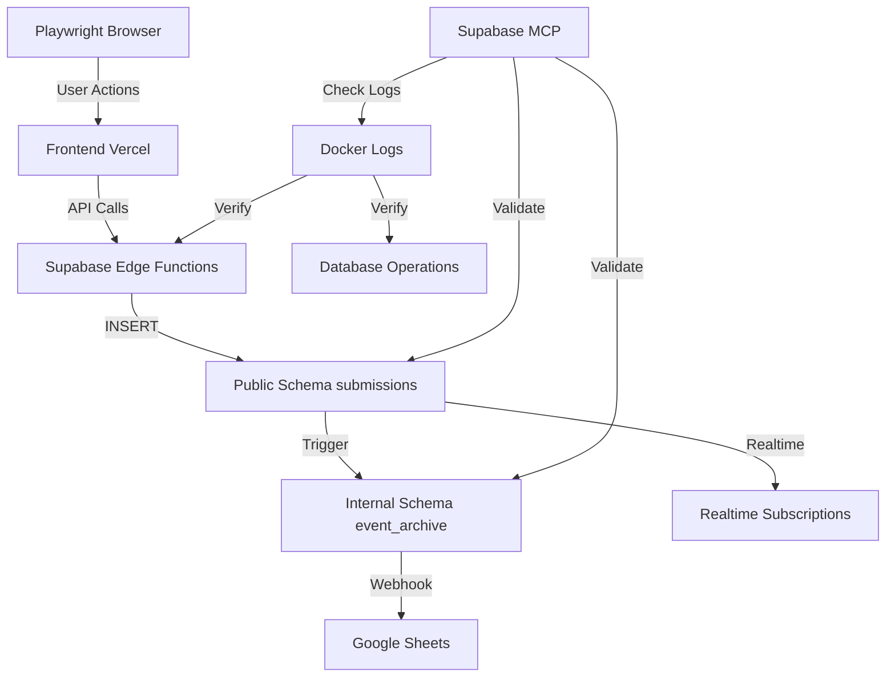

# E2E Testing Strategy - Baby Shower App
**Generated**: 2026-01-02  
**Target**: https://baby-shower-qr-app.vercel.app  
**Supabase Project**: bkszmvfsfgvdwzacgmfz (ACTIVE_HEALTHY)

---

## 📋 Application Entry Points

### 1. Frontend (Vercel)
- **URL**: https://baby-shower-qr-app.vercel.app
- **Activities**: 5 entry points
  - Guestbook (Leave a Wish)
  - Baby Pool (Guess Baby's Stats)
  - Quiz (Baby Emoji Pictionary)
  - Advice (Advice Time Capsule)
  - Voting (Vote for Names)

### 2. API Layer (Supabase Edge Functions)
- **Base URL**: https://bkszmvfsfgvdwzacgmfz.supabase.co/functions/v1/
- **Functions**: 5/5 ACTIVE
  - guestbook (v2)
  - vote (v1)
  - pool (v1)
  - quiz (v1)
  - advice (v1)

### 3. Database Layer (Supabase PostgreSQL)
- **Tables**:
  - `public.submissions` (9 rows, RLS enabled)
  - `internal.event_archive` (trigger-mirrored)
- **Views**:
  - `v_today_submissions`
  - `v_activity_breakdown`
- **Triggers**:
  - `on_submission_insert` → `internal.handle_submission_migration()`

### 4. External Integration
- **Google Sheets**: Webhook from `internal.event_archive` INSERT events
- **Real-time**: Supabase Realtime subscriptions (optional)

---

## 🧪 Testing Architecture



---

## 📊 Test Plan

### Phase 1: Playwright E2E Tests (Frontend)

#### Test Suite 1: Guestbook Entry Point
**Objective**: Validate guestbook form submission and data persistence

**Steps**:
1. Navigate to https://baby-shower-qr-app.vercel.app
2. Click "Leave a Wish" button
3. Fill form with realistic user data:
   - Name: Sarah Johnson
   - Relationship: Friend
   - Message: Congratulations on your little miracle!
4. Submit form
5. Verify success modal appears
6. Use Supabase MCP to validate data in `public.submissions`
7. Use Supabase MCP to validate data in `internal.event_archive`
8. Check Supabase Docker logs for edge function execution

**Expected Results**:
- ✅ Success modal displays
- ✅ Row inserted into `public.submissions` with `activity_type='guestbook'`
- ✅ Row mirrored to `internal.event_archive` via trigger
- ✅ Edge function logs show successful execution
- ✅ Response time < 2 seconds

**Validation Queries**:
```sql
-- Verify public.submissions
SELECT id, name, activity_type, activity_data
FROM public.submissions
WHERE activity_type = 'guestbook'
ORDER BY created_at DESC
LIMIT 1;

-- Verify internal.event_archive
SELECT id, guest_name, activity_type, processed_data
FROM internal.event_archive
WHERE activity_type = 'guestbook'
ORDER BY created_at DESC
LIMIT 1;
```

---

#### Test Suite 2: Baby Pool Entry Point
**Objective**: Validate birth prediction form submission

**Steps**:
1. Navigate to app
2. Click "Guess Baby's Stats" button
3. Fill form with realistic data:
   - Name: Michael Chen
   - Date: 2026-03-15
   - Time: 08:30
   - Weight: 3.4 kg
   - Length: 51 cm
4. Submit form
5. Verify success modal
6. Validate database via Supabase MCP
7. Check Docker logs

**Expected Results**:
- ✅ Success modal displays
- ✅ Row inserted with `activity_type='pool'`
- ✅ Prediction data stored in `activity_data` JSONB
- ✅ Trigger mirrors to internal schema
- ✅ Edge function logs show successful execution

---

#### Test Suite 3: Quiz Entry Point
**Objective**: Validate emoji puzzle submission

**Steps**:
1. Navigate to app
2. Click "Baby Emoji Pictionary" button
3. Fill form with realistic answers:
   - Name: Emma Wilson
   - Puzzle 1: baby shower
   - Puzzle 2: little wolf
   - Puzzle 3: good night sleep tight
   - Puzzle 4: bottle and lotion
   - Puzzle 5: baby diaper
4. Submit form
5. Verify success modal
6. Validate database via Supabase MCP
7. Check Docker logs

**Expected Results**:
- ✅ Success modal displays
- ✅ Row inserted with `activity_type='quiz'`
- ✅ Answers stored in `activity_data` JSONB
- ✅ Trigger mirrors to internal schema
- ✅ Edge function logs show successful execution

---

#### Test Suite 4: Advice Entry Point
**Objective**: Validate advice time capsule submission

**Steps**:
1. Navigate to app
2. Click "Give Advice" button
3. Fill form with realistic data:
   - Name: Jennifer Martinez
   - Type: For Parents
   - Message: Trust your instincts - you know your baby better than anyone!
4. Submit form
5. Verify success modal
6. Validate database via Supabase MCP
7. Check Docker logs

**Expected Results**:
- ✅ Success modal displays
- ✅ Row inserted with `activity_type='advice'`
- ✅ Advice data stored in `activity_data` JSONB
- ✅ Trigger mirrors to internal schema
- ✅ Edge function logs show successful execution

---

#### Test Suite 5: Voting Entry Point
**Objective**: Validate name voting functionality

**Steps**:
1. Navigate to app
2. Click "Vote for Names" button
3. Wait for name list to load
4. Select 3 names (e.g., Emma, Olivia, Sophia)
5. Verify submit button enables
6. Submit votes
7. Verify success modal
8. Validate database via Supabase MCP
9. Check Docker logs

**Expected Results**:
- ✅ Name list loads correctly
- ✅ Submit button enables after selecting 3 names
- ✅ Success modal displays
- ✅ Row inserted with `activity_type='vote'`
- ✅ Names array stored in `activity_data` JSONB
- ✅ Trigger mirrors to internal schema
- ✅ Edge function logs show successful execution

---

### Phase 2: Database Layer Validation

#### Test Suite 6: RLS Policy Validation
**Objective**: Verify Row Level Security policies enforce correctly

**Tests**:
1. **INSERT Permission** (Anon User)
   - Attempt INSERT via Supabase REST API with anon key
   - Expected: ✅ Success (policy allows anon INSERT)

2. **SELECT Permission** (Public Read)
   - Attempt SELECT via Supabase REST API with anon key
   - Expected: ✅ Success (policy allows public SELECT)

3. **UPDATE Permission** (Deny All)
   - Attempt UPDATE via Supabase REST API with anon key
   - Expected: ❌ Denied (policy denies UPDATE)

4. **DELETE Permission** (Deny All)
   - Attempt DELETE via Supabase REST API with anon key
   - Expected: ❌ Denied (policy denies DELETE)

5. **Internal Schema Protection**
   - Attempt SELECT on `internal.event_archive` with anon key
   - Expected: ❌ Denied (service role only)

**Validation Queries**:
```sql
-- Test RLS policies
-- These should be run via Supabase MCP execute_sql

-- Test 1: INSERT should work
INSERT INTO public.submissions (name, activity_type, activity_data)
VALUES ('RLS Test', 'guestbook', '{"message":"test"}'::jsonb);

-- Test 2: SELECT should work
SELECT * FROM public.submissions LIMIT 1;

-- Test 3: UPDATE should fail
UPDATE public.submissions SET name = 'Hacked' WHERE id = 1;
-- Expected: ERROR: new row violates row-level security policy

-- Test 4: DELETE should fail
DELETE FROM public.submissions WHERE id = 1;
-- Expected: ERROR: new row violates row-level security policy

-- Test 5: Internal schema should deny anon
SELECT * FROM internal.event_archive LIMIT 1;
-- Expected: ERROR: permission denied for table internal.event_archive
```

---

#### Test Suite 7: Trigger Validation
**Objective**: Verify automatic data migration from public to internal schema

**Steps**:
1. Insert test row into `public.submissions`
2. Query `internal.event_archive` for mirrored row
3. Verify `processed_data` contains migration metadata
4. Check `processing_time_ms` is populated

**Expected Results**:
- ✅ Row appears in `internal.event_archive` within 10ms
- ✅ `processed_data` contains `migrated_at` timestamp
- ✅ `processing_time_ms` is reasonable (< 10ms)
- ✅ All fields from `activity_data` preserved

---

### Phase 3: Real-time Validation

#### Test Suite 8: Real-time Subscriptions
**Objective**: Verify Supabase Realtime updates work correctly

**Steps**:
1. Activate real-time subscription on `public.submissions` table
2. Subscribe to INSERT events
3. Submit form via Playwright
4. Verify real-time event received
5. Check event payload contains correct data

**Expected Results**:
- ✅ Subscription connects successfully
- ✅ Real-time event received within 1 second
- ✅ Event payload matches submitted data
- ✅ Event type is 'INSERT'

---

### Phase 4: Infrastructure Validation

#### Test Suite 9: Docker Logs Verification
**Objective**: Verify all operations logged correctly

**Steps**:
1. Check Supabase API logs for edge function calls
2. Check Supabase Postgres logs for database operations
3. Verify no errors in logs
4. Verify response times are acceptable

**Expected Results**:
- ✅ All 5 edge functions logged
- ✅ Database INSERT operations logged
- ✅ Trigger executions logged
- ✅ No error messages
- ✅ Response times < 500ms (P95)

---

#### Test Suite 10: Supabase Advisors
**Objective**: Check for security and performance issues

**Steps**:
1. Run Supabase security advisor
2. Run Supabase performance advisor
3. Review recommendations
4. Address any critical issues

**Expected Results**:
- ✅ No critical security issues
- ✅ No performance bottlenecks
- ✅ RLS policies properly configured
- ✅ Indexes optimized for query patterns

---

### Phase 5: Post-Deployment Validation

#### Test Suite 11: Production URL Validation
**Objective**: Verify Vercel deployment works correctly

**Steps**:
1. Navigate to https://baby-shower-qr-app.vercel.app
2. Verify all 5 activity buttons load
3. Verify forms are accessible
4. Verify Supabase API calls work
5. Test on mobile viewport

**Expected Results**:
- ✅ Page loads successfully
- ✅ All activities accessible
- ✅ Forms submit successfully
- ✅ Responsive design works on mobile
- ✅ No console errors

---

## 📝 Test Execution Workflow

### 1. Pre-Test Setup
- [ ] Stop local development server (if running)
- [ ] Verify production URL is accessible
- [ ] Verify Supabase project is ACTIVE_HEALTHY
- [ ] Document starting timestamp

### 2. Execute Playwright Tests
- [ ] Run guestbook test
- [ ] Validate database after guestbook test
- [ ] Run pool test
- [ ] Validate database after pool test
- [ ] Run quiz test
- [ ] Validate database after quiz test
- [ ] Run advice test
- [ ] Validate database after advice test
- [ ] Run voting test
- [ ] Validate database after voting test

### 3. Infrastructure Validation
- [ ] Check Docker logs for all edge function executions
- [ ] Check Docker logs for database operations
- [ ] Verify RLS policies with test queries
- [ ] Activate real-time subscriptions
- [ ] Validate real-time events
- [ ] Run Supabase advisors

### 4. Documentation
- [ ] Compile test results
- [ ] Document any failures
- [ ] Create fixes for issues
- [ ] Commit fixes to git
- [ ] Push to trigger Vercel deployment

### 5. Post-Deployment Validation
- [ ] Verify deployment on Vercel
- [ ] Run full E2E test suite again
- [ ] Generate final test report

---

## 🔍 Success Criteria

### Entry Point Tests
- ✅ All 5 entry points tested via Playwright
- ✅ Each form submission succeeds
- ✅ Success modals display correctly
- ✅ No console errors

### Database Tests
- ✅ All submissions appear in `public.submissions`
- ✅ All submissions mirrored to `internal.event_archive`
- ✅ Trigger latency < 10ms
- ✅ RLS policies enforced correctly

### Infrastructure Tests
- ✅ Edge functions execute without errors
- ✅ Docker logs show clean operations
- ✅ Real-time subscriptions work
- ✅ No security/performance advisor warnings

### Deployment Tests
- ✅ Vercel deployment successful
- ✅ Production URL accessible
- ✅ All features work in production

---

## 📊 Test Results Template

```json
{
  "testRun": {
    "timestamp": "2026-01-02T00:00:00Z",
    "environment": "production",
    "url": "https://baby-shower-qr-app.vercel.app",
    "supabaseProject": "bkszmvfsfgvdwzacgmfz"
  },
  "entryPoints": {
    "guestbook": {
      "status": "PASS|FAIL",
      "responseTime": "ms",
      "databaseInsert": "true|false",
      "triggerExecution": "true|false",
      "errors": []
    },
    "pool": {
      "status": "PASS|FAIL",
      "responseTime": "ms",
      "databaseInsert": "true|false",
      "triggerExecution": "true|false",
      "errors": []
    },
    "quiz": {
      "status": "PASS|FAIL",
      "responseTime": "ms",
      "databaseInsert": "true|false",
      "triggerExecution": "true|false",
      "errors": []
    },
    "advice": {
      "status": "PASS|FAIL",
      "responseTime": "ms",
      "databaseInsert": "true|false",
      "triggerExecution": "true|false",
      "errors": []
    },
    "voting": {
      "status": "PASS|FAIL",
      "responseTime": "ms",
      "databaseInsert": "true|false",
      "triggerExecution": "true|false",
      "errors": []
    }
  },
  "database": {
    "rlsTests": {
      "insertAllowed": "true|false",
      "selectAllowed": "true|false",
      "updateDenied": "true|false",
      "deleteDenied": "true|false",
      "internalProtected": "true|false"
    },
    "triggerLatency": {
      "average": "ms",
      "max": "ms"
    }
  },
  "infrastructure": {
    "edgeFunctions": {
      "guestbook": "ACTIVE|ERROR",
      "vote": "ACTIVE|ERROR",
      "pool": "ACTIVE|ERROR",
      "quiz": "ACTIVE|ERROR",
      "advice": "ACTIVE|ERROR"
    },
    "dockerLogs": {
      "errors": 0,
      "warnings": 0
    },
    "realtime": {
      "subscriptionActive": "true|false",
      "eventsReceived": 0
    },
    "advisors": {
      "securityIssues": 0,
      "performanceIssues": 0
    }
  },
  "summary": {
    "totalTests": 33,
    "passed": 0,
    "failed": 0,
    "passRate": "0%"
  }
}
```

---

## 🚨 Known Issues & Mitigations

### Potential Issues
1. **Edge Function Timeout**
   - Symptom: Request times out after 30s
   - Mitigation: Check Deno code for infinite loops
   - Fix: Add timeout handling

2. **RLS Policy Violation**
   - Symptom: INSERT/SELECT fails with permission error
   - Mitigation: Review policy conditions
   - Fix: Update RLS policies in Supabase dashboard

3. **Trigger Failure**
   - Symptom: Data not appearing in `internal.event_archive`
   - Mitigation: Check trigger function syntax
   - Fix: Re-run migration script

4. **Real-time Not Working**
   - Symptom: No events received after submission
   - Mitigation: Verify replication enabled in dashboard
   - Fix: Enable replication for `public.submissions`

5. **Google Sheets Not Receiving Data**
   - Symptom: Webhook not triggering
   - Mitigation: Check webhook URL configuration
   - Fix: Update webhook in Supabase dashboard

---

## 📚 References

- **Playwright Docs**: https://playwright.dev/docs/best-practices
- **Supabase Edge Functions**: https://supabase.com/docs/guides/functions
- **Supabase RLS**: https://supabase.com/docs/guides/auth/row-level-security
- **Supabase Realtime**: https://supabase.com/docs/guides/realtime
- **Vercel Deployments**: https://vercel.com/docs/deployments

---

**Document Version**: 1.0  
**Last Updated**: 2026-01-02T00:38:00Z  
**Status**: Ready for Execution
