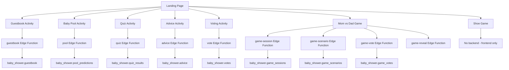

# Landing Page Strategic Plan

**Created:** January 9, 2026  
**Component:** Landing Page (Baby Shower Application)  
**Session ID:** ses-landing-page-strategic-planning

---

## 1. Executive Summary

The Landing Page serves as the entry point and central hub for the Baby Shower application. This strategic plan analyzes the current state of the Landing Page component, identifies critical issues from the QA Analysis Report, and provides a comprehensive roadmap for implementation and configuration.

### Current State Assessment

The Landing Page is a well-structured component with:
- ✅ 5 core activities: Guestbook, Baby Pool, Quiz, Advice, Voting
- ✅ 2 games: Mom vs Dad, Shoe Game (Who Would Rather)
- ✅ Real-time data updates via Supabase subscriptions
- ✅ AI-powered features (MiniMax API for roasts)
- ✅ Character-based anime mascot system
- ✅ Mobile-responsive design

### Critical Findings from QA Analysis

| Category | Count | Impact |
|----------|-------|--------|
| Broken Components | 3 | Direct functionality failure |
| Unnecessary Components | 4 | Technical debt, confusion |
| Missing Components | 3 | Feature gaps, reduced functionality |
| **Total Issues** | **10** | Requires immediate attention |

---

## 2. Current Issues and Required Fixes

### 2.1 Critical Issues (Priority 1)

#### Issue #1: Empty `setup-demo-sessions` Directory

**Location:** `C:\Project\Baby_Shower\supabase\functions\setup-demo-sessions\`

**Problem:**
- Directory exists but contains no files
- Created/modified on Jan 8 but never populated
- Creates confusion during deployment and code review

**Impact:**
- Deployments may fail if scripts check for function existence
- Developer confusion about which function handles demo sessions
- Duplicate functionality with `create-demo-sessions/index.ts`

**Root Cause:**
Incomplete refactoring during Mom vs Dad game schema migration (2026-01-08)

**Fix Required:**
```bash
# Remove the empty directory
rm -rf C:\Project\Baby_Shower\supabase\functions\setup-demo-sessions\
```

**Timeline Estimate:** 5 minutes  
**Risk:** Low - Function is not used by any code

---

#### Issue #2: Incomplete Schema Migration in `lobby-join`

**Location:** `C:\Project\Baby_Shower\supabase\functions\lobby-join\index.ts`

**Problem:**
1. **Parameter name inconsistency** (Lines 23, 73):
   ```typescript
   interface JoinSessionRequest {
     lobby_key: string  // Should be session_code per new schema
   }
   ```

2. **Dead code for LOBBY format detection** (Lines 90-94):
   ```typescript
   const lobbyMatch = normalizedLobbyKey.match(/^LOBBY-([A-D])$/)
   if (lobbyMatch) {
     normalizedLobbyKey = lobbyMatch[1]  // Converts LOBBY-A → A
   ```
   This converts "LOBBY-A" to "A", but `create-demo-sessions` creates sessions with 6-character codes like "LOBBY-A", not single letters.

3. **Comment references deprecated schema** (Lines 83-94)

**Impact:**
- Guests using LOBBY format codes cannot join sessions
- Runtime errors when comparing converted keys against actual session codes
- Broken Mom vs Dad game join functionality

**Root Cause:**
Schema migration from `mom_dad_*` tables to `game_*` tables was incomplete. Function parameters and logic were not fully updated.

**Fix Required:**
```typescript
// Update interface (Line 23)
interface JoinSessionRequest {
  session_code: string  // Changed from lobby_key
}

// Remove LOBBY format conversion code (Lines 90-94)
// This dead code should be deleted entirely

// Update all references from lobby_key to session_code
```

**Files to Modify:**
- `supabase/functions/lobby-join/index.ts`

**Timeline Estimate:** 30 minutes  
**Risk:** Medium - Affects user authentication flow

---

#### Issue #3: Vote Function Table Reference

**Location:** `C:\Project\Baby_Shower\supabase\functions\vote\index.ts`

**Problem:**
Line 61 uses incorrect table reference:
```typescript
.from('votes')  // Should be 'baby_shower.votes'
```

**Impact:**
- Data may be going to wrong table (`public.votes` vs `baby_shower.votes`)
- Inconsistent with other Edge Functions that use `baby_shower.*` prefix
- Data isolation issues - votes not visible in expected location
- Broken voting statistics on landing page

**Root Cause:**
Inconsistent schema prefix usage across Edge Functions

**Fix Required:**
```typescript
// Line 61: Change
.from('votes')
// To
.from('baby_shower.votes')
```

**Files to Modify:**
- `supabase/functions/vote/index.ts`

**Timeline Estimate:** 10 minutes  
**Risk:** Medium - Affects voting data persistence

---

### 2.2 Technical Debt (Priority 2)

#### Issue #4: Deprecated `who-would-rather` Database Tables

**Location:** `C:\Project\Baby_Shower\supabase\migrations\20260104_who_would_rather_schema.sql`

**Status:**
| Table | Rows | Usage |
|-------|------|-------|
| `who_would_rather_sessions` | 0 | Not used - frontend is session-only |
| `who_would_rather_questions` | 24 | Not used - frontend has 19 hardcoded questions |
| `who_would_rather_votes` | 0 | Not used - votes stored in JavaScript state |

**Impact:**
- Wastes database storage
- Creates confusion about data persistence expectations
- Dead code that may be accidentally used
- Question count mismatch: 24 in database vs 19 in frontend

**Recommendation:**
Delete the migration and tables, or update frontend to use database persistence.

**Timeline Estimate:** 1 hour (includes testing)  
**Risk:** Low - Tables are unused

---

#### Issue #5: Duplicate Demo Session Functions

**Status:**
| Function | Status | Purpose |
|----------|--------|---------|
| `create-demo-sessions/index.ts` | ✅ Active | Creates LOBBY-A through LOBBY-D sessions |
| `setup-demo-sessions/` | ❌ Empty directory | Duplicate/leftover |

**Fix Required:**
Already covered in Issue #1 - remove empty directory.

---

#### Issue #6: Deprecated `public.submissions` Table

**Location:** `C:\Project\Baby_Shower\supabase\migrations\supabase-production-schema.sql`

**Status:**
- Table renamed to `public.submissions_DEPRECATED` per AGENTS.md
- Still exists in schema dump
- All new code uses `baby_shower.submissions`

**Impact:**
- Dead table consuming storage
- Potential confusion if old code references it
- Should be cleaned up in next migration

**Fix Required:**
Schedule removal of `public.submissions_DEPRECATED` table in next migration.

**Timeline Estimate:** 30 minutes (migration creation)  
**Risk:** Low - Table is deprecated and unused

---

#### Issue #7: Orphaned Test/Debug Scripts

**Location:** `C:\Project\Baby_Shower\scripts\tests\`

**Status:**
- 11+ test scripts with unknown maintenance status
- May contain outdated testing patterns
- Creates noise in the codebase

**Impact:**
- Developer confusion about which tests to run
- Outdated testing patterns may mislead new developers
- Technical debt in test suite

**Fix Required:**
Consolidate into existing test framework in `tests/e2e/` directory.

**Timeline Estimate:** 2 hours (requires evaluation of each script)  
**Risk:** Low - Test scripts only

---

### 2.3 Missing Components (Priority 2)

#### Issue #8: Missing RPC Function Documentation

**Status:**
| RPC Function | Referenced In | Status |
|--------------|---------------|--------|
| `get_session_details` | `game-session/index.ts:87` | ✅ Exists |
| `insert_quiz_result` | `quiz/index.ts:78` | ✅ Exists |
| `baby_shower.generate_session_code` | `lobby-create/index.ts:115` | ⚠️ Unverified |
| `baby_shower.calculate_vote_stats` | `lobby-status/index.ts:118` | ⚠️ Unverified |
| `insert_advice` | `advice/index.ts` | ⚠️ Unverified |

**Impact:**
- Functions like `generate_session_code` and `calculate_vote_stats` are called but SQL definitions not verified
- Runtime errors may occur if functions don't exist
- Mom vs Dad game may fail at critical moments

**Fix Required:**
Verify all RPC functions exist in database migrations. Add missing functions if needed.

**Timeline Estimate:** 1 hour  
**Risk:** Medium - Affects game functionality

---

#### Issue #9: AI API Key Configuration Missing

**Status:**
| API Key | Used In | Purpose |
|---------|---------|---------|
| `Z_AI_API_KEY` | `game-start/index.ts`, `game-scenario/index.ts` | Scenario generation |
| `KIMI_API_KEY` | `game-reveal/index.ts` | Roast commentary |
| `MINIMAX_API_KEY` | `pool/index.ts`, `advice/index.ts` | AI roasts |

**Current Status:**
Code gracefully falls back when keys are missing:
```typescript
const zaiApiKey = Deno.env.get('Z_AI_API_KEY')
if (zaiApiKey) {
  // Try AI generation
} else {
  console.log('Game Start - No Z.AI API key configured, using fallback scenarios')
  scenarios = generateFallbackScenarios(...)
}
```

**Impact:**
- Game scenarios always use fallback templates (less personalized)
- AI roast commentary unavailable
- Reduced "wow factor" for Mom vs Dad game
- 2 of 3 AI integrations are non-functional

**Fix Required:**
Configure AI API keys in Supabase environment variables:
- `Z_AI_API_KEY` for scenario generation (Z.AI / GLM-4.7)
- `KIMI_API_KEY` for Moonshot AI roasts (Kimi K2)

**Timeline Estimate:** 30 minutes  
**Risk:** Low - Fallback exists, feature enhancement only

---

#### Issue #10: Question Count Mismatch - Shoe Game

**Status:**
| Source | Question Count |
|--------|----------------|
| `baby_shower.who_would_rather_questions` table | 24 questions |
| `scripts/who-would-rather.js` hardcoded array | 19 questions |

**Impact:**
- 5 database questions are never used
- If database was source of truth, 5 questions would be missing from UI
- Inconsistent state between database and frontend

**Fix Required:**
Either:
1. Update frontend to use database questions (24 questions)
2. Remove unused database questions
3. Document why frontend uses hardcoded questions

**Timeline Estimate:** 1 hour  
**Risk:** Low - Cosmetic/feature enhancement

---

## 3. Required Configuration Changes

### 3.1 Supabase Environment Variables

The following environment variables must be configured in Supabase for full AI functionality:

```bash
# Supabase Dashboard → Settings → Edge Functions → Secrets

# Required for enhanced functionality
Z_AI_API_KEY=your_z_ai_api_key_here  # GLM-4.7 for game scenarios
KIMI_API_KEY=your_kimi_api_key_here  # Kimi K2 for roast commentary

# Already configured (verify)
SUPABASE_URL=https://your-project.supabase.co
SUPABASE_SERVICE_ROLE_KEY=your_service_role_key
SUPABASE_ANON_KEY=your_anon_key
MINIMAX_API_KEY=your_minimax_api_key  # For pool/advice roasts
```

### 3.2 Database Schema Configuration

**Current Schema Status:**
| Table | Status | Action |
|-------|--------|--------|
| `baby_shower.submissions` | ✅ Active | No change |
| `baby_shower.guestbook` | ✅ Active | No change |
| `baby_shower.pool_predictions` | ✅ Active | No change |
| `baby_shower.quiz_results` | ✅ Active | No change |
| `baby_shower.advice` | ✅ Active | No change |
| `baby_shower.votes` | ⚠️ Fix needed | Add schema prefix to vote function |
| `baby_shower.game_sessions` | ✅ Active | No change |
| `baby_shower.game_scenarios` | ✅ Active | No change |
| `baby_shower.game_votes` | ✅ Active | No change |
| `baby_shower.game_answers` | ✅ Active | No change |
| `baby_shower.game_results` | ✅ Active | No change |
| `baby_shower.who_would_rather_*` | ❌ Deprecated | Remove migration and tables |
| `public.submissions_DEPRECATED` | ❌ Deprecated | Remove in next migration |

### 3.3 Frontend Configuration

**Critical Configuration in `scripts/config.js`:**

```javascript
CONFIG = {
    // Anime character system (mom, dad, baby mascots)
    ANIME_CHARACTERS: {
        mom: { name: 'Michelle', avatar: '...' },
        dad: { name: 'Jazeel', avatar: '...' },
        baby: { name: 'Baby', avatar: '...' }
    },
    
    // Milestone thresholds
    MILESTONES: {
        guestbook: [5, 10, 20, 50],
        pool: [10, 25, 50],
        quiz: [25, 50],
        advice: [10, 25],
        votes: [10, 25, 50]
    },
    
    // Quiz puzzles
    QUIZ_PUZZLES: {
        puzzle1: { emoji: '👶🎂🕯️', answer: 'Birthday Cake' },
        // ... remaining puzzles
    },
    
    // Color options for pool predictions
    FAVOURITE_COLOUR_OPTIONS: [
        'pink', 'blue', 'purple', 'green', 'yellow', 'orange', 'red', 'white'
    ],
    
    // Storage bucket configuration
    STORAGE_BUCKETS: {
        baby_shower_pictures: 'baby-shower-pictures',
        guestbook_photos: 'guestbook-photos'
    }
}
```

### 3.4 Edge Function Configuration

**Standard Headers (all Edge Functions):**

```typescript
// All functions should include these headers
const CORS_HEADERS = {
    'Access-Control-Allow-Origin': '*',
    'Access-Control-Allow-Headers': 'authorization, x-client-info, apikey, content-type',
    'Access-Control-Allow-Methods': 'POST, OPTIONS'
}

const SECURITY_HEADERS = {
    'Content-Type': 'application/json',
    'X-Content-Type-Options': 'nosniff',
    'X-Frame-Options': 'DENY'
}
```

**Required Security Functions:**

```typescript
// Import from shared security utilities
import { 
    validateEnvironmentVariables, 
    createErrorResponse, 
    createSuccessResponse,
    validateInput,
    CORS_HEADERS,
    SECURITY_HEADERS
} from '../_shared/security.ts'
```

---

## 4. Implementation Priorities

### Phase 1: Critical Fixes (Day 1)

| Priority | Issue | Estimated Time | Dependencies |
|----------|-------|----------------|--------------|
| P1-1 | Remove empty `setup-demo-sessions` directory | 5 min | None |
| P1-2 | Fix `lobby-join` parameter names and remove dead code | 30 min | None |
| P1-3 | Fix `vote` function table reference | 10 min | None |
| P1-4 | Verify RPC functions exist | 1 hour | Database access |

**Phase 1 Total Estimated Time:** 2 hours

---

### Phase 2: Technical Debt Cleanup (Day 2)

| Priority | Issue | Estimated Time | Dependencies |
|----------|-------|----------------|--------------|
| P2-1 | Remove deprecated `who_would_rather_*` tables | 1 hour | Phase 1 complete |
| P2-2 | Remove `public.submissions_DEPRECATED` | 30 min | Phase 1 complete |
| P2-3 | Consolidate test scripts | 2 hours | None |
| P2-4 | Resolve question count mismatch | 1 hour | P2-1 |

**Phase 2 Total Estimated Time:** 4.5 hours

---

### Phase 3: Feature Enhancement (Day 3)

| Priority | Issue | Estimated Time | Dependencies |
|----------|-------|----------------|--------------|
| P3-1 | Configure AI API keys (Z.AI, Kimi) | 30 min | None |
| P3-2 | Update frontend to use database questions | 1 hour | P2-1 |
| P3-3 | Document AI API key requirements | 30 min | P3-1 |
| P3-4 | Update AGENTS.md to reflect current state | 1 hour | All above |

**Phase 3 Total Estimated Time:** 3 hours

---

### Grand Total Timeline: 9.5 hours (1.5 working days)

---

## 5. Dependencies and Integration Points

### 5.1 External Dependencies

| Dependency | Type | Purpose | Status |
|------------|------|---------|--------|
| Supabase | Backend | Database, Auth, Realtime | ✅ Configured |
| MiniMax API | AI Service | Pool/Advice roasts | ⚠️ Configured |
| Z.AI (GLM-4.7) | AI Service | Game scenario generation | ❌ Not configured |
| Kimi (K2) | AI Service | Game roast commentary | ❌ Not configured |

### 5.2 Internal Dependencies



### 5.3 Data Flow Dependencies

**Landing Page Data Flow:**
```
index.html (Landing Page)
    ↓ User interaction
main.js (Central controller)
    ↓ API calls
api-supabase.js / api-supabase-enhanced.js
    ↓ Edge Functions
supabase/functions/*/index.ts
    ↓ Database operations
baby_shower schema tables
    ↓ Realtime updates
realtime-manager-enhanced.js
    ↓ UI updates
index.html (Updated display)
```

---

## 6. Success Criteria

### 6.1 Functional Success Criteria

| Criterion | Target | Measurement |
|-----------|--------|-------------|
| All Edge Functions deploy successfully | 100% | `supabase functions list` shows all functions |
| All database tables accessible | 100% | SELECT queries succeed on all `baby_shower.*` tables |
| Realtime subscriptions work | 100% | Changes propagate to all connected clients |
| AI features functional | 2/3 APIs | Z.AI and Kimi APIs configured and responding |
| Vote data persists correctly | 100% | Votes stored in `baby_shower.votes` table |
| Game sessions create successfully | 100% | LOBBY-A through LOBBY-D sessions accessible |

### 6.2 Code Quality Success Criteria

| Criterion | Target | Measurement |
|-----------|--------|-------------|
| No empty/dead directories | 0 | `setup-demo-sessions` directory removed |
| No deprecated table references | 0 | `mom_dad_*` references removed from code |
| Consistent schema prefix usage | 100% | All Edge Functions use `baby_shower.` prefix |
| No missing RPC functions | 0 | All referenced RPC functions verified |
| Test scripts consolidated | 100% | All tests in `tests/e2e/` directory |

### 6.3 Performance Success Criteria

| Criterion | Target | Measurement |
|-----------|--------|-------------|
| Page load time | < 3s | Lighthouse audit |
| API response time | < 500ms | Edge Function response times |
| Realtime sync latency | < 1s | Supabase subscription updates |
| Database query time | < 100ms | Indexed queries on all tables |

---

## 7. Risk Assessment

### 7.1 Identified Risks

| Risk | Probability | Impact | Mitigation |
|------|-------------|--------|------------|
| **AI API keys not available** | Medium | Low | Fallback scenarios exist for game features |
| **Database migration conflicts** | Low | High | Test migrations on branch before applying |
| **Edge Function deployment failures** | Low | High | Review function logs before production |
| **Frontend breaking changes** | Low | Medium | Test all activities after configuration changes |
| **Realtime subscription issues** | Low | Medium | Verify Supabase Realtime is enabled |

### 7.2 Rollback Plan

**If issues occur after deployment:**

1. **Database Rollback:**
   ```bash
   # Use Supabase branch to test migrations
   supabase branch create rollback-test
   # Apply fixes, then merge to main
   ```

2. **Edge Function Rollback:**
   ```bash
   # Redeploy previous version
   supabase functions deploy <function-name> --ref <previous-commit>
   ```

3. **Frontend Rollback:**
   ```bash
   # Revert to previous commit
   git checkout <previous-commit>
   # Redeploy
   npm run deploy
   ```

---

## 8. Specific Configuration Recommendations

### 8.1 Supabase Project Configuration

**Project URL:** `https://bkszmvfsfgvdwzacgmfz.supabase.co`

**Required Secrets (Edge Functions):**
```json
{
    "SUPABASE_URL": "https://bkszmvfsfgvdwzacgmfz.supabase.co",
    "SUPABASE_SERVICE_ROLE_KEY": "[REDACTED]",
    "SUPABASE_ANON_KEY": "[REDACTED]",
    "MINIMAX_API_KEY": "[REDACTED]",
    "Z_AI_API_KEY": "[REQUIRED]",
    "KIMI_API_KEY": "[REQUIRED]"
}
```

### 8.2 Storage Configuration

**Active Buckets:**
| Bucket Name | Purpose | Public Access |
|-------------|---------|---------------|
| `baby-shower-pictures` | Character images, decorations | ✅ Public |
| `guestbook-photos` | Uploaded guest photos | ✅ Public (RLS controlled) |

**Storage Path Pattern:** `baby-shower-pictures/Pictures/[Category]/[filename]`

### 8.3 RLS Policies

**Required RLS Policies:**
| Table | Policy | Access |
|-------|--------|--------|
| `baby_shower.guestbook` | Allow all | INSERT, SELECT |
| `baby_shower.pool_predictions` | Allow all | INSERT, SELECT |
| `baby_shower.quiz_results` | Allow all | INSERT, SELECT |
| `baby_shower.advice` | Allow all | INSERT, SELECT |
| `baby_shower.votes` | Allow all | INSERT, SELECT |
| `baby_shower.game_sessions` | Allow all | SELECT, UPDATE (by owner) |
| `baby_shower.game_scenarios` | Allow all | SELECT |
| `baby_shower.game_votes` | Allow all | INSERT, SELECT |

### 8.4 Realtime Configuration

**Required Realtime Channels:**
| Channel | Table | Purpose |
|---------|-------|---------|
| `guestbook-changes` | `baby_shower.guestbook` | Live guestbook updates |
| `pool-changes` | `baby_shower.pool_predictions` | Live pool statistics |
| `quiz-changes` | `baby_shower.quiz_results` | Live quiz results |
| `game_state` | `baby_shower.game_*` | Live game updates |

---

## 9. Action Items Checklist

### Day 1: Critical Fixes

- [ ] Remove empty `setup-demo-sessions` directory
- [ ] Fix `lobby-join` parameter name (`lobby_key` → `session_code`)
- [ ] Remove LOBBY format conversion dead code in `lobby-join`
- [ ] Update comments in `lobby-join` to reflect current schema
- [ ] Fix `vote` function table reference (`votes` → `baby_shower.votes`)
- [ ] Verify `baby_shower.generate_session_code` RPC function exists
- [ ] Verify `baby_shower.calculate_vote_stats` RPC function exists
- [ ] Verify `insert_advice` RPC function exists

### Day 2: Technical Debt Cleanup

- [ ] Delete `who_would_rather_*` migration and tables
- [ ] Create migration to remove `public.submissions_DEPRECATED`
- [ ] Evaluate and consolidate test scripts in `scripts/tests/`
- [ ] Resolve question count mismatch (24 vs 19)
- [ ] Remove dead code references to deprecated `mom_dad_*` schema

### Day 3: Feature Enhancement

- [ ] Configure `Z_AI_API_KEY` in Supabase secrets
- [ ] Configure `KIMI_API_KEY` in Supabase secrets
- [ ] Test Z.AI scenario generation functionality
- [ ] Test Kimi roast commentary functionality
- [ ] Update `scripts/who-would-rither.js` to use database questions (optional)
- [ ] Document AI API key requirements in AGENTS.md
- [ ] Update AGENTS.md with current schema status
- [ ] Run full test suite to verify all fixes
- [ ] Deploy changes to production

---

## 10. Conclusion

The Landing Page component of the Baby Shower application is fundamentally sound but requires attention to critical issues identified in the QA Analysis Report. The main areas requiring immediate action are:

1. **Schema Consistency**: Fix the `lobby-join` and `vote` functions to use consistent table references
2. **Technical Debt Cleanup**: Remove deprecated directories, tables, and migrations
3. **AI Integration**: Configure Z.AI and Kimi API keys for enhanced game features

By following this strategic plan, the Landing Page will be:
- ✅ Functionally correct with no broken components
- ✅ Technologically current with proper schema usage
- ✅ Enhanced with full AI-powered features
- ✅ Well-documented with accurate configuration

**Estimated Total Effort:** 9.5 hours (1.5 working days)  
**Risk Level:** Low to Medium  
**Expected Outcome:** Production-ready Landing Page with all features functional

---

**Document Version:** 1.0  
**Last Updated:** January 9, 2026  
**Next Review:** After Phase 3 completion
